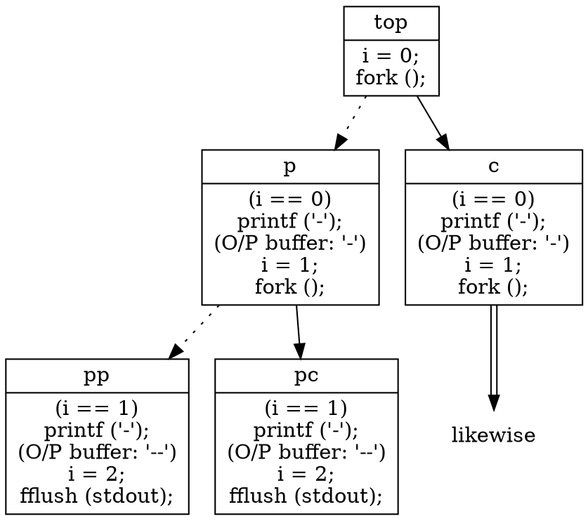

# Linux 2021: nandemoi

## γ - 1

[$fork(2)$](https://man7.org/linux/man-pages/man2/fork.2.html) spins off a copy of the running process with

1. inherited variable values, [IO buffer content duplicated](https://stackoverflow.com/questions/11346131/buffering-mechanism-when-fork-is-used-in-c) likewise, and  
2. where the execution is at.
  
When ``NNN`` is 2, the execution expressed with loop flattened in a tree diagram (parenthesized statements indicate states) would be  

&nbsp;  
Let's write ``NNN`` as $n$; the number of minus signs printed can be generalized into $n\times2^n$. When $n$ is $12$, it amounts to $49152$.

###### tags: `Linux 2021`  
