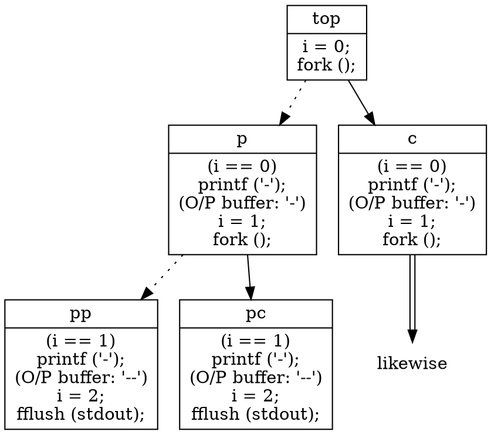

# [2021 年暑期「Linux 核心」](https://hackmd.io/@sysprog/linux2021-summer/https%3A%2F%2Fhackmd.io%2F%40sysprog%2FSyM7Y6e6u)課程  

* program in file system → process in execution  
* threads share more resources than processes  
* Trusty TEE  
* Zombie process  
* x86-64 with 48 bit address space, or ARM64 in 38 (ARM v8-A Address Translation)  
* process in kernel mode  
* kernel higher address  
* [lkmpg 0.2 bottom](https://github.com/gnab/rtl8812au/issues/147)  
  [insmod: ERROR: could not insert module HelloWorld.ko: Operation not permitted](https://askubuntu.com/questions/762254/why-do-i-get-required-key-not-available-when-install-3rd-party-kernel-modules)  
  * (Raspbian 10, VirtualBox/Ubuntu 20.04.2 LTS)```EFI variables are not supported on this system```  
* [Pi Kernel building](https://www.raspberrypi.org/documentation/linux/kernel/configuring.md):<br>!!! scroll down to "Cross-compiling" !!!  
* See ```pr_info()``` outputs with ```dmesg```
* shell command - human vs. cpu/build instruction - machine  
* issue vs. send/receive  
* ```opendiff``` or ```git difftool```  

8:47 - 7:30  
[1](https://youtu.be/ykGPShg3uoY?t=1696)  
[2](blob:https://www.youtube.com/09bcd472-8385-4a88-8646-fddeaf531073)

8/13 rcu 先看  
xor list  
你所不知道的 C 語言，linker kernel symbols  
bootlin  
rootkit  
sudo pkill -9 hyperkit  
gist qemu apple  
NPTL or M...?  
locking/rt-mutex  

CTSS  
multikernel 8:00  
priority inversion * ...8:25  
LL/SC article 8:49  
8:51 arm manual  
* 9:13 talk 09:00  

jiffies
task: proc or thread
並行: Lock-free - Timothy Harris

## Operating System Concepts  

the dinosaur book, Silberschatz, Galvin and Gagne 2018 10th Ed.  

### Process Scheduling (3.2)

* Process States:  
  * Ready (queue) till *dispatched* to execution  
  * Execution (in CPU) until it  
    * terminates,  
    * is interrupted, or  
    * or waits for the occurrence of a particular event (e.g. completion of an I/O request)  
  * Wait (queue)  
  

### Thread (Chap 4)

* basic unit of CPU utilization  
* comprises:  
  a thread ID,  
  a program counter (PC),  
  a register set,  
  and a stack
* shares:  
  code section,  
  data section,  
  and other operating-system resources, such as open files and signals.  
* Amdahl's law

| asynch | sync |
|:--|:--|
|parent/child concurr and independent|parent waits by calling ```pthread_join()``` for all children to terminate b4 resume;<br>children concurr|
|little data sharing|significant data sharing|
|server,responsive ui||

### [Cache](http://www.puppetmastertrading.com/images/hwViewForSwHackers.pdf)  

#### misses

* read
  * (startup/warmup) cache miss (not in cache):  
    the CPU will have to wait (or be “stalled”) for hundreds of cycles while the item is fetched from memory.  
  * capacity miss (cache full)  
  * associativity miss (hash collision)  
* write
  * write miss (during invalidating other CPUs' caches)  
  * communication miss (invalidated)  

## ARM with R/Pi:  

~/arm-pi  

* can't install on mp vm (the very 1st one)  
* ubuntu/vbox: ok up to ```bitbake rpi-basic-image```

## administrative  

[Download Gitter Room to a JSON File](https://medium.com/geekculture/download-gitter-room-to-a-json-file-ee69417a6b49)  
Todo: Compilation Optimization  
[How To Increase Virtualbox Disk Size For Fixed Size Disk](https://www.linuxbabe.com/virtualbox/how-to-increase-virtualbox-disk-size-for-fixed-size-disks)  
[How do I clear the purgeable area on my disk?](https://apple.stackexchange.com/questions/254676/how-do-i-clear-the-purgeable-area-on-my-disk)  
[Resizing Partitions with GParted!!](https://www.youtube.com/watch?v=kkhM5XoN9uc)  

### [Multipass](https://multipass.run/)  

* [MacOS: where is vm file location](https://github.com/canonical/multipass/issues/1263)  
  * ```/var/root/Library/Application\ Support/multipassd/vault/instances```  
  * ```/var/root/Library/Application\ Support/multipassd/virtualbox/vault/instances``` 
* [How to git clone on Ubuntu](https://www.theserverside.com/blog/Coffee-Talk-Java-News-Stories-and-Opinions/How-to-git-clone-on-Ubuntu-with-GitLab-and-GitHub)  
* ```mp mount ~/mp foo:/home/ubuntu/hw1``` (can't mount home)  
  ``` mp unmount foo```  

### [How to enable access to VirtualBox via SSH NAT ?](https://bobcares.com/blog/virtualbox-ssh-nat/)  

* [Ubuntu Linux install OpenSSH server](https://www.cyberciti.biz/faq/ubuntu-linux-install-openssh-server/)  
* ```sshfs -p 2522 nandemoi@127.0.0.1:/home/nandemoi ub```  
* [Share folder between MacOS and Ubuntu](https://medium.com/macoclock/share-folder-between-macos-and-ubuntu-4ce84fb5c1ad)  

## [Linux 核心設計: 記憶體管理](https://hackmd.io/@sysprog/linux-memory?type=view)

* huge (in terms of structure) memory  
* Page Fault: *locality*  
* 異質多核：處理器不等價、不對稱，記憶體的排列與配置方法也不對稱
  CPU/GPU 共享與不共享的記憶體內容ㄧ致  
* memory ordering  
<br/>  
* Von Neuman and nuclear bombs  
<br/>  
* 32-bit system: addressing space $2^{32}$ = 4GB  
* [手機裡頭的 ARM 處理器](https://hackfoldr.org/arm)  
* User mode (of many users and processes) → System mode: 
  * system call or software interrupt, or  
  * hardware interrupt (time, network)  
    * Interrupt Service Routine/Handler  
* [[Linux] 程序的 memory layout 初淺認識](https://pinglinblog.wordpress.com/2016/10/18/linux-%E7%A8%8B%E5%BA%8F%E7%9A%84-memory-layout-%E5%88%9D%E6%B7%BA%E8%AA%8D%E8%AD%98/)  
  [你所不知道的 C 語言：執行階段程式庫 (CRT)](https://hackmd.io/@sysprog/c-prog/%2Fs%2FHkcr5cn97)  
  [你所不知道的 C 語言：連結器和執行檔資訊](https://hackmd.io/@sysprog/c-linker-loader?type=view)  
  
[progress](https://youtu.be/kY3g2r03erk?list=PL6S9AqLQkFpongEA75M15_BlQBC9rTdd8&t=2753)

## Inception Quiz  

### [α](https://stackoverflow.com/questions/776508/best-practices-for-circular-shift-rotate-operations-in-c)

LLL = [v >> (-c & mask)](https://en.wikipedia.org/wiki/Circular_shift)  
(-c & maske) is (bits - c) ?  
RRR = v << (-c & mask)

* function call 函式呼叫 vs. macro expansion 巨集展開

### β

MMM = sz

### γ - 1

NNN = 12

[$fork(2)$](https://man7.org/linux/man-pages/man2/fork.2.html) spins off a copy of the running process with

1. inherited variable values, [<font color="red">IO buffer content duplicated</font>](https://stackoverflow.com/questions/11346131/buffering-mechanism-when-fork-is-used-in-c) likewise, and  
2. where the execution is at.
  
When ``NNN`` is 2, the execution expressed with loop flattened in a tree diagram (parenthesized statements indicate states) would be  



&nbsp;  
Let's write ``NNN`` as $n$; the number of minus signs printed can be generalized into $n\times2^n$. When $n$ is $12$, it amounts to $49152$.

### δ

AAA = node->next = queue->last  
BBB = node->value  
CCC = queue->first = new_header

### ϵ

XXX = x + 1  
YYY = (trickier)

* $mpool\_init$: why $min2$?
* $mpool\_alloc$ <font color="red">*sequentially*</font> searches for the address break that fits the requested size
  * by calculation instead?

### ζ

III = .fd = target_fd, .events = 0, .revents = 0  
JJJ = .fd = cl_fd, .events = 0, .revents = 0  

###### tags: `Linux 2021`  
