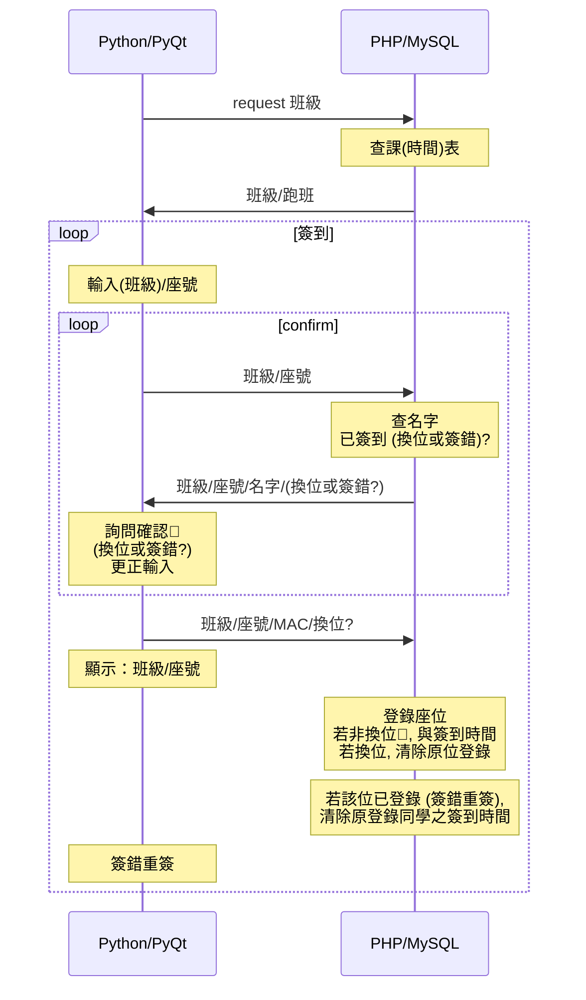

# Server  

## [Socket Programming in Python (Guide)](https://realpython.com/python-sockets/)  

* accept() *blocks* and waits for an incoming connection.  
  When a client connects, it returns a new socket object, *distinct* from the listening socket that the server is using to accept new connections.

* [Raspberry Pi: Cannot connect to socket server](https://www.raspberrypi.org/forums/viewtopic.php?t=62108)  
* Ping time-out: check the Wifi router that it connects to
  
## Mac  

### [MySQL/PHP/Apache Setup](https://discussions.apple.com/docs/DOC-3083)

* [Apache HTTP Server上常會遇到的亂碼問題](https://www.itread01.com/content/1549338675.html)  
* [403 Forbidden, Server unable to read htaccess file, denying access to be safe](https://forums.cpanel.net/threads/403-forbidden-server-unable-to-read-htaccess-file-denying-access-to-be-safe.665705/)  
* [Where is the index.html on OSX 10.9 (Mavericks) Apache setup?](https://apple.stackexchange.com/questions/146235/where-is-the-index-html-on-osx-10-9-mavericks-apache-setup)  
* [phpmyadmin連線MySQL8.0報錯#2054 - The server requested authentication method unknown to the client](https://www.itread01.com/content/1546243084.html)  

### MySQL with Python

[How to Connect to a Remote MySQL Database in Python](https://www.thepythoncode.com/article/connect-to-a-remote-mysql-server-in-python)  
[Importing data from a MySQL database into Pandas data frame](https://medium.com/analytics-vidhya/importing-data-from-a-mysql-database-into-pandas-data-frame-a06e392d27d7)  
[Pandas Dataframe to MySQL](https://www.coder.work/article/3962142)  

### [PHP GET/POST request](https://zetcode.com/php/getpostrequest/)  

* php start at a port not working but specificy filename ok
* [How can I send a POST request with a web browser?](https://stackoverflow.com/questions/3307379/how-can-i-send-a-post-request-with-a-web-browser/3307401#3307401)  

### [Flask](https://topherpedersen.blog/2019/12/28/how-to-setup-a-new-flask-app-on-a-mac/)

[Flask access from different devices](https://stackoverflow.com/questions/62499969/flask-access-from-different-devices)  

## Raspberry Pi

[Day04 使用樹莓派架設伺服器 Part1](https://ithelp.ithome.com.tw/articles/10213753)

### MariaDB on Pi

* [Raspberry Pi 筆記(61)：安裝MySQL(MariaDB)資料庫及管理工具Adminer](https://atceiling.blogspot.com/2020/03/raspberry-pi-61mysqlmariadb.html)  
* [Executing Scripts with Maria-db Command Line](https://www.syspanda.com/index.php/2017/09/07/executing-scripts-maria-db-command-line/)  
* [Import CSV File | MariaDB Tutorial for Beginners](https://www.youtube.com/watch?v=3hXk9sXBgt8)  
* [How to import CSV files to MySQL/MariaDB table](https://www.simplified.guide/mysql-mariadb/import-csv)  

### Mount Pi on Mac
sshfs pi@eltonpi.local:/home/pi/pi-works/att ~/eltonpi  
sudo diskutil unmount force ~/eltonpi  
[mount_macfuse: the file system is not available (1) #791](https://github.com/osxfuse/osxfuse/issues/791)  

### MariaDB on Mac
brew install mariadb  
pip3 install mariadb  

### Remote Connection to MariaDB
<!--[How to enable Remote access to your MariaDB/MySQL database](https://webdock.io/en/docs/how-guides/database-guides/how-enable-remote-access-your-mariadbmysql-database)-->
* [ERROR 1130 (HY000): Host '' is not allowed to connect to this MySQL server [duplicate]](https://stackoverflow.com/questions/19101243/error-1130-hy000-host-is-not-allowed-to-connect-to-this-mysql-server)  
* [How to connect Python programs to MariaDB](https://mariadb.com/resources/blog/how-to-connect-python-programs-to-mariadb/)  
* [How to convert SQL Query result to PANDAS Data Structure?](https://stackoverflow.com/questions/12047193/how-to-convert-sql-query-result-to-pandas-data-structure)  
* [How do I stop web server on my pi?](chrome-extension://noogafoofpebimajpfpamcfhoaifemoa/suspended.html#ttl=How%20do%20I%20stop%20web%20server%20on%20my%20pi%3F%20-%20HELP%20-%20Raspberry%20Pi%20Forums&pos=0&uri=https://www.raspberrypi.org/forums/viewtopic.php?t=64895)  

## [PyQt](https://build-system.fman.io/pyqt5-tutorial)    

* [PyQt5 Tutorial - How to Use Qt Designer](https://youtu.be/FVpho_UiDAY?t=521): pyuic5 -x untitled.ui -o ui.py  
* [Python GUI Development with Qt - QtDesigner's Signal-Slot Editor, Tab Order Management - Video 12](https://youtu.be/u0zhLEHHZBU?t=392)  

## ngrok HTTP forwarding

[ngrok forwarding, Flask Mega Tutorial at Bottom](https://www.twilio.com/docs/usage/tutorials/how-to-set-up-your-python-and-flask-development-environment)  
[Apache at port 80](https://www.google.com/search?q=apache+which+port&oq=apache+which+port&aqs=chrome..69i57.2850j0j1&sourceid=chrome&ie=UTF-8)  

## Projects

### Class Mgt

#### Attendance

#### Grades Checking/Highlihgts

### Bus
