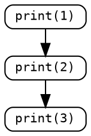
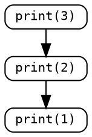

# 單元 1：循序與指定

<span style="font-size: 1.4em">**程式碼逐行循序執行、「指定 Assign」（`=`）的作用**</span>

---

## 🎯 學習重點

- 程式是按照順序一條一條依序執行。

- `=` 的作用和數學中的等號不太ㄧ樣
  
- 整數的算術 (arithmetic) 運算

- **<span style="color: red">同學要打開 <span style="color: #0492C2">Python IDLE</span> 或是其他 Python 執行環境（如 <a href="https://colab.research.google.com" target="_blank">Google Colab</a> 或 <a href="https://repl.it" target="_blank">replit</a> 等）鍵入學習單中的程式實驗觀察學習。</span>**

---

## ⏩ 程式碼逐行循序執行

程式是按照順序執行的，每一條程式碼依序執行。例如  

<div class="twocol-uc">
<div class="twocol-left">

<span style="color: silver;"> 1 | </span><span class="nb">print</span> <span class="p">(</span><span class="mi">1</span><span class="p">)</span>
<span style="color: silver;"> 2 | </span><span class="nb">print</span> <span class="p">(</span><span class="mi">2</span><span class="p">)</span>
<span style="color: silver;"> 3 | </span><span class="nb">print</span> <span class="p">(</span><span class="mi">3</span><span class="p">)</span>


程式執行會在螢幕中寫出

```output
1
2
3
```

</div>
<div class="twocol-rite">

<br>



<br>
你可以想像<br>
這樣一個在時間軸的圖像

</div>
</div>

**而程式碼如果這樣寫：**

<div class="twocol-uc">
<div class="twocol-left">

<span style="color: silver;"> 1 | </span><span class="nb">print</span> <span class="p">(</span><span class="mi">3</span><span class="p">)</span>
<span style="color: silver;"> 2 | </span><span class="nb">print</span> <span class="p">(</span><span class="mi">2</span><span class="p">)</span>
<span style="color: silver;"> 3 | </span><span class="nb">print</span> <span class="p">(</span><span class="mi">1</span><span class="p">)</span>


那程式執行時在螢幕中就會看到

```output
3
2
1
```

</div>
<div class="twocol-rite">

<br>



</div>
</div>

### 練習

執行程式碼：

<span style="color: silver;"> 1 | </span><span class="nb">print</span> <span class="p">(</span><span class="mi">5</span><span class="p">)</span>
<span style="color: silver;"> 2 | </span><span class="nb">print</span> <span class="p">(</span><span class="mi">1</span><span class="p">)</span>
<span style="color: silver;"> 3 | </span><span class="nb">print</span> <span class="p">(</span><span class="mi">7</span><span class="p">)</span>
<span style="color: silver;"> 4 | </span><span class="nb">print</span> <span class="p">(</span><span class="mi">3</span><span class="p">)</span>
<span style="color: silver;"> 5 | </span><span class="nb">print</span> <span class="p">(</span><span class="mi">2</span><span class="p">)</span>


時，在螢幕中會看到：

```output
5
--n@1--
7
3
2
```

### 練習

如果執行程式碼：

<div class="highlight"><pre><span></span><code>
<span style="color: silver;"> 1 | </span><span class="nb">print</span> <span class="p">(</span><span class="mi">220</span><span class="p">)</span>
<span style="color: silver;"> 2 | </span><span class="nb">print</span> <span class="p">(</span><span class="mi">53</span><span class="p">)</span>
<span style="color: silver;"> 3 | </span><span class="nb">print</span> <span class="p">(</span><span class="o">--</span><span class="n">n</span><span class="o">@</span><span class="mi">9</span><span class="o">--</span><span class="p">)</span>
<span style="color: silver;"> 4 | </span><span class="nb">print</span> <span class="p">(</span><span class="mi">817</span><span class="p">)</span>
<span style="color: silver;"> 5 | </span><span class="nb">print</span> <span class="p">(</span><span class="o">--</span><span class="n">n</span><span class="o">@</span><span class="mi">7</span><span class="o">--</span><span class="p">)</span>
</code></pre></div>

時，在螢幕中會看到：

```output
220
53
9
817
7
```

那框框內應填入什麼數字？  

---

## 📦 變數與 `=` 指定

變數就像一個盒子，可以放進去一個整數（或其他型別的資料）。每個盒子都有一個名字，我們叫做變數名稱。在 Python 裡面，我們用等號「=」來把數值放進變數裡。例如：

<span class="n">a</span> <span class="o">=</span> <span class="mi">5</span>


就是把等號右邊的 5 這個整數數值放進等號左邊名字叫做 a 的盒子裡。有的基礎的書會用這樣的箭頭示意，幫助我們理解。

<span class="n">a</span> <span class="err">←</span> <span class="mi">5</span>


### 變數名稱規則

- 變數名稱一定要以大小寫英文 26 字母或底線；大小寫不ㄧ樣代表不一樣的名稱 (case-senstivie)，例如 `age`, `Age`, 與 `AGE` 是 3 個不同的變數名稱。

- 第 2 個字元 (character) 開始除了英文字母和底線，還可以使用數字。

- 不要使用 Python 語法的保留字 (例如 `if`、`else`、`for`、`while` ... 等等，<span style="color:darkgray">執行時會報錯</span>) 或內建函式名稱 (例如 `sum`、`abs`、`len`、`range` ... 等等，<span style="color:darkgray">執行時**不會**報錯</span>)。

另外，命名的原則是儘量取有意義的名稱，讓你自己還有別人容易看懂你的程式。

---

--c:2value;_value2;value-2;for@_value2-- 是合法的變數名稱。

--c:_2nd_score;score_2;2nd_score;score2_@2nd_score-- 不是合法的變數名稱。

--c:Age;_age;age1;以上皆@以上皆-- 是與 `age` 不同的變數名稱。

--c:變數名稱可以以數字開頭;變數名稱可以包含底線;大小寫不同是不同變數;命名應該有意義@變數名稱可以以數字開頭-- 是錯誤的。

不建議使用 --c:sum;height;score1;_total@sum-- 作為變數

用 --c:num_students;ns;x;data@num_students-- 表示代表「學生數量」的變數最合適。

### 算術 (Arithmetic) 運算

每一行程式碼依序執行，這意味著變數的值會隨著程式執行而改變，資料會在變數間遷移。

<span style="color: silver;"> 1 | </span><span class="n">a</span> <span class="o">=</span> <span class="mi">5</span>
<span style="color: silver;"> 2 | </span><span class="n">b</span> <span class="o">=</span> <span class="mi">3</span>
<span style="color: silver;"> 3 | </span><span class="n">c</span> <span class="o">=</span> <span class="n">a</span> <span class="o">+</span> <span class="n">b</span>
<span style="color: silver;"> 4 | </span><span class="nb">print</span> <span class="p">(</span><span class="o">--</span><span class="n">n</span><span class="nd">@c</span><span class="o">--</span><span class="p">)</span>


框框裡應該填入哪一個變數名稱能使程式執行後會在螢幕視窗中寫出？  

```output
8
```

這段程式先將 5 存入 a ， 3 存入 b ，然後計算 a + b 並存入 c，最後寫出 c 的值。

<span style="color: red">**注意：**</span>一個「`=`」是「指定」的意思，<span style="color: red">**不是**</span>比較等號兩端是否相等。比較左邊和右邊是否相等要用「`==`」，後面條件判斷的時候會再提。  

### 「```+```」號怎麼打？

<div class="twocol-uf">
<div class="twocol_bigrite-left">

電腦鍵盤左下右下都有「SHIFT」鍵，按著「SHIFT」鍵不要放的同時，再用另外一隻手指按右上角的「+=」就會出現「+」。  
<br><br>
鍵盤上的鍵都有兩個符號 (或加中文)，單單按鍵出現的是下面的符號，
按著「SHIFT」鍵再按各鍵就畫出現上面的符號。

</div>
<div class="twocol_bigrite-rite">


</div>
</div>

另外也注意<span style="color: red">**不要**</span>**切換到中文輸入** (Windows 看右下方狀態列的顯示)。

對英文打字不熟悉的同學請先用[這套課程(點擊)](https://www.typing.com/student/lessons)練習。  

## 思考練習

Python 可以進行整數的加減乘除運算。填入程式碼來計算兩個整數的和。

**填入程式碼：**

<span style="color: silver;"> 1 | </span><span class="n">a</span> <span class="o">=</span> <span class="nb">int</span> <span class="p">(</span><span class="nb">input</span> <span class="p">())</span> <span class="c1"># 這是要求使用者輸入一個數，輸入後會指定給變數 a</span>
<span style="color: silver;"> 2 | </span><span class="n">b</span> <span class="o">=</span> <span class="nb">int</span> <span class="p">(</span><span class="nb">input</span> <span class="p">())</span> <span class="c1"># 要求使用者再輸入一個數，輸入後會指定給變數 b</span>
<span style="color: silver;"> 3 | </span><span class="nb">print</span> <span class="p">(</span><span class="o">--</span><span class="n">v</span><span class="p">:</span><span class="n">a</span> <span class="o">=</span> <span class="mi">5</span><span class="p">;</span> <span class="n">b</span> <span class="o">=</span> <span class="mi">3</span><span class="p">;</span> <span class="nb">print</span> <span class="p">(</span><span class="o">...</span><span class="p">)</span><span class="o">@</span><span class="mi">8</span><span class="o">--</span><span class="p">)</span>

(`#` 後面是註解，詳細說明可以看本單元最末或[點擊](#-註解-comment))

**提示：** 使用 a 和 b 的運算。

## 思考練習

Python 也可以進行乘法運算。填入程式碼來計算兩個整數的積。

<span style="color: silver;"> 1 | </span><span class="n">a</span> <span class="o">=</span> <span class="nb">int</span> <span class="p">(</span><span class="nb">input</span> <span class="p">())</span>
<span style="color: silver;"> 2 | </span><span class="n">b</span> <span class="o">=</span> <span class="nb">int</span> <span class="p">(</span><span class="nb">input</span> <span class="p">())</span>
<span style="color: silver;"> 3 | </span><span class="nb">print</span> <span class="p">(</span><span class="o">--</span><span class="n">n</span><span class="nd">@_a</span><span class="o">*</span><span class="n">b</span><span class="p">;</span><span class="n">b</span><span class="o">*</span><span class="n">a</span><span class="o">--</span><span class="p">)</span>


**提示：** 使用 a 和 b 的乘法運算。可以上網查詢 Python 乘法運算的符號是什麼？

## 思考練習

變數可以被重新指定新的值。看看以下程式：

<span style="color: silver;"> 1 | </span><span class="n">x</span> <span class="o">=</span> <span class="mi">5</span>
<span style="color: #5d5d5d;"> 2 | </span><em><span class="n">x</span> <span class="o">=</span> <span class="n">x</span> <span class="o">+</span> <span class="mi">1</span></em>
<span style="color: silver;"> 3 | </span><span class="nb">print</span><span class="p">(</span><span class="n">x</span><span class="p">)</span>


程式執行後會寫出什麼？

```output
--n@6--
```

## 思考練習

<span style="color: silver;"> 1 | </span><span class="n">x</span> <span class="o">=</span> <span class="mi">1</span>
<span style="color: silver;"> 2 | </span><span class="n">y</span> <span class="o">=</span> <span class="mi">2</span>
<span style="color: silver;"> 3 | </span><span class="nb">print</span> <span class="p">(</span><span class="n">x</span><span class="p">,</span> <span class="n">y</span><span class="p">)</span> <span class="c1"># 這裡會先寫出 1 2</span>
<span style="color: silver;"> 4 | </span>
<span style="color: #5d5d5d;"> 5 | </span><em><span class="n">z</span> <span class="o">=</span> <span class="n">x</span></em>
<span style="color: #5d5d5d;"> 6 | </span><em><span class="n">x</span> <span class="o">=</span> <span class="n">y</span></em>
<span style="color: #5d5d5d;"> 7 | </span><em><span class="n">y</span> <span class="o">=</span> <span class="n">z</span></em>
<span style="color: silver;"> 8 | </span>
<span style="color: silver;"> 9 | </span><span class="nb">print</span> <span class="p">(</span><span class="n">x</span><span class="p">,</span> <span class="n">y</span><span class="p">)</span> <span class="c1"># 會寫出什麼？</span>


程式執行後會在螢幕視窗中寫出：

```output
1 2
--n@2 1--
```

想想看這段程式做了什麼？最後程式會寫出什麼結果。  

<a href="https://nandemoi.github.io/zl111/media/swap_ani.gif" target="_blank">點擊看動畫演示</a>

---

## 🔢 資料型別 Data Type

對電腦而言 1 和 1.0 是不一樣的，0 和 0.0 也不一樣。還有 "1.0" 呈現在螢幕對我們眼睛看起來和 1.0 一樣，但前者（指 1、小數點、和 0 三個符號接在一起）和後者（指 1.0 那個數值）對電腦而言也是不一樣的。

這個在課本中有談到是不同的資料型別。在我們的課程中你先有這個概念就好，我們一開始都只會處理<span style="color: red">整數</span>的問題，先專注在程式流程的邏輯上，減少學習上的負擔。

## ➗ 整數除法

Python 的除法運算有兩種：浮點數（有小數點的數）除法和<span style="color: red">**整數除法**</span>。

**第一種**：浮點數除法「```/```」<span style="color: lightgray">（我們的課程比較少用到）</span>

<span class="nb">print</span> <span class="p">(</span> <span class="mi">7</span> <span class="o">/</span> <span class="mi">2</span> <span class="p">)</span>


會寫出

```output
3.5
```

被除數是 7，除數是 2，浮點數除法得到結果 3.5。

**第二幢：<span style="color: red">整數除法</span>**「```//```」

<span class="nb">print</span> <span class="p">(</span> <span class="mi">7</span> <span class="o">//</span> <span class="mi">2</span> <span class="p">)</span>


則會寫出  

```output
3
```

被除數是 7，除數是 2，整數除法得到商是 3。

配合整數求商的除法，有另外一個是求除法餘數的運算「%」。

<span class="nb">print</span> <span class="p">(</span> <span class="mi">7</span> <span class="o">%</span> <span class="mi">2</span> <span class="p">)</span>


會寫出

```output
1
```

被除數是 7，除數是 2，整數除法得到餘數是 1。

### 練習

這段程式

<span style="color: silver;"> 1 | </span><span class="n">a</span> <span class="o">=</span> <span class="mi">2</span>
<span style="color: silver;"> 2 | </span><span class="n">b</span> <span class="o">=</span> <span class="mi">3</span>
<span style="color: silver;"> 3 | </span><span class="n">c</span> <span class="o">=</span> <span class="mi">4</span>
<span style="color: silver;"> 4 | </span><span class="n">d</span> <span class="o">=</span> <span class="mi">5</span>
<span style="color: silver;"> 5 | </span>
<span style="color: silver;"> 6 | </span><span class="n">val</span> <span class="o">=</span> <span class="n">b</span> <span class="o">//</span> <span class="n">a</span> <span class="o">+</span> <span class="n">c</span> <span class="o">//</span> <span class="n">b</span> <span class="o">+</span> <span class="n">d</span> <span class="o">//</span> <span class="n">b</span>
<span style="color: silver;"> 7 | </span><span class="nb">print</span> <span class="p">(</span><span class="n">val</span><span class="p">)</span>


會印出

--n@3--

《APCS 105/10#4》

---

若 `r` 為一介於 $0$ 和 $10000$ 之間隨機產生的整數，則 `100 <=` --c:r % 900 + 100;r % 1000 + 1;r % 899 + 101;r % 901 + 100@r % 901 + 100-- `<= 1000`。

《APCS 106/03#12》

---

輸入兩個整數 n 代表糖果數量與 k 代表學生人數，輸出每人可分得多少糖果，剩下多少顆。

<span style="color: silver;"> 1 | </span><span class="n">n</span> <span class="o">=</span> <span class="nb">int</span> <span class="p">(</span><span class="nb">input</span> <span class="p">())</span> <span class="c1"># 糖果數量</span>
<span style="color: silver;"> 2 | </span><span class="n">k</span> <span class="o">=</span> <span class="nb">int</span> <span class="p">(</span><span class="nb">input</span> <span class="p">())</span> <span class="c1"># 學生人數</span>
<span style="color: silver;"> 3 | </span><span class="n">each</span> <span class="o">=</span> <span class="o">--</span><span class="n">n</span><span class="nd">@_n</span><span class="o">//</span><span class="n">k</span><span class="o">--</span>
<span style="color: silver;"> 4 | </span><span class="n">remain</span> <span class="o">=</span> <span class="o">--</span><span class="n">n</span><span class="nd">@_n</span><span class="o">%</span><span class="n">k</span><span class="o">--</span>
<span style="color: silver;"> 5 | </span><span class="nb">print</span> <span class="p">(</span><span class="n">each</span><span class="p">,</span> <span class="n">remain</span><span class="p">)</span> <span class="c1"># 寫出每人可分得多少糖果、剩下多少顆</span>


框框內應該填入什麼運算？  

## 💬 `#` 註解 Comment

Python 程式裡 `#` 以及跟在其後的所有文字是用來給人類讀的程式說明註解。註解寫什麼對程式執行沒有影響。<span style="color: lightgray">現在有的 AI 工具能夠根據註解產生程式碼。</span>

---

## 💻 實作練習

- [兩數相加](/prac1/p1-1)

- [計算長方形面積](/prac1/p1-2)

- [計算梯形面積](/prac1/p1-3)

[更多實作練習](http://zerojudge.tw/)

## 📘 總結

程式設計就是將問題拆解成小步驟。  

---

## 💡 補充說明

上面的[思考練習](#思考練習-3)說明了變數執行了被指定的程式指令後，原來放在裡面的值會受到複寫。但是要做到這個練習所做的事，Python 有更簡潔的寫法，鼓勵同學自己查找資料了解。  


