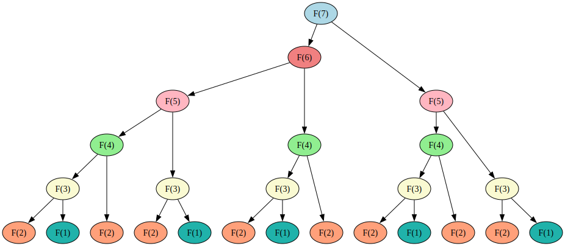

<link rel="stylesheet" href="../assets/css/works_inline.css">

# 單元 11：(Time) Complexities (時間) 複雜度們

「時間複雜度」是衡量程式執行效率的一種方式。

衡量程式執行效率，我們在意的不是程式在處理小資料量時的快慢。程式 A 在處理小資料量的時候可能比程式 B 快，卻在大資料量的時候較慢，例如有序數列的循序搜尋和[二分搜尋](#二分搜尋完整分析)的比較。

我們在意的是：**當資料量變成 <em>n</em> 倍的時候，程式處理需要花費的時間會是原來的幾倍？**

我們會使用一個 Big-O 的標記 \(O\)(...) 來表示一個程式/演算法來表示效率的度量，這個效率的度量又稱為「複雜度 Complexity」。\(O\) 是從 Order 縮寫來的，可以理解成「等級」。

通常會先關心執行的快慢，也就是「時間」複雜度 (Time Complexity)。比較完整的討論也要考慮衡量記憶體使用的「空間」複雜度 (Space Complexity)。不過這裡我們先專注在前者。

演算法的研究與開發經常使用的技巧之一是利用空間換取時間；計算資源因為在設計結構上比較複雜，相對上比記憶資源稀缺。

## (1st Order) Polynomial Time (一階) 多項式時間 (P)

<pre><code>
<pre><code> 1 | n = int (input ())
 2 | acc = 0
 3 | 
 4 | <em>while n &gt; 0:</em>
 5 |     acc = acc + n
 6 | <em>    n = n - 1</em>
 7 | 
 8 | print (acc)
</code></pre>
</code></pre>

O(?)\)

---

<pre><code>
<pre><code> 1 | n = int (input ())
 2 | factorial = 1
 3 | 
 4 | <em>while n &gt; 0:</em>
 5 |     factorial = factorial * n
 6 | <em>    n = n - 1</em>
 7 | 
 8 | print (factorial)
</code></pre>
</code></pre>

\(O(?)\)

---

<pre><code>
<pre><code> 1 | n = int (input ())
 2 | acc = 0
 3 | 
 4 | <em>while n &gt; 0:</em>
 5 |     acc = acc + n
 6 | <em>    n = n - 1</em>
 7 | 
 8 | print (acc)
</code></pre>
</code></pre>

比 較

<pre><code>
<pre><code> 1 | n = int (input ())
 2 | factorial = 1
 3 | 
 4 | <em>while n &gt; 0:</em>
 5 |     factorial = factorial * n
 6 | <em>    n = n - 1</em>
 7 | 
 8 | print (factorial)
</code></pre>
</code></pre>

\(O(?)\)

---

<pre><code>
<pre><code> 1 | a1, b1, c1 = map (int, input().split())
 2 | a2, b2, c2 = map (int, input().split())
 3 | n = int (input ())
 4 | 
 5 | mx = -9999999999
 6 | x1 = 0
 7 | 
 8 | <em>while x1 &lt;= n:</em>
 9 |     y1 = a1 * x1 * x1 + b1 * x1 + c1
10 |     x2 = n - x1
11 |     y2 = a2 * x2 * x2 + b2 * x2 + c2
12 |     if mx &lt; y1 + y2:
13 |         mx = y1 + y2
14 | <em>    x1 = x1 + 1</em>
15 | 
16 | print (mx)
</code></pre>
</code></pre>

\(O(?)\)

---

## Various Variables

<pre><code>
<pre><code> 1 | n, r = map (int, input().split())
 2 | pnr = 1
 3 | i = 0
 4 | <em>while i &lt; r:</em>
 5 |     pnr = pnr * (n - i)
 6 | <em>    i = i + 1</em>
 7 | print(pnr)
</code></pre>
</code></pre>

\(O(?)\)

---

<pre><code>
<pre><code> 1 | m, n = map (int, input().split())
 2 | 
 3 | i = 1
 4 | <em>while i &lt;= m:</em>
 5 |     j = 1
 6 | <em>    while j &lt;= n:</em>
 7 |         print (i * j)
 8 | <em>        j = j + 1</em>
 9 | <em>    i = i + 1</em>
</code></pre>
</code></pre>

\(O(?)\)

---

<pre><code>
<pre><code> 1 | n = int (input ())
 2 | 
 3 | i = 1
 4 | <em>while i &lt;= n:</em>
 5 |     j = 1
 6 | <em>    while j &lt;= n:</em>
 7 |         pass # or do something
 8 | <em>        j = j + 1</em>
 9 | <em>    i = i + 1</em>
</code></pre>
</code></pre>

\(O(?)\)

---

<pre><code>
<pre><code> 1 | m, n = map (int, input().split())
 2 | 
 3 | i = 1
 4 | <em>while i &lt;= m:</em>
 5 |     j = 1
 6 | <em>    while j &lt;= n:</em>
 7 |         print (i * j)
 8 | <em>        j = j + 1</em>
 9 | <em>    i = i + 1</em>
</code></pre>
</code></pre>

\(O(?)\)

<pre><code>
<pre><code> 1 | n = int (input ())
 2 | 
 3 | i = 1
 4 | <em>while i &lt;= n:</em>
 5 |     j = 1
 6 | <em>    while j &lt;= n:</em>
 7 |         pass # or do something
 8 | <em>        j = j + 1</em>
 9 | <em>    i = i + 1</em>
</code></pre>
</code></pre>

\(O(?)\)

---

## Logarithmic 對數的

<pre><code>
<pre><code> 1 | n = int (input())
 2 | 
 3 | while n % 2 == 0:
 4 | <em>    n = n // 2</em>
 5 | 
 6 | print (n)
</code></pre>
</code></pre>

\(O(?)\)

---

<pre><code>
<pre><code> 1 | n = int (input())
 2 | i = 1
 3 | c = 0
 4 | while i &lt; n:
 5 |     c = c + 1
 6 | <em>    i = i * 2</em>
 7 | 
 8 | print (i, c)
</code></pre>
</code></pre>

\(O(?)\)

---

<pre><code>
<pre><code> 1 | n = int (input())
 2 | 
   | 
 3 | while n % 2 == 0:
   | <em></em>
 4 | <em>    n = n // 2</em>
 5 | 
 6 | print (n)
</code></pre>
</code></pre>

比 較

<pre><code>
<pre><code> 1 | n = int (input())
 2 | i = 1
 3 | c = 0
 4 | while i &lt; n:
 5 |     c = c + 1
 6 | <em>    i = i * 2</em>
 7 | 
 8 | print (i, c)
</code></pre>
</code></pre>

\(O(?)\)

---

## 比較

---

## Nested

<pre><code>
<pre><code> 1 | n = int (input ())
 2 | 
 3 | i = 1
 4 | <em>while i &lt;= n: </em>
 5 |     j = 1
 6 | <em>    while j &lt;= n:</em>
 7 |         pass # or do something
 8 | <em>        j = j + 1</em>
 9 | <em>    i = i + 1</em>
</code></pre>
</code></pre>

\(O(?)\)

---

<pre><code>
<pre><code> 1 | n = int (input())
 2 | 
 3 | c = 0
 4 | i = 0
 5 | <em>while i &lt; n:</em>
 6 |     j = 1
 7 | <em>    while j &lt; n:</em>
 8 |         c = c + 1
 9 | <em>        j = j * 2</em>
10 | <em>    i = i + 1</em>
11 | 
12 | print (c)
</code></pre>
</code></pre>

\(O(?)\)

---

<pre><code>
<pre><code> 1 | n = int (input())
 2 | 
 3 | c = 0
 4 | i = 0
 5 | <em>while i &lt; n:</em>
 6 |     j = 1
 7 | <em>    while j &lt; n:</em>
 8 |         c = c + 1
 9 | <em>        j = j + 1</em>
10 | <em>    i = i * 2</em>
11 | 
12 | print (c)
</code></pre>
</code></pre>

\(O(?)\)

---

<pre><code>
<pre><code> 1 | n = int (input())
 2 | 
 3 | c = 0
 4 | i = 0
 5 | <em>while i &lt; n:</em>
 6 |     j = 1
 7 | <em>    while j &lt; n:</em>
 8 |         c = c + 1
 9 | <em>        j = j * 2</em>
10 | <em>    i = i + 1</em>
11 | 
12 | print (c)
</code></pre>
</code></pre>

比 較

<pre><code>
<pre><code> 1 | n = int (input())
 2 | 
 3 | c = 0
 4 | i = 0
 5 | <em>while i &lt; n:</em>
 6 |     j = 1
 7 | <em>    while j &lt; n:</em>
 8 |         c = c + 1
 9 | <em>        j = j + 1</em>
10 | <em>    i = i * 2</em>
11 | 
12 | print (c)
</code></pre>
</code></pre>

\(O(?)\)

---

## 非多項式時間 Non-polynomial Time

`exp (n)` 算出 { 1, 2, ..., n } 的子集合個數

<pre><code>
<pre><code>def exp (n: int, i = 1):
    if i &gt; n:
        return 1  # 1~n 都考慮的，算一個子集合
    return exp (n, i + 1) + exp (n, i + 1)  # 有和沒有
</code></pre>
</code></pre>

\(O(?)\)

---

`fact_perm (a)` 算出 a 中元素所有可能排列會有幾種。

$n$ 是 `len(a)` (`a` 的長度)，即 `a` 有 $n$ 項元素。

<pre><code>
<pre><code>def fact_perm (a: list):
    if len (a) &lt;= 1:
        return 1  # 一種排列
    total = 0
    for i in range (len (a)):         # 首有 n 個選擇 
        b = a [:i] + a [i + 1:]           # 餘項
        total = total + fact_perm (b)     # 遞迴少了首項
    return total
</code></pre>
</code></pre>

\(O(?)\)

---

## All Chart

---

對數尺度 Log/logarithmic Scale

---

## 《費波那契數列 (Fibonacci Sequence)》

<pre><code>
<pre><code>def fib_recr (n: int):
    if n == 1:
        return 0
    elif n == 2:
        return 1
    else:
        return fib_rec (n-1) \
             + fib_rec (n-2)

　            
</code></pre>
</code></pre>

\(O(?)\)

vs.

<pre><code>
<pre><code>def fib_iter (n: int):
    if n == 1:
        return 0
    elif n == 2:
        return 1
    else:
        a, b = 0, 1 # F (1), F (2)
        for _ in range (3, n + 1):
            a, b = b, a + b  
        return b
</code></pre>
</code></pre>

\(O(?)\)

---

`fib_recr (n)` 直接從[定義](https://openhome.cc/zh-tw/algorithm/basics/fibonacci/)用遞迴的方式算出費式數列第 `n` 項：

<pre><code>
<pre><code>def fib_recr (n: int):
    if n == 1:
        return 0
    elif n == 2:
        return 1
    else:
        return fib_rec (n - 1) + fib_rec (n - 2)
</code></pre>
</code></pre>

這個做法的問題是會有很多重複的動作：以求 $F (7)$ 為例

<blockquote>

\(F (7) = F (6) + \)\(F (5)\)

\(F (6) = \)&nbsp;\(F (5)\)\( + F (4)\)

</blockquote>

這表示 `fib_recr(5)` 會被重複執行，而每次執行 `fib_recr(5)` 又會重複執行 `fib_rec(3)` 等等 ....

\(O(?)\) ($1 \lt k \lt 2$)

---

`fib_iter (n)` 則使用迭代／動態規劃 (Dynamic Programming)：

<pre><code>
<pre><code>def fib_iter (n: int):
    if n == 1:
        return 0
    elif n == 2:
        return 1
    else:
        a, b = 0, 1  # a = F(1), b = F(2)
        for _ in range (3, n + 1):
            a, b = b, a + b  # 進一階：新的 b 為前兩項之和
        return b
</code></pre>
</code></pre>

\(O(?)\)

---

## 《大衛牧羊》

<pre><code>
<pre><code> 1 | n = int (input ())
 2 | 
 3 | i = 1
 4 | <em>while i &lt;= n: </em>
 5 |     j = 1
 6 | <em>    while j &lt;= n:</em>
 7 |         pass # or do something
 8 | <em>        j = j + 1</em>
 9 | <em>    i = i + 1</em>
</code></pre>
</code></pre>

\(O(?)\)

---

[題目](/prac1/p6-5)

<pre><code>
<pre><code> 1 | n, m = map (int, input().split())
 2 | backs = list (map (int, input().split()))
</code></pre>
</code></pre>

<pre><code>
<pre><code>   | 　
   | 
   | 
   | 
   | 
   | 
   | 
   | 
 3 | 
 4 | i = 1
 5 | <em>while i &lt;= n:</em>
 6 | <em>    if i not in backs:</em>
 7 |         print (i, end=&quot; &quot;)
 8 | <em>    i = i + 1</em>
</code></pre>
</code></pre>

\(O(?)\)

vs.

<pre><code>
<pre><code> 4 | # 有回來的先一個一個登記到點名表
 5 | board = [ False ] * (n + 1) 
 6 | # (題目說羊隻編號從 1 開始)
 7 | 
 8 | i = 0
 9 | <em>while i &lt; m:</em>
10 |     board [backs [i]] = True
11 | <em>    i = i + 1</em>
12 | 
13 | i = 1
14 | <em>while i &lt;= n:</em>
15 |     if not board [i]:
16 |         print (i, end=&quot; &quot;)
17 | <em>    i = i + 1</em>
</code></pre>
</code></pre>

\(O(?)\)

---

<a href="https://stackoverflow.com/questions/13884177/complexity-of-in-operator-in-python" target="_blank"><code>in</code> 的複雜度是 \(O(n)\)</a>

<pre><code>
<pre><code> 1 | n, m = map (int, input().split())
 2 | backs = list (map (int, input().split()))
</code></pre>
</code></pre>

<pre><code>
<pre><code>   | 　
   | 
   | 
   | 
   | 
   | 
   | 
 3 | 
 4 | i = 1
 5 | <em>while i &lt;= n:</em>
 6 | <em>    if i not in backs:</em>
 7 |         print (i, end=&quot; &quot;)
 8 | <em>    i = i + 1</em>
</code></pre>
</code></pre>

\(\approx\)

<pre><code>
<pre><code> 4 | <em>def myIn (who, backlist, m):</em>
 5 |     j = 0
 6 | <em>    while j &lt; m:</em>
 7 |         if i == backs [j]:
 8 |             return True
 9 | <em>        j = j + 1</em>
10 |     return False
11 | 
12 | i = 1
13 | <em>while i &lt;= n:</em>
14 | <em>    if not myIn (i, backs, m):</em>
15 |         print (i, end=&quot; &quot;)
16 | <em>    i = i + 1</em>
</code></pre>
</code></pre>

或

<pre><code>
<pre><code> 1 | n, m = map (int, input().split())
 2 | backs = list (map (int, input().split()))
</code></pre>
</code></pre>

<pre><code>
<pre><code> 4 | i = 1
 5 | <em>while i &lt;= n:</em>
   | <em></em>
   | <em></em>
   | <em></em>
   | <em></em>
   | <em></em>
   | <em></em>
   | <em></em>
   | <em></em>
 6 | <em>    if i not in backs:</em>
 7 |         print (i, end=&quot; &quot;)
   | <em></em>
 8 | <em>    i = i + 1</em>
</code></pre>
</code></pre>

\(\approx\)

<pre><code>
<pre><code> 4 | i = 1
 5 | <em>while i &lt;= n:</em>
 6 |     j = 0
 7 |     bBack = False
 8 | <em>    while j &lt; m:</em>
 9 |         if i == backs [j]:
10 |             bBack = True
11 |             break
12 | <em>        j = j + 1</em>
13 | 
14 |     if not bBack:
15 |         print (i, end=&quot; &quot;)
16 | 
17 | <em>    i = i + 1</em>
</code></pre>
</code></pre>

\(O(?)\)

---

<pre><code>
<pre><code> 1 | n, m = map (int, input().split())
 2 | backs = list (map (int, input().split()))
 3 | 
 4 | # 有回來的先一個一個登記到點名表
 5 | board = [ False ] * (n + 1) # 羊隻編號從 1 開始但 board 的索引序號會從 0 開始
 6 | 
 7 | i = 0
 8 | <em>while i &lt; m:</em>
 9 |     board [backs [i]] = True
10 | <em>    i = i + 1</em>
11 | 
12 | i = 1
13 | <em>while i &lt;= n:</em>
14 |     if not board [i]:
15 |         print (i, end=&quot; &quot;)
16 |     i = i + 1
</code></pre>
</code></pre>

\(O(?)\)

---

### 比較

---

2025 © Elton Huang
