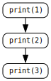
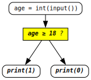
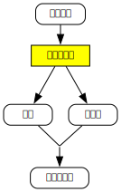
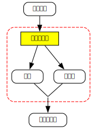
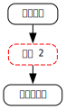
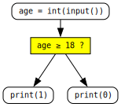
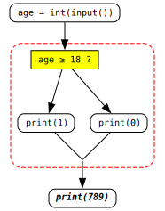

<link rel="stylesheet" href="{{ '../assets/css/works_inline.css' | relative_url }}">

# 單元 2：初探 `if`

<span style="font-size: 1.4em">**用 `if`、`else` 讓程式根據條件做不同的事情、邏輯**</span>

---

## 🎯 學習重點

- 基本條件判斷：`if`、`else`、`elif`
    - 程式如何根據條件做決定
    - 縮排 (indent)
    - 比較與邏輯運算

- 笛摩根定律（De Morgan's Law）

- **<span style="color: red">同學要打開 <span style="color: #0492C2">Python IDLE</span> 或是其他 Python 執行環境（如 <a href="https://colab.research.google.com" target="_blank">Google Colab</a> 或 <a href="https://repl.it" target="_blank">replit</a> 等）鍵入學習單中的程式實驗觀察學習。</span>**

---

## 🤔 程式中的決定

在日常生活中，我們經常需要根據不同的情況做出不同的決定。例如：

- 如果下雨，就帶雨傘
- 如果溫度低於 15 度，就穿厚外套
- 如果考試分數達到 60 分，就判定及格

程式也需要這種「判斷」能力。在 Python 中，我們使用 `if` 來表達這種條件判斷。

### 最簡單的 `if`

讓我們從最簡單的例子開始：

<div class="highlight"><pre><span></span><code><div class="highlight"><pre><span></span><code><span style="color: silver;"> 1 | </span><span class="n">age</span> <span class="o">=</span> <span class="nb">int</span><span class="p">(</span><span class="nb">input</span><span class="p">())</span>
<span style="color: #5d5d5d;"> 2 | </span><em><span class="k">if</span> <span class="n">age</span> <span class="o">&gt;=</span> <span class="mi">18</span><span class="p">:</span></em>
<span style="color: #5d5d5d;"> 3 | </span><em>    <span class="nb">print</span><span class="p">(</span><span class="mi">1</span><span class="p">)</span>  <span class="c1"># 1 表示成年</span></em>
</code></pre></div></code></pre></div>

程式執行後輸入 `18`，接著會輸出什麼？

<pre class="output"><input type="text" class="answer-input answer-inline"></pre>

### <span style="color: red">縮排</span>

請同學<span style="color: red">**特別注意**</span>上面 `if` 敘述的寫法：

1. `if` 條件之後接著個<span style="color: red">**`:`**</span>，這個<span style="color: red">**冒號**</span>表示這句話還沒講完 ...
   
2. 下面接著是還沒把句子的後半句講完；這個後半句<span style="color: red">**開頭空了 4 格空格**</span>，我們稱之為<span style="color: red">**縮排**</span>。開頭<span style="color: red">**縮**</span>到後面，讀 Python 程式的電腦或人才知道這個後半句要是接著前半句把話講完的！

### 練習：簡單判斷

<div class="highlight"><pre><span></span><code><div class="highlight"><pre><span></span><code><span style="color: silver;"> 1 | </span><span class="n">score</span> <span class="o">=</span> <span class="mi">75</span>
<span style="color: silver;"> 2 | </span><span class="k">if</span> <span class="n">score</span> <span class="o">&gt;=</span> <span class="mi">60</span><span class="p">:</span>
<span style="color: silver;"> 3 | </span>    <span class="nb">print</span><span class="p">(</span><span class="mi">1</span><span class="p">)</span>  <span class="c1"># 1 表示及格</span>
</code></pre></div></code></pre></div>

執行後會輸出：

<pre class="output"><input type="text" class="answer-input answer-inline"></pre>

---

### `if` 和 `else` 的組合

在上面的例子中，如果條件不成立，程式就什麼都不做。但有時候我們希望「如果條件成立就做 A，否則就做 B」。這時候就需要 `else`:

<div class="highlight"><pre><span></span><code><div class="highlight"><pre><span></span><code><span style="color: silver;"> 1 | </span><span class="n">age</span> <span class="o">=</span> <span class="nb">int</span><span class="p">(</span><span class="nb">input</span><span class="p">())</span>
<span style="color: #5d5d5d;"> 2 | </span><em><span class="k">if</span> <span class="n">age</span> <span class="o">&gt;=</span> <span class="mi">18</span><span class="p">:</span></em>
<span style="color: #5d5d5d;"> 3 | </span><em>    <span class="nb">print</span><span class="p">(</span><span class="mi">1</span><span class="p">)</span>  <span class="c1"># 1 表示成年</span></em>
<span style="color: #5d5d5d;"> 4 | </span><em><span class="k">else</span><span class="p">:</span></em>
<span style="color: #5d5d5d;"> 5 | </span><em>    <span class="nb">print</span><span class="p">(</span><span class="mi">0</span><span class="p">)</span>  <span class="c1"># 0 表示未成年</span></em>
</code></pre></div></code></pre></div>

程式執行後輸入 `15`，接著會輸出什麼？

<pre class="output"><input type="text" class="answer-input answer-inline"></pre>

### <span style="color: red">縮排</span>

這裡同樣請同學<span style="color: red">**注意**</span>：

1. `else` 後要接著 <span style="color: red">**`:`**</span> (冒號)，接下來要把話說完 ...
   
2. 下面接著要把句子講完的後半句<span style="color: red">**開頭同樣縮排了 4 格空格**</span>！

### 練習：及格與不及格

<div class="highlight"><pre><span></span><code><div class="highlight"><pre><span></span><code><span style="color: silver;"> 1 | </span><span class="n">score</span> <span class="o">=</span> <span class="mi">45</span>
<span style="color: silver;"> 2 | </span><span class="k">if</span> <span class="n">score</span> <span class="o">&gt;=</span> <span class="mi">60</span><span class="p">:</span>
<span style="color: silver;"> 3 | </span>    <span class="nb">print</span><span class="p">(</span><span class="mi">1</span><span class="p">)</span>  <span class="c1"># 1 表示及格</span>
<span style="color: silver;"> 4 | </span><span class="k">else</span><span class="p">:</span>
<span style="color: silver;"> 5 | </span>    <span class="nb">print</span><span class="p">(</span><span class="mi">0</span><span class="p">)</span>  <span class="c1"># 0 表示不及格</span>
</code></pre></div></code></pre></div>

輸出結果：

<pre class="output"><input type="text" class="answer-input answer-inline"></pre>

### *平行宇宙*

<div class="twocol-uf">
<div class="twocol-left">

在上一個單元我們說明程式按照順序執行。例如

<div class="highlight"><pre><span></span><code><div class="highlight"><pre><span></span><code><span style="color: silver;"> 1 | </span><span class="nb">print</span> <span class="p">(</span><span class="mi">1</span><span class="p">)</span>
<span style="color: silver;"> 2 | </span><span class="nb">print</span> <span class="p">(</span><span class="mi">2</span><span class="p">)</span>
<span style="color: silver;"> 3 | </span><span class="nb">print</span> <span class="p">(</span><span class="mi">3</span><span class="p">)</span>
</code></pre></div></code></pre></div>

</div>
<div class="twocol-rite-ctrimg">



</div>
</div>

<div class="twocol-uf">
<div class="twocol-left">

<br>

而這個單元我們介紹了 <code>if</code>-<code>else</code> 這樣的流程進行對時間軸而言，因為決定條件不同，則可能會走不同的分岔路徑，產生不同的結果，好像造成了<em>平行宇宙</em>。

<div class="highlight"><pre><span></span><code><div class="highlight"><pre><span></span><code><span style="color: silver;"> 1 | </span><span class="n">age</span> <span class="o">=</span> <span class="nb">int</span><span class="p">(</span><span class="nb">input</span><span class="p">())</span>
<span style="color: #5d5d5d;"> 2 | </span><em><span class="k">if</span> <span class="n">age</span> <span class="o">&gt;=</span> <span class="mi">18</span><span class="p">:</span></em>
<span style="color: #5d5d5d;"> 3 | </span><em>    <span class="nb">print</span><span class="p">(</span><span class="mi">1</span><span class="p">)</span> </em>
<span style="color: #5d5d5d;"> 4 | </span><em><span class="k">else</span><span class="p">:</span></em>
<span style="color: #5d5d5d;"> 5 | </span><em>    <span class="nb">print</span><span class="p">(</span><span class="mi">0</span><span class="p">)</span> </em>
</code></pre></div></code></pre></div>

</div>
<div class="twocol-rite-ctrimg">

<br><br><br>


</div>
</div>

程式的流程不再只走在一條線上，它可能有分支，擴展到平面。

### 練習：奇偶數判斷

<div class="highlight"><pre><span></span><code><div class="highlight"><pre><span></span><code><span style="color: silver;"> 1 | </span><span class="n">n</span> <span class="o">=</span> <span class="mi">8</span>
<span style="color: silver;"> 2 | </span><span class="k">if</span> <span class="n">n</span> <span class="o">%</span> <span class="mi">2</span> <span class="o">==</span> <span class="mi">0</span><span class="p">:</span>
<span style="color: silver;"> 3 | </span>    <span class="nb">print</span><span class="p">(</span><span class="mi">0</span><span class="p">)</span>  <span class="c1"># 0 表示偶數</span>
<span style="color: silver;"> 4 | </span><span class="k">else</span><span class="p">:</span>
<span style="color: silver;"> 5 | </span>    <span class="nb">print</span><span class="p">(</span><span class="mi">1</span><span class="p">)</span>  <span class="c1"># 1 表示奇數</span>
</code></pre></div></code></pre></div>

輸出：

<pre class="output"><input type="text" class="answer-input answer-inline"></pre>

---

## ⇥ 再談縮排，或<span style="color: red">不縮排</span>

<div class="twocol-half">
<div class="twocol-lefthalf">

回到日常生活中的例子：早上出門上學，如果下雨，就帶雨傘。然後不管有沒有帶傘，都要接著走路到學校。

<br><br>



</div>
<div class="twocol-ritehalf">

而如果我們把中間那段決定並實際是否帶傘的那些步驟看成<b><span style="color: red">一整組</span>大步驟 2</b>，像這樣：
<br>

<br><br>



</div>
</div>

<p style="text-align: right;">那是不是像上個單元那樣的依照順序的 3 個步驟：</p>

<div class="twocol-half">
<div class="twocol_bigrite-left">
</div>
<div class="twocol-ritehalf" style="padding-left: 6rem;">

<br>



</div>
</div>

這個把步驟看成<span style="color: red">**一整組**</span>的思考方法是了解程式設計的關鍵：

<div class="twocol-uf">
<div class="twocol-left">

例如上面那段程式

<div class="highlight"><pre><span></span><code><div class="highlight"><pre><span></span><code><span style="color: silver;"> 1 | </span><span class="n">age</span> <span class="o">=</span> <span class="nb">int</span><span class="p">(</span><span class="nb">input</span><span class="p">())</span>
<span style="color: silver;"> 2 | </span><span class="k">if</span> <span class="n">age</span> <span class="o">&gt;=</span> <span class="mi">18</span><span class="p">:</span>
<span style="color: silver;"> 3 | </span>    <span class="nb">print</span><span class="p">(</span><span class="mi">1</span><span class="p">)</span> 
<span style="color: silver;"> 4 | </span><span class="k">else</span><span class="p">:</span>
<span style="color: silver;"> 5 | </span>    <span class="nb">print</span><span class="p">(</span><span class="mi">0</span><span class="p">)</span> 
</code></pre></div></code></pre></div>
</div>
<div class="twocol-rite-ctrimg">



</div>
</div>

<p style="margin-top: 0;">如果無論輸入的數字是什麼，在下面要接一個動作，例如 <code>print(789)</code>，那應該要怎麼寫？</p>

<div class="twocol-half" style="margin-top: 1em">
<div class="twocol-lefthalf">

<em>是這樣嗎？</em>

<div class="highlight"><pre><span></span><code><div class="highlight"><pre><span></span><code><span style="color: silver;"> 1 | </span><span class="n">age</span> <span class="o">=</span> <span class="nb">int</span><span class="p">(</span><span class="nb">input</span><span class="p">())</span>
<span style="color: silver;"> 2 | </span><span class="k">if</span> <span class="n">age</span> <span class="o">&gt;=</span> <span class="mi">18</span><span class="p">:</span>
<span style="color: silver;"> 3 | </span>    <span class="nb">print</span><span class="p">(</span><span class="mi">1</span><span class="p">)</span>  
<span style="color: silver;"> 4 | </span><span class="k">else</span><span class="p">:</span>
<span style="color: silver;"> 5 | </span>    <span class="nb">print</span><span class="p">(</span><span class="mi">0</span><span class="p">)</span>  
<span style="color: #5d5d5d;"> 6 | </span><em>    <span class="nb">print</span><span class="p">(</span><span class="mi">789</span><span class="p">)</span> <span class="c1"># 有縮排</span></em>
</code></pre></div></code></pre></div>

<b>有<em>縮排</em>？</b>

</div>
<div class="twocol-ritehalf">

<em>還是這樣？</em>

<div class="highlight"><pre><span></span><code><div class="highlight"><pre><span></span><code><span style="color: silver;"> 1 | </span><span class="n">age</span> <span class="o">=</span> <span class="nb">int</span><span class="p">(</span><span class="nb">input</span><span class="p">())</span>
<span style="color: silver;"> 2 | </span><span class="k">if</span> <span class="n">age</span> <span class="o">&gt;=</span> <span class="mi">18</span><span class="p">:</span>
<span style="color: silver;"> 3 | </span>    <span class="nb">print</span><span class="p">(</span><span class="mi">1</span><span class="p">)</span>  
<span style="color: silver;"> 4 | </span><span class="k">else</span><span class="p">:</span>
<span style="color: silver;"> 5 | </span>    <span class="nb">print</span><span class="p">(</span><span class="mi">0</span><span class="p">)</span> 
<span style="color: #5d5d5d;"> 6 | </span><em><span class="nb">print</span><span class="p">(</span><span class="mi">789</span><span class="p">)</span> <span class="c1"># 沒縮排</span></em>
</code></pre></div></code></pre></div>

<b>沒<em>縮排</em>？</b>
</div>
</div>

學程式的時候如果有這樣的疑問，最有效的學習方式就是在可以執行程式的環境試試看，看看結果有什麼差別，然後去思考為什麼一開始定義 Python 的人為什麼要那樣定義。

首先我們回到上個單元的例子：

<div class="highlight"><pre><span></span><code><div class="highlight"><pre><span></span><code><span style="color: silver;"> 1 | </span><span class="nb">print</span> <span class="p">(</span><span class="mi">1</span><span class="p">)</span>
<span style="color: silver;"> 2 | </span><span class="nb">print</span> <span class="p">(</span><span class="mi">2</span><span class="p">)</span>
<span style="color: silver;"> 3 | </span><span class="nb">print</span> <span class="p">(</span><span class="mi">3</span><span class="p">)</span>
</code></pre></div></code></pre></div>

這 3 個步驟由上至下依序執行，它們的<span style="color: red">**開頭是**</span>靠左<span style="color: red">**對齊的**</span>。

接下來我們看這個例子，上面有提到，你可以把條件判斷和根據條件判斷要做的事情看成<span style="color: red">**一整組**</span>步驟，像這樣：

步驟 1：
<div class="highlight"><pre><span></span><code><div class="highlight"><pre><span></span><code><span style="color: silver;"> 1 | </span><span class="n">age</span> <span class="o">=</span> <span class="nb">int</span><span class="p">(</span><span class="nb">input</span><span class="p">())</span>
</code></pre></div></code></pre></div>

<span style="color: red">步驟 2</span>：

<div class="highlight"><pre><span></span><code><div class="highlight"><pre><span></span><code><span style="color: silver;"> 2 | </span><span class="k">if</span> <span class="n">age</span> <span class="o">&gt;=</span> <span class="mi">18</span><span class="p">:</span>
<span style="color: silver;"> 3 | </span>    <span class="nb">print</span><span class="p">(</span><span class="mi">1</span><span class="p">)</span> 
<span style="color: silver;"> 4 | </span><span class="k">else</span><span class="p">:</span>
<span style="color: silver;"> 5 | </span>    <span class="nb">print</span><span class="p">(</span><span class="mi">0</span><span class="p">)</span> 
</code></pre></div></code></pre></div>

請注意<span style="color: red">步驟 2 </span>雖然比較複雜：一句話分好幾個半句來講，但是他的<span style="color: red">**開頭**</span>的那半句和步驟 1 的<span style="color: red">**開頭**</span>是<span style="color: red">**對齊的**</span>。  

所以，如果我們要接第 3 個步驟，是不管步驟 2 的條件判斷結果是什麼都ㄧ定要接著執行的，那它的<span style="color: red">**開頭**</span>也應該和步驟 1 和 步驟 2 的<span style="color: red">**開頭對齊**</span>。也就是

<div class="twocol-uc" style="margin-top: 1em;">
<div class="twocol-left">

步驟 1：
<div class="highlight"><pre><span></span><code><div class="highlight"><pre><span></span><code><span style="color: silver;"> 1 | </span><span class="n">age</span> <span class="o">=</span> <span class="nb">int</span><span class="p">(</span><span class="nb">input</span><span class="p">())</span>
</code></pre></div></code></pre></div>

<span style="color: red">步驟 2</span>：

<div class="highlight"><pre><span></span><code><div class="highlight"><pre><span></span><code><span style="color: silver;"> 2 | </span><span class="k">if</span> <span class="n">age</span> <span class="o">&gt;=</span> <span class="mi">18</span><span class="p">:</span>
<span style="color: silver;"> 3 | </span>    <span class="nb">print</span><span class="p">(</span><span class="mi">1</span><span class="p">)</span> 
<span style="color: silver;"> 4 | </span><span class="k">else</span><span class="p">:</span>
<span style="color: silver;"> 5 | </span>    <span class="nb">print</span><span class="p">(</span><span class="mi">0</span><span class="p">)</span> 
</code></pre></div></code></pre></div>
步驟 3：
<div class="highlight"><pre><span></span><code><div class="highlight"><pre><span></span><code><span style="color: #5d5d5d;"> 6 | </span><em><span class="nb">print</span><span class="p">(</span><span class="mi">789</span><span class="p">)</span></em>
</code></pre></div></code></pre></div>

或 <b>3 個步驟接起來</b>就是：

</div>
<div class="twocol-rite-ctrimg" style="margin-top: .7em;">

<br><br>



</div>
</div> 

<div class="highlight"><pre><span></span><code><div class="highlight"><pre><span></span><code><span style="color: silver;"> 1 | </span><span class="n">age</span> <span class="o">=</span> <span class="nb">int</span><span class="p">(</span><span class="nb">input</span><span class="p">())</span>
<span style="color: silver;"> 2 | </span><span class="k">if</span> <span class="n">age</span> <span class="o">&gt;=</span> <span class="mi">18</span><span class="p">:</span>
<span style="color: silver;"> 3 | </span>    <span class="nb">print</span><span class="p">(</span><span class="mi">1</span><span class="p">)</span>  
<span style="color: silver;"> 4 | </span><span class="k">else</span><span class="p">:</span>
<span style="color: silver;"> 5 | </span>    <span class="nb">print</span><span class="p">(</span><span class="mi">0</span><span class="p">)</span> 
<span style="color: #5d5d5d;"> 6 | </span><em><span class="nb">print</span><span class="p">(</span><span class="mi">789</span><span class="p">)</span> <span class="c1"># 沒縮排</span></em>
</code></pre></div></code></pre></div>

這裡開始，你要開始能夠想像虛線框框，能夠把你看到或是要寫的程式碼區分段落區塊 block，像作文那樣。

### 練習

<div class="highlight"><pre><span></span><code><div class="highlight"><pre><span></span><code><span style="color: silver;"> 1 | </span><span class="n">age</span> <span class="o">=</span> <span class="mi">17</span>
<span style="color: silver;"> 2 | </span><span class="k">if</span> <span class="n">age</span> <span class="o">&lt;</span> <span class="mi">18</span><span class="p">:</span>
<span style="color: silver;"> 3 | </span>    <span class="nb">print</span><span class="p">(</span><span class="mi">0</span><span class="p">)</span>  
<span style="color: silver;"> 4 | </span><span class="k">else</span><span class="p">:</span>
<span style="color: silver;"> 5 | </span>    <span class="nb">print</span><span class="p">(</span><span class="mi">1</span><span class="p">)</span> 
<span style="color: silver;"> 6 | </span><span class="nb">print</span><span class="p">(</span><span class="mi">789</span><span class="p">)</span> <span class="c1"># 沒縮排</span>
</code></pre></div></code></pre></div>

程式執行輸出的結果會是 <select class="answer-select answer-inline" style="width: 105px"><option value="">請選擇...</option><option value="左邊">左邊</option><option value="右邊">右邊</option></select>

<div class="twocol-half" style="margin-top: 1em">
<div class="twocol-lefthalf">

<pre class="output">0</pre>

</div>
<div class="twocol-ritehalf">

<pre class="output">0
789</pre>
</div>
</div>

### 想一想

範例中 ```print(789)``` 那條程式根據我們對程式的「規格 (spec 或 specification) 要求」:「*不管步驟 2 的條件判斷結果是什麼都ㄧ定要接著執行*」的寫法是*不*縮排。

但如果規格要求不一樣，那有可能就*要*縮排，也就是和 ```print(1)``` 那條程式指令的開頭對齊；這個我們留到後面的單元說明，不過你可以先想想看、實際測試看看什麼樣的情況 ...

---

## ⚖️ 比較與邏輯運算

在程式中，*比較*與*邏輯*運算是 `if` 判斷的靈魂。  
我們常常不是只問「是不是下雨」，而是問更複雜的問題：

> 「有沒有*下雨*而且*今天是星期一*？」  
> 「是不是*沒下雨*或者*帶了傘*？」

Python 讓我們能用簡單的符號來表示這些條件。

### 「`==` 等於」與其他比較

上個單元我們有提到：一個等號 `=` 是「指定 (Assign)」的意思，作用是把等號右邊的值放進等號左邊那個變數名稱的盒子裡。例如 ```a = 5``` 可以理解為 ```a ← 5```。

而如果要比較兩個數值 (包括運算結果)、變數、或是變數與數值，要用兩個等號連打 `==`。例如：

<div class="highlight"><pre><span></span><code><div class="highlight"><pre><span></span><code><span style="color: silver;"> 1 | </span><span class="n">n</span> <span class="o">=</span> <span class="nb">int</span><span class="p">(</span><span class="nb">input</span><span class="p">())</span>
<span style="color: silver;"> 2 | </span><span class="k">if</span> <span class="n">n</span> <span class="o">==</span> <span class="mi">5</span><span class="p">:</span>
<span style="color: silver;"> 3 | </span>    <span class="nb">print</span><span class="p">(</span><span class="mi">1</span><span class="p">)</span>
</code></pre></div></code></pre></div>

如果程式執行後輸入 `5`，就會把 `1` 印出來。

其他比較符號為（與數學符號對應）：

<div style="text-align: center;">
<table border="1" style="border-collapse: collapse;">
<thead>
<tr>
<th style="padding: 3px 8px;">數學符號</th>
<th style="padding: 0 8px;">≠</th>
<th style="padding: 0 8px;">></th>
<th style="padding: 0 8px;">≥</th>
<th style="padding: 0 8px;"><</th>
<th style="padding: 0 8px;">≤</th>
</tr>
</thead>
<tbody>
<tr>
<td style="padding: 8px;"><code>Python 符號</code></td>
<td style="padding: 8px;"><code>!=</code></td>
<td style="padding: 8px;"><code>></code></td>
<td style="padding: 8px;"><code>>=</code></td>
<td style="padding: 8px;"><code><</code></td>
<td style="padding: 8px;"><code><=</code></td>
</tr>
</tbody>
</table>
</div>

### 練習

請觀察並填入正確的比較運算符，讓程式輸出 `1`。

<div class="highlight"><pre><span></span><code><div class="highlight"><pre><span></span><code><span style="color: silver;"> 1 | </span><span class="n">temperature</span> <span class="o">=</span> <span class="mi">12</span>
<span style="color: silver;"> 2 | </span><span class="k">if</span> <span class="n">temperature</span> <input type="text" class="answer-input answer-inline"> <span class="mi">15</span><span class="p">:</span>
<span style="color: silver;"> 3 | </span>    <span class="nb">print</span><span class="p">(</span><span class="mi">1</span><span class="p">)</span>  <span class="c1"># 1 表示「比較冷」</span>
<span style="color: silver;"> 4 | </span><span class="k">else</span><span class="p">:</span>
<span style="color: silver;"> 5 | </span>    <span class="nb">print</span><span class="p">(</span><span class="mi">0</span><span class="p">)</span>  <span class="c1"># 0 表示「不很冷」</span>
</code></pre></div></code></pre></div>

### 區間表示

Python 在表示比較區間的時候可以連寫，例如 ```40 <= score < 60```。

### 練習

<div class="highlight"><pre><span></span><code><div class="highlight"><pre><span></span><code><span style="color: silver;"> 1 | </span><span class="n">score</span> <span class="o">=</span> <span class="mi">50</span>
<span style="color: silver;"> 2 | </span><span class="k">if</span> <span class="mi">40</span> <span class="o">&lt;=</span> <span class="n">score</span> <span class="o">&lt;</span> <span class="mi">60</span><span class="p">:</span>
<span style="color: silver;"> 3 | </span>    <span class="nb">print</span> <span class="p">(</span><span class="o">-</span><span class="mi">1</span><span class="p">)</span> <span class="c1"># 表示補考</span>
<span style="color: silver;"> 4 | </span><span class="k">else</span><span class="p">:</span>
<span style="color: silver;"> 5 | </span>    <span class="nb">print</span> <span class="p">(</span><span class="mi">0</span><span class="p">)</span>  
</code></pre></div></code></pre></div>

執行後會輸出

<pre class="output"><input type="text" class="answer-input answer-inline"></pre>

### 邏輯運算 (Logic Operations)

邏輯運算用來組合多個條件：

- `and`：兩個條件都要為真，整個表達式才為真
- `or` ：只要有一個條件為真，整個表達式就為真
- `not`：反轉條件的真假

例如：下面 3 段 `if`-`else` 比較後都會執行到 ```print(1)```

<div class="highlight"><pre><span></span><code><div class="highlight"><pre><span></span><code><span style="color: silver;"> 1 | </span><span class="c1"># 第 1 段示範 and</span>
<span style="color: silver;"> 2 | </span><span class="n">a</span> <span class="o">=</span> <span class="mi">3</span>
<span style="color: silver;"> 3 | </span><span class="n">b</span> <span class="o">=</span> <span class="mi">5</span>
<span style="color: silver;"> 4 | </span><span class="k">if</span> <span class="n">a</span> <span class="o">&gt;</span> <span class="mi">2</span> <span class="ow">and</span> <span class="n">b</span> <span class="o">==</span> <span class="mi">5</span><span class="p">:</span>
<span style="color: silver;"> 5 | </span>    <span class="nb">print</span><span class="p">(</span><span class="mi">1</span><span class="p">)</span>  <span class="c1"># 因為兩個條件都真 True</span>
<span style="color: silver;"> 6 | </span><span class="k">else</span><span class="p">:</span>
<span style="color: silver;"> 7 | </span>    <span class="nb">print</span><span class="p">(</span><span class="mi">0</span><span class="p">)</span>
</code></pre></div></code></pre></div>
<div class="highlight"><pre><span></span><code><div class="highlight"><pre><span></span><code><span style="color: silver;"> 8 | </span><span class="c1"># 第 2 段示範 or</span>
<span style="color: silver;"> 9 | </span><span class="n">c</span> <span class="o">=</span> <span class="mi">1</span>
<span style="color: silver;">10 | </span><span class="n">d</span> <span class="o">=</span> <span class="mi">2</span>
<span style="color: silver;">11 | </span><span class="k">if</span> <span class="mi">4</span> <span class="o">&lt;</span> <span class="n">c</span> <span class="ow">or</span> <span class="n">d</span> <span class="o">!=</span> <span class="mi">3</span><span class="p">:</span>
<span style="color: silver;">12 | </span>    <span class="nb">print</span><span class="p">(</span><span class="mi">1</span><span class="p">)</span>  <span class="c1"># 因為至少一個條件為真 True</span>
<span style="color: silver;">13 | </span><span class="k">else</span><span class="p">:</span>
<span style="color: silver;">14 | </span>    <span class="nb">print</span><span class="p">(</span><span class="mi">0</span><span class="p">)</span>
</code></pre></div></code></pre></div>
<div class="highlight"><pre><span></span><code><div class="highlight"><pre><span></span><code><span style="color: silver;">15 | </span><span class="c1"># 第 3 段示範 not</span>
<span style="color: silver;">16 | </span><span class="n">e</span> <span class="o">=</span> <span class="mi">7</span>
<span style="color: silver;">17 | </span><span class="k">if</span> <span class="ow">not</span> <span class="p">(</span><span class="mi">7</span> <span class="o">&lt;</span> <span class="n">e</span><span class="p">):</span>
<span style="color: silver;">18 | </span>    <span class="nb">print</span><span class="p">(</span><span class="mi">1</span><span class="p">)</span>  <span class="c1"># 因為 7 &lt; 7 是假 False，反轉後為真 True</span>
<span style="color: silver;">19 | </span><span class="k">else</span><span class="p">:</span>
<span style="color: silver;">20 | </span>    <span class="nb">print</span><span class="p">(</span><span class="mi">0</span><span class="p">)</span>
</code></pre></div></code></pre></div>

### 練習

下題：```grade``` 表示幾年級，```school``` 表示學校代碼，中崙高中的學校代碼是 ```313302```。請填入正確的運算符，使得當身份是中崙高中高中同學時印出 1。

<div class="highlight"><pre><span></span><code><div class="highlight"><pre><span></span><code><span style="color: silver;"> 1 | </span><span class="n">grade</span> <span class="o">=</span> <span class="mi">11</span>
<span style="color: silver;"> 2 | </span><span class="n">school</span> <span class="o">=</span> <span class="mi">313302</span>
<span style="color: silver;"> 3 | </span><span class="k">if</span> <span class="n">grade</span> <span class="o">&gt;=</span> <span class="mi">10</span> <input type="text" class="answer-input answer-inline"> <span class="n">school</span> <span class="o">==</span> <span class="mi">313302</span><span class="p">:</span>
<span style="color: silver;"> 4 | </span>    <span class="nb">print</span><span class="p">(</span><span class="mi">1</span><span class="p">)</span>  <span class="c1"># 表示中崙高中高中同學</span>
<span style="color: silver;"> 5 | </span><span class="k">else</span><span class="p">:</span>
<span style="color: silver;"> 6 | </span>    <span class="nb">print</span><span class="p">(</span><span class="mi">0</span><span class="p">)</span>
</code></pre></div></code></pre></div>

下題：```is_student == 1``` 時表示身份為學生。請填入正確的運算符，使得當身份是學生時印出 1。

<div class="highlight"><pre><span></span><code><div class="highlight"><pre><span></span><code><span style="color: silver;"> 1 | </span><span class="n">is_student</span> <span class="o">=</span> <span class="mi">1</span>
<span style="color: silver;"> 2 | </span><span class="k">if</span> <input type="text" class="answer-input answer-inline"> <span class="p">(</span><span class="n">is_student</span> <span class="o">==</span> <span class="mi">1</span><span class="p">):</span>
<span style="color: silver;"> 3 | </span>    <span class="nb">print</span><span class="p">(</span><span class="mi">0</span><span class="p">)</span>  
<span style="color: silver;"> 4 | </span><span class="k">else</span><span class="p">:</span>
<span style="color: silver;"> 5 | </span>    <span class="nb">print</span><span class="p">(</span><span class="mi">1</span><span class="p">)</span>  <span class="c1"># 表示身份是學生</span>
</code></pre></div></code></pre></div>

---

### 是非題

選擇正確的輸出結果。

<div class="highlight"><pre><span></span><code><div class="highlight"><pre><span></span><code><span style="color: silver;"> 1 | </span><span class="k">if</span> <span class="mi">3</span> <span class="o">&gt;</span> <span class="mi">2</span> <span class="ow">and</span> <span class="mi">5</span> <span class="o">==</span> <span class="mi">5</span><span class="p">:</span>
<span style="color: silver;"> 2 | </span>    <span class="nb">print</span><span class="p">(</span><span class="mi">1</span><span class="p">)</span>
<span style="color: silver;"> 3 | </span><span class="k">else</span><span class="p">:</span>
<span style="color: silver;"> 4 | </span>    <span class="nb">print</span><span class="p">(</span><span class="mi">0</span><span class="p">)</span>
</code></pre></div></code></pre></div>

執行後將輸出

<input type="text" class="answer-input answer-inline">

---

<div class="highlight"><pre><span></span><code><div class="highlight"><pre><span></span><code><span style="color: silver;"> 1 | </span><span class="k">if</span> <span class="mi">4</span> <span class="o">&lt;</span> <span class="mi">1</span> <span class="ow">or</span> <span class="mi">2</span> <span class="o">==</span> <span class="mi">3</span><span class="p">:</span>
<span style="color: silver;"> 2 | </span>    <span class="nb">print</span><span class="p">(</span><span class="mi">1</span><span class="p">)</span>
<span style="color: silver;"> 3 | </span><span class="k">else</span><span class="p">:</span>
<span style="color: silver;"> 4 | </span>    <span class="nb">print</span><span class="p">(</span><span class="mi">0</span><span class="p">)</span>
</code></pre></div></code></pre></div>

執行後將輸出

<input type="text" class="answer-input answer-inline">

---

<div class="highlight"><pre><span></span><code><div class="highlight"><pre><span></span><code><span style="color: silver;"> 1 | </span><span class="k">if</span> <span class="ow">not</span> <span class="p">(</span><span class="mi">7</span> <span class="o">&gt;=</span> <span class="mi">7</span><span class="p">):</span>
<span style="color: silver;"> 2 | </span>    <span class="nb">print</span><span class="p">(</span><span class="mi">1</span><span class="p">)</span>
<span style="color: silver;"> 3 | </span><span class="k">else</span><span class="p">:</span>
<span style="color: silver;"> 4 | </span>    <span class="nb">print</span><span class="p">(</span><span class="mi">0</span><span class="p">)</span>
</code></pre></div></code></pre></div>

執行後將輸出

<input type="text" class="answer-input answer-inline">

### 小挑戰

讓程式只在「氣溫在 18 (不包括) 到 25 (不包括) 度之間而且沒下雨」的時候印出 1。

<div class="highlight"><pre><span></span><code><div class="highlight"><pre><span></span><code><span style="color: silver;"> 1 | </span><span class="n">temp</span> <span class="o">=</span> <span class="nb">int</span><span class="p">(</span><span class="nb">input</span><span class="p">())</span> <span class="c1"># 輸入氣溫</span>
<span style="color: silver;"> 2 | </span><span class="n">raining</span> <span class="o">=</span> <span class="nb">int</span><span class="p">(</span><span class="nb">input</span><span class="p">())</span> <span class="c1"># 輸入有沒有下雨：1有；0沒有</span>
<span style="color: silver;"> 3 | </span><span class="k">if</span> <input type="text" class="answer-input answer-inline" style="width: 300px;"><span class="p">:</span>
<span style="color: silver;"> 4 | </span>    <span class="nb">print</span><span class="p">(</span><span class="mi">1</span><span class="p">)</span> <span class="c1"># 出門散步</span>
<span style="color: silver;"> 5 | </span><span class="k">else</span><span class="p">:</span>
<span style="color: silver;"> 6 | </span>    <span class="nb">print</span><span class="p">(</span><span class="mi">0</span><span class="p">)</span> <span class="c1"># 待在家裡</span>
</code></pre></div></code></pre></div>

---

<div class="highlight"><pre><span></span><code><div class="highlight"><pre><span></span><code><span style="color: silver;"> 1 | </span><span class="n">a</span> <span class="o">=</span> <span class="nb">int</span> <span class="p">(</span><span class="nb">input</span> <span class="p">())</span>
<span style="color: silver;"> 2 | </span><span class="k">if</span> <select class="answer-select answer-inline" style="width: 120px"><option value="">請選擇...</option><option value="a % 2 != 1">a % 2 != 1</option><option value="a * 2 > 16">a * 2 > 16</option><option value="a + 3 < 12">a + 3 < 12</option><option value="a * a < 50">a * a < 50</option></select><span class="p">:</span>
<span style="color: silver;"> 3 | </span>    <span class="nb">print</span> <span class="p">(</span><span class="n">a</span> <span class="o">*</span> <span class="mi">2</span> <span class="o">+</span> <span class="mi">3</span><span class="p">)</span>
<span style="color: silver;"> 4 | </span><span class="k">else</span><span class="p">:</span>
<span style="color: silver;"> 5 | </span>    <span class="nb">print</span> <span class="p">(</span><span class="n">a</span> <span class="o">*</span> <span class="mi">3</span> <span class="o">+</span> <span class="mi">1</span><span class="p">)</span>
</code></pre></div></code></pre></div>

能使

輸入為 $7$ 時，輸出為 $17$；  
輸入為 $8$ 時，輸出為 $25$。

《APCS 106/03》

---

下題：請填入正確的運算符，使得當 `score` 在 `40` (包含) 到 `60` (不包含) 之間時印出 `-1`。

<div class="highlight"><pre><span></span><code><div class="highlight"><pre><span></span><code><span style="color: silver;"> 1 | </span><span class="n">score</span> <span class="o">=</span> <span class="mi">50</span>
<span style="color: silver;"> 2 | </span><span class="k">if</span> <span class="n">score</span> <span class="o">&lt;</span> <span class="mi">40</span> <input type="text" class="answer-input answer-inline"> <span class="mi">60</span> <span class="o">&lt;=</span> <span class="n">score</span><span class="p">:</span>
<span style="color: silver;"> 3 | </span>    <span class="nb">print</span><span class="p">(</span><span class="mi">0</span><span class="p">)</span> 
<span style="color: silver;"> 4 | </span><span class="k">else</span><span class="p">:</span>
<span style="color: silver;"> 5 | </span>    <span class="nb">print</span><span class="p">(</span><span class="o">-</span><span class="mi">1</span><span class="p">)</span>  <span class="c1"># 表示補考</span>
</code></pre></div></code></pre></div>

---

### 善用括號 `(`...`)`

你如果寫出很長的邏輯和比較，像是 ```a > 3 and b < 2 or not c < x```，Python 有一套規則運算優先的順序，但是你可能不確定哪一個符號會先運算，那就多利用括號 `(`...`)`，使用括號請注意：

1. 要成對，記得用右括號將左括號開始的表示完結關起來。

2. 只能用圓 (小) 括號 `(`...`)`，方 (中) 括號 `[`...`]` 和大括號 `{`...`}` 有其他的意思、其他語法意義。這邊是另一個和數學習慣不一樣的地方。

3. 因為只能用圓括號，如果邏輯表示很複雜，你可能會有很多層括號錯綜複雜，容易出錯也不容易除錯。所以你就要練習你的邏輯並學習如下面*笛摩根定律*等邏輯規則。

---

## 🤖 笛摩根定律 De Morgan's Law

小明、小華、小強三個人在教室裡，老師進到了教室：

> **三人問**：「*老師，請問你要找我們當中的一位嗎？*」

> **老師**：「*是的。但我要找的人不是小明，也不是小華。*」

> **三人**一臉狐疑，**說道**：

> 「*老師，你為什麼不直接說要找* <select class="answer-select answer-inline" style="width: 105px"><option value="">請選擇...</option><option value="小明">小明</option><option value="小華">小華</option><option value="小強">小強</option></select> *就好？*」

> **老師回答**：「*喔，因為我要讓你們練習《笛摩根定律》。*」

直接說小強語句上會簡潔許多。這類簡單的邏輯原則，是電腦晶片設計的最基礎。

---

## 💻 實作練習


[更多實作練習](http://zerojudge.tw/)

## 📘 總結

- 使用正確的縮排來陳述程式語句
- 熟悉比較與邏輯運算
- 善用 `if`-`else`

---

## 💡 難題解答

同學上面標題[小挑戰](#小挑戰)的第 3 題是笛摩根定律的應用。

這個你現在高中不會很正常，你如果直接用你平常講的話套上去，碰到這種問題一定會繞得比較久。但這正是你高中要開始學習，以後到大學要接著訓練的**邏輯思考**。這是我們為什麼要上學，學平常自己學不見得學得到的東西。

另外講得更直白一點，這種問題對**學測**高度相關。  

我們先複習一下笛摩根定律的數學表示：

> 非 ($P$ **且** $Q$) ☰ (非 $P$) **或** (非 $Q$) <span style="color: darkgray">... 這題用到這條</span>   
> 非 ($P$ **或** $Q$) ☰ (非 $P$) **或** (非 $Q$)  

或者我們用數學符號：

$$ 
\begin{aligned}
\sim (P \land Q)~☰~(\sim P) \lor (\sim Q) \\
\sim (P \lor Q)~☰~(\sim P) \land (\sim Q)
\end{aligned}
$$ 

題目說「當 `score` 在 `40` (包含) 到 `60` (不包含) 之間時印出 `-1`」，程式中「`...`」必須填什麼：

```ptyhon
#@@@1
if score < 40 ... 60 <= score:
    print(0) 
else:
    print(-1)
```

我們先讓那個條件式用 $R$ 來代表，即

$R$ ☰ `score < 40 ... 60 <= score`

注意 `print (-1)` 是 `else:` 要做的事，而題目問的條件式 $R$ 則在 `if`。也就是說：

&nbsp;&nbsp;&nbsp;&nbsp;&nbsp;&nbsp;&nbsp;&nbsp;*那個「`score` 在 `40` (包含) 到 `60` (不包含) 之間」是那個條件式的*<span style="color:red">***否定***<span>

所以，(下面用 $s$ 代表 `score`)

$$
\begin{aligned}
R &\equiv \mathbf{～}(40 \le s < 60) \\
&\equiv \mathbf{～}(40 \le s \land s < 60) \\
&\equiv \mathbf{～(40 \le s) \lor ～(s < 60)} \text{ ... by }\underline{\text{De Morgan's Law}}\\
&\equiv s < 40 \lor 60 \le s
\end{aligned}
$$

現階段練習寫程式，就是練習能過很熟練而正確地思考這些邏輯條理，對以後無論是工程應用或是科學研究都是不可或缺的基礎。  

沒有受過訓練的話可能會很自然地套上口語「既 ... 又 ...」回答

> `score < 40 and 60 <= score`

你答完題或寫完程式時看一下，絕不可能有一個數又小於 40 又不比 60 小。上面那個表示式**永遠為假**，如果永遠為假，通常不會需要用那麼多字符來描述，一定是有什麼問題。  

### 程式小技巧

- 再強調一次，邏輯運算的表示轉換是你現在的求學階段須要開始多多練習的

- 練習的時候、特別是練習多了以後，寫程式如果遇到邏輯理不清、繞不出來的時候，就試著換一種你覺得有把握的說法，還有儘量用正面表述，也就是試著把「不是 ...」轉成「是 ...」，讓你句子儘量簡短、簡單，會比較容易把你要的邏輯清理出來。

