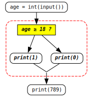
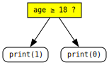
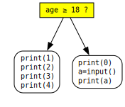
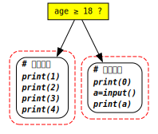
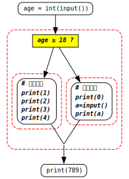
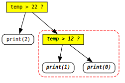
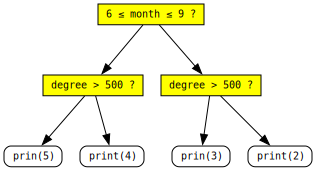

<link rel="stylesheet" href="../assets/css/works_inline.css">
# 單元 3：程式區塊與 `if`  

**了解程式區塊 (block)、縮排層次、`elif` 以及巢狀條件判斷**

---

## 🎯 學習目標  

- 程式區塊 (block) 的概念  
    - 縮排層次與區塊的對應關係  

- `elif` 的使用  
    - 多層 (巢狀 nested) `if` 結構

---

## 🧱 程式區塊 (block)

這個單元我們從上個單元對縮排和程式段落區塊的關係的說明開始講。我們要認識：在結構上，**程式是由區塊 (block) 組成的**

我們說對這個程式：

<pre><code>
<pre><code> 1 | age = int(input())
 2 | if age &gt;= 18:
 3 |     print(1)  
 4 | else:
 5 |     print(0) 
 6 | print(789) # 沒縮排
</code></pre>
</code></pre>

你要能夠看成是 3 個步驟或 3 個段落

<pre><code>
<pre><code> 1 | # 步驟 1 / 段落 1：
 2 | age = int(input())
 3 | 
 4 | <em># 步驟 2 / 段落 2：</em>
 5 | <em>if age &gt;= 18:</em>
 6 | <em>    print(1) </em>
 7 | <em>else:</em>
 8 | <em>    print(0) </em>
 9 | 
10 | # 步驟 3 / 段落 3：
11 | print(789)
</code></pre>
</code></pre>

 

我們先看看一個更簡單的例子

如果把下面這段程式分成 3 個段落，你會怎賣分？

<pre><code>
<pre><code>print (8)
print (12)
print (2)
print (21)
print (9)
print (17)
print (23)
</code></pre>
</code></pre>

想一想

...  
...  
...  
...  
...  
...  
...  

如果是 3 個段落的話，這樣分應該是合理的：

<pre><code>
<pre><code># 段落 1
print (8)
print (12)
print (2)

# 段落 2
print (21)
print (9)

# 段落 3
print (17)
print (23)
</code></pre>
</code></pre>

為什麼這樣分？同學之間可以討論看看；如果沒有答案可以問老師。你如果有想出答案也可以率先讓老師知道。

當然程式要不要分區塊段落、怎麼分、分幾段是一個設計上的選擇 (Design Choice)。做法要符合一定的原則但幾乎不是絕對的，就和寫作文一樣。

區塊怎麼看、段落怎麼分對電腦執行程式不會有影響，但它是屬於更高層次流程結構設計的問題，最主要的目的是讓我們設計程式時能夠**理清邏輯思緒**。

### 小複習

關於「程式要不要分區塊段落、怎麼分、分幾段」的說法，「<select class="answer-select answer-inline" style="width: 720px"><option value="">請選擇...</option><option value="一定要依照電腦執行的順序分段">一定要依照電腦執行的順序分段</option><option value="分段方式是設計者的選擇，只要符合原則即可">分段方式是設計者的選擇，只要符合原則即可</option><option value="段落數量固定，不能改變">段落數量固定，不能改變</option><option value="Python 會自動幫你決定段落">Python 會自動幫你決定段落</option></select>」是正確的。

把程式分成區塊或段落的主要目的是：<select class="answer-select answer-inline" style="width: 360px"><option value="">請選擇...</option><option value="讓電腦執行得更快">讓電腦執行得更快</option><option value="讓程式碼變短">讓程式碼變短</option><option value="幫助我們理清邏輯思緒">幫助我們理清邏輯思緒</option><option value="讓程式自動除錯">讓程式自動除錯</option></select>。

區塊分段的不同會不會影響電腦執行結果？<select class="answer-select answer-inline" style="width: 468px"><option value="">請選擇...</option><option value="會，因為段落順序會改變結果">會，因為段落順序會改變結果</option><option value="不會，但影響人對程式的理解">不會，但影響人對程式的理解</option><option value="一定會出現語法錯誤">一定會出現語法錯誤</option><option value="Python 會警告使用者">Python 會警告使用者</option></select>。

---

而至於上面這類簡單一條線平鋪直敘的程式這樣分有什麼用處後面講函式的時候會講。這裏要先奠定**程式區塊**的概念的主要目的是為了接下來講完比較複雜的 `if` 結構以及迴圈。我們先確定一下清楚了解區塊段落的原則：

### 區塊段落的原則

如前所述，把程式看成區塊段落的目的是為了能夠清楚地思考程式流程的設計。怎麼分沒有一定的規定，但會有不能違背的原則：和你寫作文一樣，分段的地方，不會是句子講了一半的地方，不會在冒號或逗號。

- **縮排**: 縮排用來表示承接表示說面前半句沒講完的後半句，注意縮排和你程式區塊的關係。

- `if`-`else` 還有等一下要講的 `if`-`elif`-`else` 整組結構以 `if` 開頭，整組必須看在同一個區塊內，不能斷開。

所以，如我們前面看到的，程式區塊可能會長成這樣：

  

    

    

    

    

    

    

    

  

  

    

    

    

    

    

    

    

  

  

    

    

    

    

    

    

    

  

或是後面會看到的：

  

    

    

    

    

    

    

    

  

  

    

    

    

    

    

    

    

  

  

    

    

    

    

    

    

    

  

但<b>絕不會長這樣：</b>  

第一條程式碼縮排表示 
前面還有原來的半句話

  

    

      ❌ 

    
  
    

    

    

    

    

    

  

也<b>不會這樣：</b>

<pre><code>
<pre><code>if age &gt;= 18:
    print(1)  
</code></pre>
</code></pre>

❌ 不能把完整的 <code>if</code>-<code>else</code> 結構看成在不同的區塊內

<pre><code>
<pre><code>else:
    print(0) 
</code></pre>
</code></pre>

### 小複習

哪一項最能說明縮排的用途？<select class="answer-select answer-inline" style="width: 468px"><option value="">請選擇...</option><option value="讓程式碼排列漂亮">讓程式碼排列漂亮</option><option value="表示前半句還沒講完的後半句">表示前半句還沒講完的後半句</option><option value="增加執行速度">增加執行速度</option><option value="讓電腦知道要換行">讓電腦知道要換行</option></select>

為什麼 `if`–`else` 不能分在不同區塊？<select class="answer-select answer-inline" style="width: 468px"><option value="">請選擇...</option><option value="因為 Python 不允許空行">因為 Python 不允許空行</option><option value="因為整組邏輯應屬於同一結構">因為整組邏輯應屬於同一結構</option><option value="因為 else 必須靠左對齊">因為 else 必須靠左對齊</option><option value="因為 print() 不能重複出現">因為 print() 不能重複出現</option></select>

關於程式區塊的分段原則，「<select class="answer-select answer-inline" style="width: 456px"><option value="">請選擇...</option><option value="分段可以任意斷開句子">分段可以任意斷開句子</option><option value="縮排不影響邏輯結構">縮排不影響邏輯結構</option><option value="分段是為了讓邏輯更清楚">分段是為了讓邏輯更清楚</option><option value="每段都必須有 if、else 才完整">每段都必須有 if、else 才完整</option></select>」是正確的。

「分段的地方，不會是句子講了一半的地方」這句話是要提醒：<select class="answer-select answer-inline" style="width: 288px"><option value="">請選擇...</option><option value="縮排應該隨意">縮排應該隨意</option><option value="要讓語意連貫">要讓語意連貫</option><option value="可以在冒號後換段">可以在冒號後換段</option><option value="程式可以隨時中斷">程式可以隨時中斷</option></select>

## 🌳 程式區塊作為 <code>if ...:</code> 或 <code>else:</code> 的後半句

在我們介紹 `if`-`else` 的例子中，判斷條件成立或不成立後要做的動作都只有一個

<pre><code>
<pre><code> 1 | if age &gt;= 18:
 2 |     print(1) 
 3 | else:
 4 |     print(0) 
</code></pre>
</code></pre>

 

然而，更常見的是條件判斷後要做的動作不會只有一個。例如

  

這時候 Python 程式的表示<b>請注意：</b>

<ul>
  <li>作為後半句 (<code>if ...:</code> 的或 <code>else:</code> 的) 的<b>一整組</b>步驟</li>要視為<b>一整個程式碼區塊</b>，意思是每一條程式指令句子的<b>開頭要對齊</b>。</li>
    
  <li>因為整組程式區塊是一起作為 <code>if ...:</code> 或 <code>else:</code> 的後半句，所以要<b>一起縮排</b>。</li>
</ul>

像這樣：

<pre><code>
<pre><code> 1 | if age &gt;= 18:
 2 | <em>    # 若「是」要執行的區塊</em>
 3 | <em>    print (1)</em>
 4 | <em>    print (2)</em>
 5 | <em>    print (3)</em>
 6 | <em>    print (4)</em>
 7 | else:
 8 | <em>    # 若「否」要執行的區塊</em>
 9 | <em>    print (0)</em>
10 | <em>    a = input()</em>
11 | <em>    print (a)</em>
</code></pre>
</code></pre>

### 小測驗

<pre><code>
<pre><code> 1 | age = 17
 2 | if age &lt; 18:
 3 |     print(0)  
 4 | else:
 5 |     print(1)  
 6 |     print(789)
</code></pre>
</code></pre>

<pre><code>
<pre><code> 1 | age = 17
 2 | if age &lt; 18:
 3 |     print(0)  
 4 | else:
 5 |     print(1) 
 6 | print(789)
</code></pre>
</code></pre>

<select class="answer-select answer-inline" style="width: 105px"><option value="">請選擇...</option><option value="左邊">左邊</option><option value="右邊">右邊</option></select> 的程式執行後的輸出是：

<pre class="output">0</pre>

## 🪆 俄羅斯套娃 (區塊的層次)

我們在這個單元的最開始複習上個單元把 `if`-`else` 整個結構看成一個區塊：

<pre><code>
<pre><code> 1 | # 步驟 1 / 段落 1：
 2 | age = int(input())
 3 | 
 4 | <em># 步驟 2 / 段落 2：</em>
 5 | <em>if age &gt;= 18:</em>
 6 | <em>    print(1) </em>
 7 | <em>else:</em>
 8 | <em>    print(0) </em>
 9 | 
10 | # 步驟 3 / 段落 3：
11 | print(789)
</code></pre>
</code></pre>

現在我們把步驟 2 `if`-`else` 這段換成上面《程式區塊作為 <code>if ...:</code> 或 <code>else:</code> 的後半句》的 `if`-`else` 那段例子：

<pre><code>
<pre><code> 1 | # 步驟 1 / 段落 1：
 2 | age = int(input())
 3 | 
 4 | <em># 步驟 2 / 段落 2：</em>
 5 | <em>if age &gt;= 18:</em>
 6 | <em>    # 若「是」要執行的區塊</em>
 7 | <em>    print (1)</em>
 8 | <em>    print (2)</em>
 9 | <em>    print (3)</em>
10 | <em>    print (4)</em>
11 | <em>else:</em>
12 | <em>    # 若「否」要執行的區塊</em>
13 | <em>    print (0)</em>
14 | <em>    a = input()</em>
15 | <em>    print (a)</em>
16 | 
17 | # 步驟 3 / 段落 3：
18 | print(789)
</code></pre>
</code></pre>

你看到我們有大區塊包著小區塊這樣的結構，正好對應著程式的<b>縮排</b>。

### 縮排的使用與筆記整理的作法相似

理解縮排的作用同學也可以聯想自己或是 AI 幫你整理筆記時，屬於某一類的子重點是不是會條列並且縮排在主要標題或大重點之下。

在 Python 程式中也是這樣：縮排不只是為了「好看」，而是用來表達層次與從屬關係。  

同一層縮排代表它們屬於同一個層級、或同一個區塊一連串的行動內容；進一步縮排的部分則表示它們是上一層動作的「子內容」或「後半句」。

不過要注意的是筆記的重點不一定有時間的順序，但是程式碼的執行先後順序是按照排列與縮排的層次決定的。

也就是說，電腦在執行程式時，會由上而下一條一條依序執行，遇到縮排就知道那是一個區塊 (block)，
代表「這些行屬於同一連串依序動作的內容」。

---

## 🎋 `elif`

很多時候決定的選項不只兩項，條件判斷也就不會只是一次的是/否。例如我們要寫一個機器人程式告訴我們氣溫超過 22 度告訴我 2 我知道穿短袖，氣溫低於 12 度告訴我 0 要加外套，這之間 1 穿長袖。我們可以在 `if` 和 `elif` 之間加一個 `elif` 的判斷：

<pre><code>
<pre><code> 1 | if temp &gt; 22:
 2 |     print (2)
 3 | <em>elif temp &gt; 12:</em>
 4 | <em>    print (1)</em>
 5 | else:
 6 |     print (0)
</code></pre>
</code></pre>

如果有更多選項，就插入更多的 `elif` 的判斷。

### 練習

<pre><code>
<pre><code> 1 | score = int(inut())
 2 | # 會考積分換算
 3 | if score &gt; 96:
 4 |     print(7)
 5 | elif score &gt; 90:
 6 |     print(6)
 7 | elif score &gt; 80:
 8 |     print(5)
 9 | elif score &gt; 70:
10 |     print(4)
11 | elif score &gt; 60:
12 |     print(3)
13 | elif score &gt; 40:
14 |     print(2)
15 | else:
16 |     print(1)
</code></pre>
</code></pre>

對於上面這段程式：

輸入 65 → 輸出 4  
輸入 99 → 輸出&nbsp;<input type="text" class="answer-input answer-inline">  
輸入 12 → 輸出&nbsp;<input type="text" class="answer-input answer-inline">  
輸入 77 → 輸出&nbsp;<input type="text" class="answer-input answer-inline">  
輸入 49 → 輸出&nbsp;<input type="text" class="answer-input answer-inline">  
輸入 91 → 輸出&nbsp;<input type="text" class="answer-input answer-inline">  
輸入 60 → 輸出&nbsp;<input type="text" class="answer-input answer-inline">  

---

這個「`elif`」其實是從「`else: if`」演變過來的，我們來看更基本的形式：

### 多層 (巢狀 nested) `if`

如果不知道 `elif`，那上面氣溫機器人的規格要求通常會用這樣的程式實現：

<pre><code>
<pre><code> 1 | if temp &gt; 22:
 2 |     print (2)
 3 | else:
 4 | <em>    if temp &gt; 12:</em>
 5 | <em>        print (1)</em>
 6 | <em>    else:</em>
 7 | <em>        print (0)</em>
</code></pre>
</code></pre>

這裏 lines 4-7 這個區塊是第一層 <code>else:</code> 的後半句

把 line 3 和 line 4 結合起來「`else: if ...:`」→「`elif ...:`」，縮排整理一下，就會是：

用 <code>elif</code> 讓上面這類的多層 (巢狀) <code>if</code> 結構能看起來比較簡潔。

### `if`-`else` 要正確配對

並不是所有的多層 (巢狀) `if` 結構都能夠或適合有用 `elif` 改寫的部分。

例如某電力公司的每度電價格表為：

<table style="border-collapse: collapse; text-align: center;">
  <tr>
    <th style="border: 1px solid gray; padding: 3px 8px; text-align: left;">印出</th>
    <th style="border: 1px solid gray; padding: 0 8px; text-align: center;">5</th>
    <th style="border: 1px solid gray; padding: 0 8px; text-align: center;">3</th>
    <th style="border: 1px solid gray; padding: 0 8px; text-align: center;">4</th>
    <th style="border: 1px solid gray; padding: 0 8px; text-align: center;">2</th>
  </tr>
  <tr>
    <td style="border: 1px solid gray; padding: 5px 8px; text-align: left;">月份 month</td>
    <td style="border: 1px solid gray; padding: 0 8px;">6–9</td>
    <td style="border: 1px solid gray; padding: 0 8px;">6–9</td>
    <td style="border: 1px solid gray; padding: 0 8px;">其他</td>
    <td style="border: 1px solid gray; padding: 0 8px;">其他</td>
  </tr>
  <tr>
    <td style="border: 1px solid gray; padding: 5px 8px; text-align: left;">度數 degree</td>
    <td style="border: 1px solid gray; padding: 0 8px;">&gt; 500</td>
    <td style="border: 1px solid gray; padding: 0 8px;">≤ 500</td>
    <td style="border: 1px solid gray; padding: 0 8px;">&gt; 500</td>
    <td style="border: 1px solid gray; padding: 0 8px;">≤ 500</td>
  </tr>
</table>

程式可以這樣寫：

<pre><code>
<pre><code> 1 | if 6 &lt;= month &lt;= 9:
 2 |     if degree &gt; 500:
 3 |         print (5)
 4 |     else:
 5 |         print (4)
 6 | else:
 7 |     if degree &gt; 500:
 8 |         print (3)
 9 |     else:
10 |         print (2)
</code></pre>
</code></pre>

   

如果你的程式會用到類似的結構，要**特別注意**：  

**`if ...:` 和 `else:` 是成對的，成對的 `if`-`else` 開頭要對齊。**

這是寫程式很容易犯錯的地方。

例如我們看下這個練習：

### 練習

程式開始先指定 `month` 和 `degree`：

<pre><code>
<pre><code> 1 | month = 7
 2 | degree = 100
</code></pre>
</code></pre>

接下來

<pre><code>
<pre><code> 3 | if 6 &lt;= month &lt;= 9:
 4 |     if degree &gt; 500:
 5 |         print (5)
 6 | <em>    else:</em>
 7 | <em>        print (4)</em>
</code></pre>
</code></pre>

或 ...

<pre><code>
<pre><code> 3 | if 6 &lt;= month &lt;= 9:
 4 |     if degree &gt; 500:
 5 |         print (5)
 6 | <em>else:</em>
 7 | <em>    print (4)</em>
</code></pre>
</code></pre>

<select class="answer-select answer-inline" style="width: 105px"><option value="">請選擇...</option><option value="左邊">左邊</option><option value="右邊">右邊</option></select> 的輸出結果會是：

<pre class="output">4</pre>

---

### 其他練習

<pre><code>
<pre><code> 1 | if a == 3:
 2 |     if b == 6:
 3 |         print (123)
 4 |     else:
 5 |         print (456)
 6 | else:
 7 |     print (456)
</code></pre>
</code></pre>

請完成下面程式框框內的邏輯表示式使其和上面那段執行結果相同：

<pre><code>
<pre><code> 1 | if <input type="text" class="answer-input answer-inline">:
 2 |     print (123)
 3 | else
 4 |     print (456)
</code></pre>
</code></pre>

---

關於下面這段程式：

<pre><code>
<pre><code> 1 | if s &gt;= 90:
 2 |     print (4)
 3 | elif s &gt;= 80:
 4 |     print (3)
 5 | elif s &gt; 60:
 6 |     print (1)
 7 | elif s &gt; 70:
 8 |     print (2)
 9 | else:
10 |     print (0)
</code></pre>
</code></pre>

這段程式碼處理分數 $0 \leq s \leq 100$ 印出積分點的規格要求應為

<table border="1" style="border-collapse: collapse; text-align: center;">
<tr><th><code>s</code></th><th style="border: 1px solid gray; padding: 0 7px;">印出積分點</th></tr>
<tr><td style="border: 1px solid gray; padding: 0 10px;"><code>90 ~ 100</code></td><td><code>4</code></td></tr>
<tr><td><code>80 ~ &#160;89</code></td><td><code>3</code></td></tr>
<tr><td><code>70 ~ &#160;79</code></td><td><code>2</code></td></tr>
<tr><td><code>60 ~ &#160;69</code></td><td><code>1</code></td></tr>
<tr><td><code>&#160;0 ~ &#160;59</code></td><td><code>0</code></td></tr>
</table>

有 <input type="text" class="answer-input answer-inline"> 個分數印出的積分點會是錯的。(填入整數)

《APCS 題本範例#17》

---

同上題但程式碼改為

<pre><code>
<pre><code> 1 | if s &gt;= 90:
 2 |     print (4)
 3 | elif s &gt;= 80:
 4 |     print (3)
 5 | elif s &gt;= 60:
 6 |     print (2)
 7 | elif s &gt;= 70:
 8 |     print (1)
 9 | else:
10 |     print (0)
</code></pre>
</code></pre>

則有 <input type="text" class="answer-input answer-inline"> 個分數印出的積分點會是錯的。(填入整數)

---

<pre><code>
<pre><code> 1 | count = 10
 2 | if count &gt; 0:
 3 |     count = 11
 4 | if count &gt; 10
 5 |     count = 12
 6 |     if count % 3 == 4:
 7 |         count = 1
 8 |     else:
 9 |         count = 0
10 | elif count &gt; 11:
11 |     count = 13
12 | else:
13 |     count = 14
14 | if count != 0:
15 |     count = 15
16 | else:
17 |     count = 16
18 | print (count)
</code></pre>
</code></pre>

輸出會是

<input type="text" class="answer-input answer-inline">

《APCS 105/03#16、範例題本#10》

---

右邊程式框框內各填入什麼比較符號和整數，執行結果會和左邊程式完全相同？

<pre><code>
<pre><code>...

if day == 0:
    if age &lt; 12:
        print (0)
    else:
        print (100)
else:
    if age &lt; 12:
        print (50)
    else:
        print (150)
</code></pre>
</code></pre>

<pre><code>
<pre><code>...

price = 0

if day <input type="text" class="answer-input answer-inline"> 0
    price = price + <input type="text" class="answer-input answer-inline">

if age <input type="text" class="answer-input answer-inline"> 12:
    price = price + <input type="text" class="answer-input answer-inline">

print (price)
</code></pre>
</code></pre>

---

## 💻 實作練習

[更多實作練習](http://zerojudge.tw/)

## 📘 總結

- 程式區塊 block
    - 同一層縮排表示屬於同一個區塊，但可以包含更內層的子區塊（例如巢狀 `if` 或後面會講的迴圈）。
    - 縮排表示程式控制範圍，決定哪些語句屬於同一區塊。

- 縮排 indent
    - 縮排表示接著的是前面上半句沒講完（如 `if ...:`、`elif ...:` 或 `else:`）的後半句
    - 要把完整的 `if`-`elif`-`else` 和後面會講的迴圈結構看成在某**一個**區塊內。

- 多層條件判斷可用 `elif` 讓程式更簡潔，避免巢狀過深。

- 多層 (巢狀 nested) if
    - 程式可以有巢狀結構。
    - 區塊內可以再有子區塊，縮排更深。
    - 內層區塊縮排在外層區塊之下，整組縮排要一致。

---

### 重點複習

關於縮排，「<select class="answer-select answer-inline" style="width: 468px"><option value="">請選擇...</option><option value="縮排只是讓程式好看">縮排只是讓程式好看</option><option value="縮排表示語句之間的層次關係">縮排表示語句之間的層次關係</option><option value="縮排會讓程式變快">縮排會讓程式變快</option></select>」是正確的。

2025 © Elton Huang