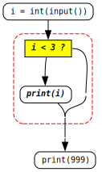

<link rel="stylesheet" href="../assets/css/works_inline.css">
# 單元 4：迴圈  

在前面的單元中，我們學會了以「循序」方式讓程式一步一步執行，也學會用 `if` 判斷不同的情況。  

然而，在許多問題中，某些動作需要重複多次才能完成。為了避免重複撰寫相同的程式碼，我們可以使用**迴圈 (loop)** 來讓電腦自動重複執行某些指令。  

---

## 🎯 學習目標  

- 理解重複運算的需求與概念、「**迭代 iteration**」  
    - `for` 迴圈、與區塊的運用  

- `while` 迴圈  
    - 重複的條件的初始與終止、無窮迴圈

---

## 🌀 迴圈的基本概念  

迴圈的核心是「重複執行」。  
若沒有迴圈，我們的程式會顯得非常冗長。  

<div class="highlight"><pre><span></span><code><div class="highlight"><pre><span></span><code><span style="color: silver;"> 0 | </span><span class="c1"># 沒有使用迴圈</span>
<span style="color: silver;"> 1 | </span><span class="nb">print</span><span class="p">(</span><span class="mi">999</span><span class="p">)</span>
<span style="color: silver;"> 2 | </span><span class="nb">print</span><span class="p">(</span><span class="mi">999</span><span class="p">)</span>
<span style="color: silver;"> 3 | </span><span class="nb">print</span><span class="p">(</span><span class="mi">999</span><span class="p">)</span>
<span style="color: silver;"> 4 | </span><span class="nb">print</span><span class="p">(</span><span class="mi">999</span><span class="p">)</span>
<span style="color: silver;"> 5 | </span><span class="nb">print</span><span class="p">(</span><span class="mi">999</span><span class="p">)</span>
</code></pre></div></code></pre></div>

如果使用迴圈，只要這樣寫：

<div class="highlight"><pre><span></span><code><div class="highlight"><pre><span></span><code><span style="color: silver;"> 0 | </span><span class="c1"># 使用迴圈</span>
<span style="color: silver;"> 1 | </span><span class="k">for</span> <span class="n">i</span> <span class="ow">in</span> <span class="nb">range</span><span class="p">(</span><span class="mi">5</span><span class="p">):</span>
<span style="color: silver;"> 2 | </span>    <span class="nb">print</span><span class="p">(</span><span class="mi">999</span><span class="p">)</span>
</code></pre></div></code></pre></div>

這裡同樣請同學注意冒號 <span style="color: red">**`:`**</span> 和<span style="color: red">**縮排**</span>。`for` 開始的半句話基本上說後半句的動作要做 `5` 次，然後接著冒號 <span style="color: red">**`:`**</span> 要接後半句話。

後半句話接著寫在下面，開頭要<span style="color: red">**縮排**</span>，道理與前面單元同，表示前半句還沒講完，這裏開始是接前半句的後半句。

上面的例子，`print (999)` 重複了 `5` 次，或者我們也可以說「**迭代**」了 `5` 次，或是

&nbsp;&nbsp;&nbsp;&nbsp;&nbsp;&nbsp;那個 `for` 迴圈做了 `5` 個「**迭代 iteration(s)**」而每次「**迭代**」的內容是 `print (999)`。

### 練習

框框內填入什麼**整數**？

<div class="highlight"><pre><span></span><code><div class="highlight"><pre><span></span><code><span style="color: silver;"> 1 | </span><span class="k">for</span> <span class="n">i</span> <span class="ow">in</span> <span class="nb">range</span><span class="p">(</span><input type="text" class="answer-input answer-inline"><span class="p">):</span>
<span style="color: silver;"> 2 | </span>    <span class="nb">print</span><span class="p">(</span><span class="mi">999</span><span class="p">)</span>
</code></pre></div></code></pre></div>

執行後會印出：

<pre class="output">999
999
999</pre>

「`... i in range(...)`」算是最簡單和常見的迴圈形式之ㄧ，你要動作重複幾次換掉 `range(...)` 括號裡面的數字就可以了。  

---

### 區塊作為 `for ...:` 的後半句

這裡第二個重點是同 `if`-`elif`-`else` 一樣，冒號後面通常寫在下ㄧ列並且<span style="color:red">**縮排**</span>的**後半句**可以是<span style="color:red">**區塊**</span>。整個區塊會是 `for` 迴圈每次**迭代**的內容。

例如，想一下：

<div style="display: flex; flex-wrap: wrap; align-items: flex-start; gap: 20px; margin-top: -1em;">
<div style="flex: 1 1 47.5%; border-right: 1px solid #ccc padding-right: 10px;">

<div class="highlight"><pre><span></span><code><div class="highlight"><pre><span></span><code><span style="color: silver;"> 1 | </span><span class="k">for</span> <span class="n">i</span> <span class="ow">in</span> <span class="nb">range</span> <span class="p">(</span><span class="mi">3</span><span class="p">)</span>
<span style="color: silver;"> 2 | </span>    <span class="nb">print</span> <span class="p">(</span><span class="mi">999</span><span class="p">)</span>
<span style="color: silver;"> 3 | </span><span class="nb">print</span> <span class="p">(</span><span class="mi">123</span><span class="p">)</span>
</code></pre></div></code></pre></div>

</div>
<div style="flex: 1 1 47.5%;">

<div class="highlight"><pre><span></span><code><div class="highlight"><pre><span></span><code><span style="color: silver;"> 1 | </span><span class="k">for</span> <span class="n">i</span> <span class="ow">in</span> <span class="nb">range</span> <span class="p">(</span><span class="mi">3</span><span class="p">)</span>
<span style="color: silver;"> 2 | </span>    <span class="nb">print</span> <span class="p">(</span><span class="mi">999</span><span class="p">)</span>
<span style="color: silver;"> 3 | </span>    <span class="nb">print</span> <span class="p">(</span><span class="mi">123</span><span class="p">)</span>
</code></pre></div></code></pre></div>

</div>
</div>

<select class="answer-select answer-inline" style="width: 105px"><option value="">請選擇...</option><option value="左邊">左邊</option><option value="右邊">右邊</option></select> 程式的輸出結果會是：

<pre class="output">999
123
999
123
999
123</pre>

同一個區塊作為 `for ...:` 的後半句，所**迭代** (重複) 的是整個區塊的執行。  

### `range (...)`

在最一開始示範的程式裡

<div class="highlight"><pre><span></span><code><div class="highlight"><pre><span></span><code><span style="color: silver;"> 1 | </span><span class="k">for</span> <span class="n">i</span> <span class="ow">in</span> <span class="nb">range</span><span class="p">(</span><span class="mi">5</span><span class="p">):</span>
<span style="color: silver;"> 2 | </span>    <span class="nb">print</span><span class="p">(</span><span class="mi">999</span><span class="p">)</span>
</code></pre></div></code></pre></div>

注意 `for` 後面有一個 `i` 是一個變數，上面的程式都沒有使用到。你可以試試：

<div class="highlight"><pre><span></span><code><div class="highlight"><pre><span></span><code><span style="color: silver;"> 1 | </span><span class="k">for</span> <span class="n">i</span> <span class="ow">in</span> <span class="nb">range</span><span class="p">(</span><span class="mi">5</span><span class="p">):</span>
<span style="color: silver;"> 2 | </span>    <span class="nb">print</span> <span class="p">(</span><span class="n">i</span><span class="p">)</span>
</code></pre></div></code></pre></div>

`for` 迴圈執行所重複的是 `print (i)`，執行的結果會是

<pre class="output">0
1
2
3
4</pre>

也就是說，迴圈每次**迭代**，`i` 都會改變，而「`i` 最開始是 `0`。這個 `i` **從 `0` 開始、每次迭代加 `1` 但<span style="color:red">不會</span>到 `5`** 的值」是由 `range (5)` 賦予的。我們下面看迴圈的基本形式 `while` 時就會了解 `for` 迴圈這樣寫相當於每次迭代就會把新的值**指定**給 `i`。

同學請特別注意，我們要開始習慣多數程式語言從 `0` 開始的計數，例如上面看到的例子：

- 從 `0` 印到 `4`，`for i in range (`**`5`**`):` 的 **`i` <span style="color:red">不會</span>到 `5`**
- `0` 算到 `4` 是 <span style="color:red">**5**</span> 個數字。所以 `for i in ragne (5):` 所迭代的次數是 **5** 次

### 練習

<div class="highlight"><pre><span></span><code><div class="highlight"><pre><span></span><code><span style="color: silver;"> 1 | </span><span class="k">for</span> <span class="n">i</span> <span class="ow">in</span> <span class="n">ragne</span> <span class="p">(</span><span class="mi">5</span><span class="p">):</span>
<span style="color: silver;"> 2 | </span>    <span class="nb">print</span> <span class="p">(</span><span class="n">i</span> <span class="o">+</span> <span class="mi">10</span><span class="p">)</span>
</code></pre></div></code></pre></div>

執行後會輸出：

<pre class="output">10
11
<input type="text" class="answer-input answer-inline">
13
<input type="text" class="answer-input answer-inline"></pre>

---

下面這段程式：

<div class="highlight"><pre><span></span><code><div class="highlight"><pre><span></span><code><span style="color: silver;"> 1 | </span><span class="k">for</span> <span class="n">i</span> <span class="ow">in</span> <span class="n">ragne</span> <span class="p">(</span><span class="mi">3</span><span class="p">):</span>
<span style="color: silver;"> 2 | </span>    <span class="nb">print</span> <span class="p">(</span><span class="o">-</span><span class="n">i</span> <span class="o">-</span> <span class="mi">1</span><span class="p">)</span>
</code></pre></div></code></pre></div>

執行後會輸出：

<pre class="output">-1
<input type="text" class="answer-input answer-inline">
<input type="text" class="answer-input answer-inline"></pre>

`for i in range (`**`3`**`):` 給了 `i` **從 `0` 開始**、每次迭代**加 `1`**、**<span style="color:red">不會</span>到 `3`**。  

我們已經知道改變 `range (...)` 括號裡的值可以改變 `for` 迴圈迭代 `i` 結束的值。但其實我們可以在 ```range (...)``` 括弧裡用不同的寫法讓 `i` 不是從 `0` 開始、或不是每次加 `1`。這個我們這裡不細談，同學可以參考 [Snakify Lesson 4](https://snakify.org/en/lessons/for_loop_range/)。

但 `range (...)` 基本上提供的是一個 `i` 迭代的等差數列。有些時候我們需要的是更為靈活的迭代方式，那就要認識更基本的迴圈語法 `while`：    

---

## 🔁 `while` 迴圈

認識基本的迴圈 `while` 我們延續單元 1 循序執行加上後然認識程式可能分岔的觀念。

我們先看這個簡單的例子：


注意最開始的三條指令很像，但沒有完全一樣，如果我們要讓他們完全一樣的話，可以這樣做:


現在有 3 段完全一樣的程式重複，就可以把他們用 `while` 包起來：


<div class="twocol-half" style="margin-top: 1em">
<div class="twocol-lefthalf">

這是一個基本的 <code>while</code> 迴圈

<div class="highlight"><pre><span></span><code><div class="highlight"><pre><span></span><code><span style="color: silver;"> 0 | </span><span class="n">i</span> <span class="o">=</span> <span class="mi">0</span>
<span style="color: silver;"> 1 | </span><span class="k">while</span> <span class="n">i</span> <span class="o">&lt;</span> <span class="mi">3</span><span class="p">:</span>
<span style="color: silver;"> 2 | </span>    <span class="nb">print</span> <span class="p">(</span><span class="n">i</span><span class="p">)</span>
<span style="color: silver;"> 3 | </span>    <span class="n">i</span> <span class="o">=</span> <span class="n">i</span> <span class="o">+</span> <span class="mi">1</span>
</code></pre></div></code></pre></div>

</div>
<div class="twocol-ritehalf">

它是這個 <code>for</code> 迴圈的基本形

<div class="highlight"><pre><span></span><code><div class="highlight"><pre><span></span><code>　 
<span class="k">for</span> <span class="n">i</span> <span class="ow">in</span> <span class="nb">range</span> <span class="p">(</span><span class="mi">3</span><span class="p">):</span>
    <span class="nb">print</span> <span class="p">(</span><span class="n">i</span><span class="p">)</span>
　
</code></pre></div></code></pre></div>

</div>
</div>

Lines 1~3 是 `while` 迴圈，請注意幾點：

- 它和 `if`-`elif`-`else` 以及 `for` 一樣會有一個冒號 `:` 要接後半句

- 和 `if` 一樣，前半句在 `while` 後面是一個邏輯條件式

    - 但是和 `if` <span style="color:red">**不一樣**</span>的是：`if` 不迭代，條件成立的話，要做的事情只做一次，而 `while` 則是：若條件成立做了要做的事後會**再**回來檢查。

<div style="display: flex; gap: 20px; margin-top: -0.7em; ">
<div style="flex: 1 1 47.5%; border-right: 1px solid #ccc padding-right: 10px;">

<div class="highlight"><pre><span></span><code><div class="highlight"><pre><span></span><code><span style="color: #5d5d5d;"> 0 | </span><em><span class="n">i</span> <span class="o">=</span> <span class="mi">0</span></em>
<span style="color: #5d5d5d;"> 1 | </span><em><span class="k">while</span> <span class="n">i</span> <span class="o">&lt;</span> <span class="mi">3</span><span class="p">:</span></em>
<span style="color: #5d5d5d;"> 2 | </span><em>    <span class="nb">print</span> <span class="p">(</span><span class="n">i</span><span class="p">)</span></em>
<span style="color: #5d5d5d;"> 3 | </span><em>    <span class="n">i</span> <span class="o">=</span> <span class="n">i</span> <span class="o">+</span> <span class="mi">1</span></em>
<span style="color: silver;"> 4 | </span><span class="nb">print</span> <span class="p">(</span><span class="mi">999</span><span class="p">)</span>
</code></pre></div></code></pre></div>


</div>
<div style="flex: 1 1 47.5%;">

<div class="highlight"><pre><span></span><code><div class="highlight"><pre><span></span><code><span style="color: silver;"> 0 | </span><span class="n">i</span> <span class="o">=</span> <span class="nb">int</span><span class="p">(</span><span class="nb">input</span><span class="p">())</span>
<span style="color: #5d5d5d;"> 1 | </span><em><span class="k">if</span> <span class="n">i</span> <span class="o">&lt;</span> <span class="mi">3</span><span class="p">:</span></em>
<span style="color: #5d5d5d;"> 2 | </span><em>    <span class="nb">print</span> <span class="p">(</span><span class="n">i</span><span class="p">)</span></em>
<span style="color: silver;"> 3 | </span>
<span style="color: silver;"> 4 | </span><span class="nb">print</span> <span class="p">(</span><span class="mi">999</span><span class="p">)</span>
</code></pre></div></code></pre></div>

<br>



</div>
</div>

- 因為會再回去檢查，所以如果在迴圈迭代的內容區塊中從不改變條件的話，那迴圈就用永遠不會結束。稱為「無窮迴圈 infinite loop」。

    - 因為迭代內容區塊除了做本來要重複的事之外，幾乎都須要去改變條件，或者改變條件也才會讓那間重複的事達成。
  
        例如上面的例子，`i = i + 1` 讓 `print (i)` 能接續印出累進的 `i`，也讓 `while i < 3:` 的檢查條件終究會不成立。
    
        所以 <span style="color:red">`while` 這個後半句的區塊大概都會是**多條命令**</span>，不會像我們一開始學 `if` 或是最上面 `for` 開始舉的例子那樣只有一跳命令。

- Line 0: 我們在 `while` 迴圈開始之前也幾乎都要設定條件初始的狀態，例如上面的例子要先把 `i` 指定為 `0`，所以雖然它也可以算是 `while` 迴圈的一部分。
  
    - <span style="color:darkgray">為什麼說「也可以算是」是因為不像 `while` 整句是一個相連的區塊，它可以不寫在一起、或者會是更複雜的形式。這個以後再慢慢了解。

這裏有點複雜，同學上面的說明多看幾次，想一想，和同學討論，有問題提出來。

然後看看下面的動畫，看看程式按照流程執行時，變數如何變化、輸出如何產生：


認識理解迴圈的運作並能靈活應用的關鍵在於對執行時每一個步驟的變數變化都有清楚且詳細的意識。同學試著了解或練習時不要怕麻煩，要<span style="color:red">**拿出紙筆**</span>來做像上面動畫這樣樣的操作練習。

### 小測驗

哪一項最能說明 `while` 的特性？<select class="answer-select answer-inline" style="width: 540px"><option value="">請選擇...</option><option value="while 不需要條件式">while 不需要條件式</option><option value="while 不能有縮排">while 不能有縮排</option><option value="條件成立時只執行一次">條件成立時只執行一次</option><option value="條件成立時會重複執行直到不成立">條件成立時會重複執行直到不成立</option></select>

在前面 `while i < 3:` 的迴圈範例中，<select class="answer-select answer-inline" style="width: 120px"><option value="">請選擇...</option><option value="i = 0">i = 0</option><option value="print(i)">print(i)</option><option value="i = i + 1">i = i + 1</option><option value="print(999)">print(999)</option></select> 能讓迴圈終能結束。

同上，若把 `i = i + 1` 拿掉，<select class="answer-select answer-inline" style="width: 324px"><option value="">請選擇...</option><option value="程式會執行更快">程式會執行更快</option><option value="while 會變成無窮迴圈">while 會變成無窮迴圈</option><option value="程式會出錯無法執行">程式會出錯無法執行</option><option value="只會印出一次結果">只會印出一次結果</option></select>。

在 `while` 迴圈開始前設定 `i = 0` 的目的是 <select class="answer-select answer-inline" style="width: 396px"><option value="">請選擇...</option><option value="讓條件有初始值可以檢查">讓條件有初始值可以檢查</option><option value="為了讓 print() 能使用">為了讓 print() 能使用</option><option value="以上皆是">以上皆是</option></select>

何者說明前面 `if i < 3:` 和 `while i < 3:` 兩組程式比較上的差異？<select class="answer-select answer-inline" style="width: 516px"><option value="">請選擇...</option><option value="if 只檢查一次而 while 會重複檢查">if 只檢查一次而 while 會重複檢查</option><option value="只有 if 有縮排">只有 if 有縮排</option><option value="while 不能用比較運算">while 不能用比較運算</option></select>

### 練習

框框內填入什麼**整數**

<div class="highlight"><pre><span></span><code><div class="highlight"><pre><span></span><code><span style="color: silver;"> 1 | </span><span class="n">i</span> <span class="o">=</span> <span class="mi">0</span>
<span style="color: silver;"> 2 | </span><span class="k">while</span> <span class="n">i</span> <span class="o">&lt;</span> <input type="text" class="answer-input answer-inline"><span class="p">:</span>
<span style="color: silver;"> 3 | </span>    <span class="nb">print</span><span class="p">(</span><span class="mi">999</span><span class="p">)</span>
<span style="color: silver;"> 4 | </span>    <span class="n">i</span> <span class="o">=</span> <span class="n">i</span> <span class="o">+</span> <span class="mi">1</span>
</code></pre></div></code></pre></div>

執行後會印出：

<pre class="output">999
999
999</pre>

---

<div style="display: flex; flex-wrap: wrap; align-items: flex-start; gap: 20px; ">
<div style="flex: 1 1 47.5%; border-right: 1px solid #ccc padding-right: 10px;">

<div class="highlight"><pre><span></span><code><div class="highlight"><pre><span></span><code><span style="color: silver;"> 1 | </span><span class="n">i</span> <span class="o">=</span> <span class="mi">0</span>
<span style="color: silver;"> 2 | </span><span class="k">while</span> <span class="n">i</span> <span class="o">&lt;</span> <span class="mi">3</span><span class="p">:</span>
<span style="color: silver;"> 3 | </span>    <span class="nb">print</span> <span class="p">(</span><span class="mi">999</span><span class="p">)</span>
<span style="color: silver;"> 4 | </span>    <span class="n">i</span> <span class="o">=</span> <span class="n">i</span> <span class="o">+</span> <span class="mi">1</span>
<span style="color: silver;"> 5 | </span><span class="nb">print</span> <span class="p">(</span><span class="mi">123</span><span class="p">)</span>
</code></pre></div></code></pre></div>

</div>
<div style="flex: 1 1 47.5%;">

<div class="highlight"><pre><span></span><code><div class="highlight"><pre><span></span><code><span style="color: silver;"> 1 | </span><span class="n">i</span> <span class="o">=</span> <span class="mi">0</span>
<span style="color: silver;"> 2 | </span><span class="k">while</span> <span class="n">i</span> <span class="o">&lt;</span> <span class="mi">3</span><span class="p">:</span>
<span style="color: silver;"> 3 | </span>    <span class="nb">print</span> <span class="p">(</span><span class="mi">999</span><span class="p">)</span>
<span style="color: silver;"> 4 | </span>    <span class="n">i</span> <span class="o">=</span> <span class="n">i</span> <span class="o">+</span> <span class="mi">1</span>
<span style="color: silver;"> 5 | </span>    <span class="nb">print</span> <span class="p">(</span><span class="mi">123</span><span class="p">)</span>
</code></pre></div></code></pre></div>

</div>
</div>

<select class="answer-select answer-inline" style="width: 105px"><option value="">請選擇...</option><option value="左邊">左邊</option><option value="右邊">右邊</option></select> 程式的輸出結果會是：

<pre class="output">999
999
999
123</pre>

---

下面這段程式：

<div class="highlight"><pre><span></span><code><div class="highlight"><pre><span></span><code><span style="color: silver;"> 1 | </span><span class="n">i</span> <span class="o">=</span> <span class="mi">0</span>
<span style="color: silver;"> 2 | </span><span class="k">while</span> <span class="n">i</span> <span class="o">&lt;</span> <span class="mi">17</span><span class="p">:</span>
<span style="color: silver;"> 3 | </span>    <span class="nb">print</span> <span class="p">(</span><span class="n">i</span> <span class="o">+</span> <span class="mi">10</span><span class="p">)</span>
<span style="color: silver;"> 4 | </span>    <span class="n">i</span> <span class="o">=</span> <span class="n">i</span> <span class="o">+</span> <span class="mi">3</span>
</code></pre></div></code></pre></div>

執行後會輸出：

<pre class="output">10
<input type="text" class="answer-input answer-inline">
<input type="text" class="answer-input answer-inline"></pre>

---

下面這段程式：

<div class="highlight"><pre><span></span><code><div class="highlight"><pre><span></span><code><span style="color: silver;"> 1 | </span><span class="n">i</span> <span class="o">=</span> <span class="mi">0</span>
<span style="color: silver;"> 2 | </span><span class="k">while</span> <span class="n">i</span> <span class="o">&gt;</span> <span class="o">-</span><span class="mi">3</span><span class="p">:</span>
<span style="color: silver;"> 3 | </span>    <span class="nb">print</span> <span class="p">(</span><span class="o">-</span><span class="n">i</span> <span class="o">-</span> <span class="mi">1</span><span class="p">)</span>
<span style="color: silver;"> 4 | </span>    <span class="n">i</span> <span class="o">=</span> <span class="n">i</span> <span class="o">-</span> <span class="mi">1</span>
</code></pre></div></code></pre></div>

執行後會輸出：

<pre class="output">-1
<input type="text" class="answer-input answer-inline">
<input type="text" class="answer-input answer-inline"></pre>

---

下面這段程式：

<div class="highlight"><pre><span></span><code><div class="highlight"><pre><span></span><code><span style="color: silver;"> 1 | </span><span class="n">i</span> <span class="o">=</span> <span class="mi">1</span>
<span style="color: silver;"> 2 | </span><span class="n">total</span> <span class="o">=</span> <span class="mi">0</span>
<span style="color: silver;"> 3 | </span><span class="k">while</span> <span class="n">i</span> <span class="o">&lt;=</span> <span class="mi">3</span><span class="p">:</span>
<span style="color: silver;"> 4 | </span>    <span class="n">total</span> <span class="o">=</span> <span class="n">total</span> <span class="o">+</span> <span class="n">i</span>
<span style="color: silver;"> 5 | </span>    <span class="n">i</span> <span class="o">=</span> <span class="n">i</span> <span class="o">+</span> <span class="mi">1</span>
<span style="color: silver;"> 6 | </span><span class="nb">print</span><span class="p">(</span><span class="n">total</span><span class="p">)</span>
</code></pre></div></code></pre></div>

執行後會輸出：

<pre class="output"><input type="text" class="answer-input answer-inline"></pre>

---

框框內應填入什麼？

<div class="highlight"><pre><span></span><code><div class="highlight"><pre><span></span><code><span style="color: silver;"> 1 | </span><span class="n">i</span> <span class="o">=</span> <span class="mi">5</span>
<span style="color: silver;"> 2 | </span><span class="k">while</span> <span class="n">i</span> <span class="o">&gt;=</span> <span class="mi">1</span><span class="p">:</span>
<span style="color: silver;"> 3 | </span>    <span class="nb">print</span><span class="p">(</span><span class="n">i</span><span class="p">)</span>
<span style="color: silver;"> 4 | </span>    <span class="n">i</span> <span class="o">=</span> <span class="n">i</span> <input type="text" class="answer-input answer-inline"> <span class="mi">1</span>
</code></pre></div></code></pre></div>

執行後會輸出：

<pre class="output">5
4
3
2
1</pre>

---

框框內填入什麼**整數**？

<div class="highlight"><pre><span></span><code><div class="highlight"><pre><span></span><code><span style="color: silver;"> 1 | </span><span class="n">i</span> <span class="o">=</span> <span class="mi">2</span>
<span style="color: silver;"> 2 | </span><span class="k">while</span> <span class="n">i</span> <span class="o">&lt;=</span> <span class="mi">10</span><span class="p">:</span>
<span style="color: silver;"> 3 | </span>    <span class="n">i</span> <span class="o">=</span> <span class="n">i</span> <span class="o">+</span> <input type="text" class="answer-input answer-inline">
<span style="color: silver;"> 4 | </span><span class="nb">print</span> <span class="p">(</span><span class="n">i</span><span class="p">)</span>
</code></pre></div></code></pre></div>

執行後會輸出：

<pre class="output">12</pre>

---

框框內填入什麼**整數**？

<div class="highlight"><pre><span></span><code><div class="highlight"><pre><span></span><code><span style="color: silver;"> 1 | </span><span class="n">i</span> <span class="o">=</span> <span class="mi">0</span>
<span style="color: silver;"> 2 | </span><span class="k">while</span> <span class="n">i</span> <span class="o">&lt;</span> <input type="text" class="answer-input answer-inline"><span class="p">:</span>
<span style="color: silver;"> 3 | </span>    <span class="nb">print</span> <span class="p">(</span><span class="n">i</span> <span class="o">+</span> <span class="mi">20</span><span class="p">)</span>
<span style="color: silver;"> 4 | </span>    <span class="n">i</span> <span class="o">=</span> <span class="n">i</span> <span class="o">+</span> <span class="mi">5</span>
</code></pre></div></code></pre></div>

執行後會輸出：

<pre class="output">20
25
30</pre>

---

框框內填入什麼**整數**？

<div class="highlight"><pre><span></span><code><div class="highlight"><pre><span></span><code><span style="color: silver;"> 1 | </span><span class="n">i</span> <span class="o">=</span> <span class="mi">1</span>
<span style="color: silver;"> 2 | </span><span class="n">total</span> <span class="o">=</span> <span class="mi">0</span>
<span style="color: silver;"> 3 | </span><span class="k">while</span> <span class="n">i</span> <span class="o">&lt;=</span> <input type="text" class="answer-input answer-inline"><span class="p">:</span>
<span style="color: silver;"> 4 | </span>    <span class="n">total</span> <span class="o">=</span> <span class="n">total</span> <span class="o">+</span> <span class="n">i</span>
<span style="color: silver;"> 5 | </span>    <span class="n">i</span> <span class="o">=</span> <span class="n">i</span> <span class="o">+</span> <span class="mi">1</span>
<span style="color: silver;"> 6 | </span><span class="nb">print</span><span class="p">(</span><span class="n">total</span><span class="p">)</span>
</code></pre></div></code></pre></div>

執行後會輸出：

<pre class="output">10</pre>

---

框框內填入什麼**整數**？

<div class="highlight"><pre><span></span><code><div class="highlight"><pre><span></span><code><span style="color: silver;"> 1 | </span><span class="n">i</span> <span class="o">=</span> <span class="mi">2</span>
<span style="color: silver;"> 2 | </span><span class="n">total</span> <span class="o">=</span> <span class="mi">0</span>
<span style="color: silver;"> 3 | </span><span class="k">while</span> <span class="n">i</span> <span class="o">&lt;=</span> <span class="mi">8</span><span class="p">:</span>
<span style="color: silver;"> 4 | </span>    <span class="n">total</span> <span class="o">=</span> <span class="n">total</span> <span class="o">+</span> <span class="n">i</span>
<span style="color: silver;"> 5 | </span>    <span class="n">i</span> <span class="o">=</span> <span class="n">i</span> <span class="o">+</span> <input type="text" class="answer-input answer-inline">
<span style="color: silver;"> 6 | </span><span class="nb">print</span><span class="p">(</span><span class="n">total</span><span class="p">)</span>
</code></pre></div></code></pre></div>

執行後會輸出：

<pre class="output">20</pre>

---

框框內填入什麼**整數**？

<div class="highlight"><pre><span></span><code><div class="highlight"><pre><span></span><code><span style="color: silver;"> 1 | </span><span class="n">i</span> <span class="o">=</span> <span class="mi">3</span>
<span style="color: silver;"> 2 | </span><span class="n">total</span> <span class="o">=</span> <span class="mi">0</span>
<span style="color: silver;"> 3 | </span><span class="k">while</span> <span class="n">i</span> <span class="o">&lt;=</span> <span class="mi">12</span><span class="p">:</span>
<span style="color: silver;"> 4 | </span>    <span class="n">total</span> <span class="o">=</span> <span class="n">total</span> <span class="o">+</span> <span class="n">i</span>
<span style="color: silver;"> 5 | </span>    <span class="n">i</span> <span class="o">=</span> <span class="n">i</span> <span class="o">+</span> <input type="text" class="answer-input answer-inline">
<span style="color: silver;"> 6 | </span><span class="nb">print</span><span class="p">(</span><span class="n">total</span><span class="p">)</span>
</code></pre></div></code></pre></div>

執行後會輸出：

<pre class="output">30</pre>

---

框框內填入什麼**整數**？

<div class="highlight"><pre><span></span><code><div class="highlight"><pre><span></span><code><span style="color: silver;"> 1 | </span><span class="n">n</span> <span class="o">=</span> <span class="mi">2</span>
<span style="color: silver;"> 2 | </span><span class="k">while</span> <span class="n">n</span> <span class="o">&lt;</span> <input type="text" class="answer-input answer-inline"><span class="p">:</span>
<span style="color: silver;"> 3 | </span>    <span class="n">n</span> <span class="o">=</span> <span class="n">n</span> <span class="o">*</span> <span class="mi">2</span>
<span style="color: silver;"> 4 | </span><span class="nb">print</span><span class="p">(</span><span class="n">n</span><span class="p">)</span>
</code></pre></div></code></pre></div>

執行後會輸出：

<pre class="output">16</pre>

---

框框內填入什麼**整數**

<div class="highlight"><pre><span></span><code><div class="highlight"><pre><span></span><code><span style="color: silver;"> 1 | </span><span class="n">n</span> <span class="o">=</span> <input type="text" class="answer-input answer-inline">
<span style="color: silver;"> 2 | </span><span class="n">fact</span> <span class="o">=</span> <span class="mi">1</span>
<span style="color: silver;"> 3 | </span><span class="k">while</span> <span class="n">n</span> <span class="o">&gt;</span> <span class="mi">0</span><span class="p">:</span>
<span style="color: silver;"> 4 | </span>    <span class="n">fact</span> <span class="o">=</span> <span class="n">fact</span> <span class="o">*</span> <span class="n">n</span>
<span style="color: silver;"> 5 | </span>    <span class="n">n</span> <span class="o">=</span> <span class="n">n</span> <span class="o">-</span> <span class="mi">1</span>
<span style="color: silver;"> 6 | </span><span class="nb">print</span><span class="p">(</span><span class="n">fact</span><span class="p">)</span>
</code></pre></div></code></pre></div>

執行後會印出：

<pre class="output">120</pre>

---

框框內填入什麼**整數**

<div class="highlight"><pre><span></span><code><div class="highlight"><pre><span></span><code><span style="color: silver;"> 1 | </span><span class="n">i</span> <span class="o">=</span> <span class="mi">1</span>
<span style="color: silver;"> 2 | </span><span class="k">while</span> <span class="n">i</span> <span class="o">*</span> <span class="mi">2</span> <span class="o">&lt;</span> <input type="text" class="answer-input answer-inline"><span class="p">:</span>
<span style="color: silver;"> 3 | </span>    <span class="n">i</span> <span class="o">=</span> <span class="n">i</span> <span class="o">+</span> <span class="mi">1</span>
<span style="color: silver;"> 4 | </span><span class="nb">print</span><span class="p">(</span><span class="n">i</span><span class="p">)</span>
</code></pre></div></code></pre></div>

執行後會輸出：

<pre class="output">4</pre>

---

框框內填入什麼**整數**？

<div class="highlight"><pre><span></span><code><div class="highlight"><pre><span></span><code><span style="color: silver;"> 1 | </span><span class="n">i</span> <span class="o">=</span> <span class="mi">1</span>
<span style="color: silver;"> 2 | </span><span class="n">p</span> <span class="o">=</span> <span class="mi">1</span>
<span style="color: silver;"> 3 | </span><span class="k">while</span> <span class="n">i</span> <span class="o">&lt;=</span> <input type="text" class="answer-input answer-inline"><span class="p">:</span>
<span style="color: silver;"> 4 | </span>    <span class="n">p</span> <span class="o">=</span> <span class="n">p</span> <span class="o">*</span> <span class="n">i</span>
<span style="color: silver;"> 5 | </span>    <span class="n">i</span> <span class="o">=</span> <span class="n">i</span> <span class="o">+</span> <span class="mi">1</span>
<span style="color: silver;"> 6 | </span><span class="nb">print</span><span class="p">(</span><span class="n">p</span><span class="p">)</span>
</code></pre></div></code></pre></div>

執行後會輸出：

<pre class="output">24</pre>

---

<div class="twocol-half" style="margin-top: 1em">
<div class="twocol-lefthalf">

框框內填入什麼<b>整數</b>？

<div class="highlight"><pre><span></span><code><div class="highlight"><pre><span></span><code><span style="color: silver;"> 1 | </span><span class="n">a</span> <span class="o">=</span> <span class="mi">0</span>
<span style="color: silver;"> 2 | </span><span class="nb">print</span> <span class="p">(</span><span class="n">a</span><span class="p">)</span>
<span style="color: silver;"> 3 | </span><span class="n">b</span> <span class="o">=</span> <span class="mi">1</span>
<span style="color: silver;"> 4 | </span><span class="nb">print</span> <span class="p">(</span><span class="n">b</span><span class="p">)</span>
<span style="color: silver;"> 5 | </span><span class="k">for</span> <span class="n">i</span> <span class="ow">in</span> <span class="nb">range</span> <span class="p">(</span><input type="text" class="answer-input answer-inline"><span class="p">):</span>
<span style="color: silver;"> 6 | </span>    <span class="n">c</span> <span class="o">=</span> <span class="n">a</span> <span class="o">+</span> <span class="n">b</span>
<span style="color: silver;"> 7 | </span>    <span class="nb">print</span> <span class="p">(</span><span class="n">c</span><span class="p">)</span>
<span style="color: silver;"> 8 | </span>    <span class="n">a</span> <span class="o">=</span> <span class="n">b</span>
<span style="color: silver;"> 9 | </span>    <span class="n">b</span> <span class="o">=</span> <span class="n">c</span>
</code></pre></div></code></pre></div>

</div>
<div>

執行後會輸出：

<pre class="output">0
1
1
2
3
5
8
13
21
34</pre>

</div>
</div>

---

執行程式

<div class="highlight"><pre><span></span><code><div class="highlight"><pre><span></span><code><span style="color: silver;"> 1 | </span><input type="text" class="answer-input answer-inline">
<span style="color: silver;"> 2 | </span><span class="k">while</span> <span class="n">n</span> <span class="o">&gt;</span> <span class="mi">0</span><span class="p">:</span>
<span style="color: silver;"> 3 | </span>    <input type="text" class="answer-input answer-inline">
</code></pre></div></code></pre></div>

的過程 `n` 的變化會是

`n`: 4 → 3 → 2 → 1

---

關於程式：

<div class="highlight"><pre><span></span><code><div class="highlight"><pre><span></span><code><span style="color: silver;"> 1 | </span><span class="n">n</span> <span class="o">=</span> <span class="nb">int</span> <span class="p">(</span><span class="nb">input</span> <span class="p">())</span>
<span style="color: silver;"> 2 | </span><span class="k">while</span> <span class="n">n</span> <span class="o">%</span> <span class="mi">2</span> <span class="o">==</span> <span class="mi">0</span><span class="p">:</span>
<span style="color: silver;"> 3 | </span>    <input type="text" class="answer-input answer-inline">
</code></pre></div></code></pre></div>

如果輸入是 20，程式執行 `n` 的變化會是

`n`: 20 → 10 → 5

而如果輸入是 8，程式執行 `n` 的變化則會是

`n`: 8 → 4 → 2 → 1

---

程式

<div class="highlight"><pre><span></span><code><div class="highlight"><pre><span></span><code><span style="color: silver;"> 1 | </span><span class="n">n</span> <span class="o">=</span> <span class="mi">2</span>
<span style="color: silver;"> 2 | </span><span class="n">m</span> <span class="o">=</span> <span class="mi">10</span>
<span style="color: silver;"> 3 | </span><input type="text" class="answer-input answer-inline">
<span style="color: silver;"> 4 | </span><span class="k">while</span> <select class="answer-select answer-inline" style="width: 105px"><option value="">請選擇...</option><option value="n > m">n > m</option><option value="n < m">n < m</option><option value="n == m">n == m</option><option value="n != m">n != m</option></select><span class="p">:</span>
<span style="color: silver;"> 5 | </span>    <input type="text" class="answer-input answer-inline">
<span style="color: silver;"> 6 | </span>    <input type="text" class="answer-input answer-inline">
<span style="color: silver;"> 7 | </span><span class="nb">print</span> <span class="p">(</span><input type="text" class="answer-input answer-inline"><span class="p">)</span>
</code></pre></div></code></pre></div>

執行的過程暨各變數的變化會是

<table style="border-collapse: collapse; text-align: center; ">
  <tr>
    <th style="border: 1px solid gray; padding: 3px 8px; text-align: left;">執行</th>
    <th style="border: 1px solid gray; padding: 0 8px; text-align: left;">變數變化 (或執行內容或結果)</th>
  </tr>
  <tr>
    <td style="border: 1px solid gray; padding: 5px 8px; text-align: left;">line <span style="font-family: monospace">1</span></td>
    <td style="border: 1px solid gray; padding: 0 8px; text-align: left;"><code>n: 2</code></td>
  </tr>
  <tr>
    <td style="border: 1px solid gray; padding: 5px 8px; text-align: left;">line <span style="font-family: monospace">2</span></td>
    <td style="border: 1px solid gray; padding: 0 8px; text-align: left;"><code>m: 10</code></td>
  </tr>
  <tr>
    <td style="border: 1px solid gray; padding: 5px 8px; text-align: left;">line <span style="font-family: monospace">3</span></td>
    <td style="border: 1px solid gray; padding: 0 8px; text-align: left;"><code>c: 0</code></td>
  </tr>
  <tr>
    <td style="border: 1px solid gray; padding: 5px 8px; text-align: left;">line <span style="font-family: monospace">4</span></td>
    <td style="border: 1px solid gray; padding: 0 8px; text-align: left;">(比較)</td>
  </tr>
  <tr>
    <td style="border: 1px solid gray; padding: 5px 8px; text-align: left;">line <span style="font-family: monospace">5</span></td>
    <td style="border: 1px solid gray; padding: 0 8px; text-align: left;"><code>n: 2 → 6</code></td>
  </tr>
  <tr>
    <td style="border: 1px solid gray; padding: 5px 8px; text-align: left;">line <span style="font-family: monospace">6</span></td>
    <td style="border: 1px solid gray; padding: 0 8px; text-align: left;"><code>c: 0 → 1</code></td>
  </tr>
  <tr>
    <td style="border: 1px solid gray; padding: 5px 8px; text-align: left;">line <span style="font-family: monospace">4</span></td>
    <td style="border: 1px solid gray; padding: 0 8px; text-align: left;">(比較)</td>
  </tr>
  <tr>
    <td style="border: 1px solid gray; padding: 5px 8px; text-align: left;">line <span style="font-family: monospace">5</span></td>
    <td style="border: 1px solid gray; padding: 0 8px; text-align: left;"><code>n: 6 → 18</code></td>
  </tr>
  <tr>
    <td style="border: 1px solid gray; padding: 5px 8px; text-align: left;">line <span style="font-family: monospace">6</span></td>
    <td style="border: 1px solid gray; padding: 0 8px; text-align: left;"><code>c: 1 → 2</code></td>
  </tr>
  <tr>
    <td style="border: 1px solid gray; padding: 5px 8px; text-align: left;">line <span style="font-family: monospace">4</span></td>
    <td style="border: 1px solid gray; padding: 0 8px; text-align: left;">(比較)</td>
  </tr>
  <tr>
    <td style="border: 1px solid gray; padding: 5px 8px; text-align: left;">line <span style="font-family: monospace">7</span></td>
    <td style="border: 1px solid gray; padding: 0 8px; text-align: left;">(印出 <code>2</code>)</td>
  </tr>
</table>

---

### 迴圈看成一整個區塊

<div class="twocol-half" style="margin-top: 1em">
<div class="twocol-lefthalf">

前面的單元我們說把整個 <code>if</code>-(<code>elif</code>)-<code>else</code> 結構看成一段程式區塊 (如右)。<br>
<br>
對於迴圈也相同，例如：

<div class="highlight"><pre><span></span><code><div class="highlight"><pre><span></span><code><span style="color: silver;"> 1 | </span><span class="nb">print</span> <span class="p">(</span><span class="mi">17</span><span class="p">)</span>
<span style="color: silver;"> 2 | </span><span class="nb">print</span> <span class="p">(</span><span class="mi">3</span><span class="p">)</span>
<span style="color: silver;"> 3 | </span><span class="nb">print</span> <span class="p">(</span><span class="mi">89</span><span class="p">)</span>
<span style="color: silver;"> 4 | </span><span class="n">m</span> <span class="o">=</span> <span class="mi">24</span>
<span style="color: silver;"> 5 | </span><span class="k">while</span> <span class="n">n</span> <span class="o">&gt;</span> <span class="mi">17</span><span class="p">:</span>
<span style="color: silver;"> 6 | </span>    <span class="nb">print</span> <span class="p">(</span><span class="n">m</span><span class="p">)</span>
<span style="color: silver;"> 7 | </span>    <span class="n">m</span> <span class="o">=</span> <span class="n">n</span> <span class="o">-</span> <span class="mi">2</span>
<span style="color: silver;"> 8 | </span><span class="nb">print</span> <span class="p">(</span><span class="mi">9</span><span class="p">)</span>
<span style="color: silver;"> 9 | </span><span class="nb">print</span> <span class="p">(</span><span class="mi">11</span><span class="p">)</span>
<span style="color: silver;">10 | </span><span class="nb">print</span> <span class="p">(</span><span class="mi">13</span><span class="p">)</span>
<span style="color: silver;">11 | </span><span class="nb">print</span> <span class="p">(</span><span class="mi">15</span><span class="p">)</span>
<span style="color: silver;">12 | </span><span class="n">n</span> <span class="o">=</span> <span class="mi">2</span>
<span style="color: silver;">13 | </span><span class="k">while</span> <span class="n">n</span> <span class="o">&lt;=</span> <span class="mi">32</span>
<span style="color: silver;">14 | </span>    <span class="nb">print</span> <span class="p">(</span><span class="n">n</span><span class="p">)</span>
<span style="color: silver;">15 | </span>    <span class="n">n</span> <span class="o">=</span> <span class="n">n</span> <span class="o">*</span> <span class="mi">2</span>
<span style="color: silver;">16 | </span><span class="nb">print</span> <span class="p">(</span><span class="mi">999</span><span class="p">)</span>
</code></pre></div></code></pre></div>

適合這樣分段看：

<div class="highlight"><pre><span></span><code><div class="highlight"><pre><span></span><code><span style="color: silver;"> 1 | </span><span class="c1"># 第 1 段：印一些質數</span>
<span style="color: silver;"> 2 | </span><span class="nb">print</span> <span class="p">(</span><span class="mi">17</span><span class="p">)</span>
<span style="color: silver;"> 3 | </span><span class="nb">print</span> <span class="p">(</span><span class="mi">2</span><span class="p">)</span>
<span style="color: silver;"> 4 | </span><span class="nb">print</span> <span class="p">(</span><span class="mi">89</span><span class="p">)</span>
<span style="color: silver;"> 5 | </span>
<span style="color: #5d5d5d;"> 6 | </span><em><span class="c1"># 第 2 段：倒序印一段偶數</span></em>
<span style="color: #5d5d5d;"> 7 | </span><em><span class="n">m</span> <span class="o">=</span> <span class="mi">24</span></em>
<span style="color: #5d5d5d;"> 8 | </span><em><span class="k">while</span> <span class="n">n</span> <span class="o">&gt;</span> <span class="mi">17</span><span class="p">:</span></em>
<span style="color: #5d5d5d;"> 9 | </span><em>    <span class="nb">print</span> <span class="p">(</span><span class="n">m</span><span class="p">)</span></em>
<span style="color: #5d5d5d;">10 | </span><em>    <span class="n">m</span> <span class="o">=</span> <span class="n">n</span> <span class="o">-</span> <span class="mi">2</span></em>
<span style="color: silver;">11 | </span>
<span style="color: silver;">12 | </span><span class="c1"># 第 3 段：印一些奇數</span>
<span style="color: silver;">13 | </span><span class="nb">print</span> <span class="p">(</span><span class="mi">13</span><span class="p">)</span>
<span style="color: silver;">14 | </span><span class="nb">print</span> <span class="p">(</span><span class="mi">15</span><span class="p">)</span>
<span style="color: silver;">15 | </span><span class="nb">print</span> <span class="p">(</span><span class="mi">9</span><span class="p">)</span>
<span style="color: silver;">16 | </span><span class="nb">print</span> <span class="p">(</span><span class="mi">11</span><span class="p">)</span>
<span style="color: silver;">17 | </span>
<span style="color: #5d5d5d;">18 | </span><em><span class="c1"># 第 4 段：順序印一段 2 的指數乘冪</span></em>
<span style="color: #5d5d5d;">19 | </span><em><span class="n">n</span> <span class="o">=</span> <span class="mi">2</span></em>
<span style="color: #5d5d5d;">20 | </span><em><span class="k">while</span> <span class="n">n</span> <span class="o">&lt;=</span> <span class="mi">32</span></em>
<span style="color: #5d5d5d;">21 | </span><em>    <span class="nb">print</span> <span class="p">(</span><span class="n">n</span><span class="p">)</span></em>
<span style="color: #5d5d5d;">22 | </span><em>    <span class="n">n</span> <span class="o">=</span> <span class="n">n</span> <span class="o">*</span> <span class="mi">2</span></em>
<span style="color: silver;">23 | </span>
<span style="color: silver;">24 | </span><span class="c1"># 第 5 段</span>
<span style="color: silver;">25 | </span><span class="nb">print</span> <span class="p">(</span><span class="mi">999</span><span class="p">)</span>
</code></pre></div></code></pre></div>

</div>
<div style="margin-top: 1em;">

<br><br><br><br><br>

<br><br><br><br><br>

<br><br><br><br><br>

要把整個 <code>if</code>-<code>else</code> 結構看成一段程式區塊：

<div class="highlight"><pre><span></span><code><div class="highlight"><pre><span></span><code><span style="color: silver;"> 1 | </span><span class="n">age</span> <span class="o">=</span> <span class="nb">int</span><span class="p">(</span><span class="nb">input</span><span class="p">())</span>
<span style="color: silver;"> 2 | </span><span class="k">if</span> <span class="n">age</span> <span class="o">&gt;=</span> <span class="mi">18</span><span class="p">:</span>
<span style="color: silver;"> 3 | </span>    <span class="nb">print</span><span class="p">(</span><span class="mi">1</span><span class="p">)</span>  
<span style="color: silver;"> 4 | </span><span class="k">else</span><span class="p">:</span>
<span style="color: silver;"> 5 | </span>    <span class="nb">print</span><span class="p">(</span><span class="mi">0</span><span class="p">)</span> 
<span style="color: silver;"> 6 | </span><span class="nb">print</span><span class="p">(</span><span class="mi">789</span><span class="p">)</span> <span class="c1"># 沒縮排</span>
</code></pre></div></code></pre></div>

&nbsp;&nbsp;&nbsp;&nbsp;&nbsp;&nbsp;&nbsp;&nbsp;&nbsp;&nbsp;&nbsp;&nbsp;&nbsp;&nbsp;&nbsp;&nbsp;&nbsp;&nbsp;&nbsp;&nbsp;&nbsp;&nbsp;&nbsp;&nbsp;&nbsp;&nbsp;&nbsp;⇩

<div class="highlight"><pre><span></span><code><div class="highlight"><pre><span></span><code><span style="color: silver;"> 1 | </span><span class="c1"># 步驟 1 / 段落 1：</span>
<span style="color: silver;"> 2 | </span><span class="n">age</span> <span class="o">=</span> <span class="nb">int</span><span class="p">(</span><span class="nb">input</span><span class="p">())</span>
<span style="color: silver;"> 3 | </span>
<span style="color: #5d5d5d;"> 4 | </span><em><span class="c1"># 步驟 2 / 段落 2：</span></em>
<span style="color: #5d5d5d;"> 5 | </span><em><span class="k">if</span> <span class="n">age</span> <span class="o">&gt;=</span> <span class="mi">18</span><span class="p">:</span></em>
<span style="color: #5d5d5d;"> 6 | </span><em>    <span class="nb">print</span><span class="p">(</span><span class="mi">1</span><span class="p">)</span> </em>
<span style="color: #5d5d5d;"> 7 | </span><em><span class="k">else</span><span class="p">:</span></em>
<span style="color: #5d5d5d;"> 8 | </span><em>    <span class="nb">print</span><span class="p">(</span><span class="mi">0</span><span class="p">)</span> </em>
<span style="color: silver;"> 9 | </span>
<span style="color: silver;">10 | </span><span class="c1"># 步驟 3 / 段落 3：</span>
<span style="color: silver;">11 | </span><span class="nb">print</span><span class="p">(</span><span class="mi">789</span><span class="p">)</span>
</code></pre></div></code></pre></div>

</div>
</div>

---

## 📝 APCS 觀念題選

---

<div class="highlight"><pre><span></span><code><div class="highlight"><pre><span></span><code><span style="color: silver;"> 1 | </span><span class="n">n</span> <span class="o">=</span> <span class="nb">int</span> <span class="p">(</span><span class="nb">input</span> <span class="p">())</span>
<span style="color: silver;"> 2 | </span><span class="n">fact</span> <span class="o">=</span> <span class="mi">1</span>
<span style="color: silver;"> 3 | </span><span class="k">while</span> <span class="n">n</span> <span class="o">&gt;=</span> <span class="mi">0</span><span class="p">:</span>
<span style="color: silver;"> 4 | </span>    <span class="n">fact</span> <span class="o">=</span> <span class="n">fact</span> <span class="o">*</span> <span class="n">n</span>
<span style="color: silver;"> 5 | </span>    <span class="n">n</span> <span class="o">=</span> <span class="n">n</span> <span class="o">-</span> <span class="mi">1</span>
<span style="color: silver;"> 6 | </span><span class="nb">print</span> <span class="p">(</span><span class="n">fact</span><span class="p">)</span>
</code></pre></div></code></pre></div>

把 <select class="answer-select answer-inline" style="width: 420px"><option value="">請選擇...</option><option value="line 2 改成 fact = n">line 2 改成 fact = n</option><option value="line 3 改成 if n > 0:">line 3 改成 if n > 0:</option><option value="line 4 改成 fact = n * (n - 1)">line 4 改成 fact = n * (n - 1)</option><option value="line 4 改成 fact = fact * (n - 1)">line 4 改成 fact = fact * (n - 1)</option></select> 能夠讓程式最後印出 $n$ 階乘 ($n!$)

《改自範例題本#11》

---

下面這段程式規格設定應要印出 $20$ 次 `123` 但有 bug：會印出 <input type="text" class="answer-input answer-inline"> 次。(填入整數)

如果將 <select class="answer-select answer-inline" style="width: 672px"><option value="">請選擇...</option><option value="i <= 100 改成 i < 20 並且 i = i + 5 改成 i = i + 1">i <= 100 改成 i < 20 並且 i = i + 5 改成 i = i + 1</option><option value="i = 0 改成 i = 5">i = 0 改成 i = 5</option><option value="i <= 100 改成 i < 100">i <= 100 改成 i < 100</option><option value="i = 0 改成 i = 5 並且 i <= 100 改成 i < 100">i = 0 改成 i = 5 並且 i <= 100 改成 i < 100</option></select> 仍**無法**使之符合規格要求。

<div class="highlight"><pre><span></span><code><div class="highlight"><pre><span></span><code><span style="color: silver;"> 1 | </span><span class="n">i</span> <span class="o">=</span> <span class="mi">0</span>
<span style="color: silver;"> 2 | </span><span class="k">while</span> <span class="n">i</span> <span class="o">&lt;=</span> <span class="mi">100</span><span class="p">:</span>
<span style="color: silver;"> 3 | </span>    <span class="nb">print</span> <span class="p">(</span><span class="mi">123</span><span class="p">)</span>
<span style="color: silver;"> 4 | </span>    <span class="n">i</span> <span class="o">=</span> <span class="n">i</span> <span class="o">+</span> <span class="mi">5</span>
</code></pre></div></code></pre></div>

《106/03#13》

如果依照仍無法修 bug 的選項那樣改的話，會印出 <input type="text" class="answer-input answer-inline"> 次。(填入整數)

---

下面程式中 `__(a)__`, `__(b)__`, `__(c)__` 分別換成 <select class="answer-select answer-inline" style="width: 105px"><option value="">請選擇...</option><option value=""1, 2, 1">"1, 2, 1</option><option value="0, 1, 2">0, 1, 2</option><option value="0, 2, 1">0, 2, 1</option><option value="1, 1, 1"">1, 1, 1"</option></select>

<div class="highlight"><pre><span></span><code><div class="highlight"><pre><span></span><code><span style="color: silver;"> 1 | </span><span class="n">p</span> <span class="o">=</span> <span class="mi">0</span>
<span style="color: silver;"> 2 | </span><span class="n">i</span> <span class="o">=</span> <span class="mi">4</span>
<span style="color: silver;"> 3 | </span><span class="k">while</span> <span class="n">i</span> <span class="o">&gt;=</span> <span class="n">__</span><span class="p">(</span><span class="n">a</span><span class="p">)</span><span class="n">__</span><span class="p">:</span>
<span style="color: silver;"> 4 | </span>    <span class="n">p</span> <span class="o">=</span> <span class="mi">10</span> <span class="o">-</span> <span class="n">__</span><span class="p">(</span><span class="n">b</span><span class="p">)</span><span class="n">__</span> <span class="o">*</span> <span class="n">i</span>
<span style="color: silver;"> 5 | </span>    <span class="nb">print</span> <span class="p">(</span><span class="n">p</span><span class="p">)</span>
<span style="color: silver;"> 6 | </span>    <span class="n">i</span> <span class="o">=</span> <span class="n">i</span> <span class="o">-</span> <span class="n">__</span><span class="p">(</span><span class="n">c</span><span class="p">)</span><span class="n">__</span>
</code></pre></div></code></pre></div>

輸出會是

<pre class="output">2
4
6
8</pre>

《105/03#23, 範例題本#12》

---

## 💻 實作練習

程式中迴圈的設計掌握 3 個重點：

1. 條件的開始

2. 條件的改變

3. 條件的結束<span style="color:red">**/持續**</span>，但記得 `while ...:` 所描述的是迴圈<span style="color:red">**持續**</span>的條件，也就是邏輯上是<span style="color:red">**相反**</span>的。

舉例而言：如果我要寫一個迴圈求從 $1$ 加到 $10$ 的加總，可以用一個變數 `i` 從 `1` 改變到 `10` 來控制這個迴圈：

1. 條件的開始：`i` 一開始會是 `1`，即 `i = 1`；

2. 條件的改變：迭代過程中 `i` 每次增加 `1`，即 `i = i + 1`；

3. 條件的結束<span style="color:red">**/持續**</span>：`i` 持續增加，直到 `10`，所以<span style="color:red">**持續**</span>的條件就是 `i <= 10`；

上面三點合起來就是：

<div class="highlight"><pre><span></span><code><div class="highlight"><pre><span></span><code><span class="n">i</span> <span class="o">=</span> <span class="mi">1</span>          <span class="c1"># ... 1. 條件的開始</span>
<span class="k">while</span> <span class="n">i</span> <span class="o">&lt;=</span> <span class="mi">10</span><span class="p">:</span> <span class="c1"># ... 3. 迴圈持續的條件</span>
    <span class="n">i</span> <span class="o">=</span> <span class="n">i</span> <span class="o">+</span> <span class="mi">1</span>  <span class="c1"># ... 2.     條件的改變</span>
</code></pre></div></code></pre></div>

這就是迴圈控制的結構。接著我們目的是算從 $1$ 加到 $10$ 的加總，也就是把 `i` 從 `1` 一直變化到 `10` 過程中累加起來，那麼就可以再用另外一個變數 `total` 來做累加這件事：這裡一樣可以用這 3 個重點：

1. 開始：因為是要累加，所以一開始要先將 `total` 清 0，即 `total = 0`

<div style="display: flex; flex-wrap: wrap; align-items: flex-start; gap: 20px; margin-top: -1.2em; margin-bottom: -1em; ">
<div style="flex: 1 1 1 40%; border-right: 1px solid #ccc padding-right: 10px;">

<div class="highlight"><pre><span></span><code><div class="highlight"><pre><span></span><code>                        　　
<span class="n">i</span> <span class="o">=</span> <span class="mi">1</span>
<span class="k">while</span> <span class="n">i</span> <span class="o">&lt;=</span> <span class="mi">10</span><span class="p">:</span>
    <span class="n">i</span> <span class="o">=</span> <span class="n">i</span> <span class="o">+</span> <span class="mi">1</span>
</code></pre></div></code></pre></div>
</div>
<div style="flex: 1 1 1 15%; margin-top: 3.85em;">

⇨

</div>
<div style="flex: 1 1 1 40%;">

<div class="highlight"><pre><span></span><code><div class="highlight"><pre><span></span><code><span class="n">total</span> <span class="o">=</span> <span class="mi">0</span>             <span class="c1"># 開始</span>
<span class="n">i</span> <span class="o">=</span> <span class="mi">1</span>
<span class="k">while</span> <span class="n">i</span> <span class="o">&lt;=</span> <span class="mi">10</span><span class="p">:</span>　     
    <span class="n">i</span> <span class="o">=</span> <span class="n">i</span> <span class="o">+</span> <span class="mi">1</span>
</code></pre></div></code></pre></div>

</div>
</div>

<ol start="2">
<li>改變：迭代過程中持續把 <code>i</code> 加到 <code>total</code> 上，即 <code>total = total + i</code></li> 
</ol>

<div style="display: flex; flex-wrap: wrap; align-items: flex-start; gap: 20px; margin-top: -1.2em; margin-bottom: -1em; ">
<div style="flex: 1 1 1 40%; border-right: 1px solid #ccc padding-right: 10px;">

<div class="highlight"><pre><span></span><code><div class="highlight"><pre><span></span><code><span class="n">total</span> <span class="o">=</span> <span class="mi">0</span>             <span class="c1"># 開始</span>
<span class="n">i</span> <span class="o">=</span> <span class="mi">1</span>
<span class="k">while</span> <span class="n">i</span> <span class="o">&lt;=</span> <span class="mi">10</span><span class="p">:</span>
    　　　　　　　　
    <span class="n">i</span> <span class="o">=</span> <span class="n">i</span> <span class="o">+</span> <span class="mi">1</span>
</code></pre></div></code></pre></div>

</div>
<div style="flex: 1 1 1 15%; margin-top: 4.8em;">

⇨

</div>
<div style="flex: 1 1 1 40%;">

<div class="highlight"><pre><span></span><code><div class="highlight"><pre><span></span><code><span class="n">total</span> <span class="o">=</span> <span class="mi">0</span>             <span class="c1"># 開始</span>
<span class="n">i</span> <span class="o">=</span> <span class="mi">1</span>
<span class="k">while</span> <span class="n">i</span> <span class="o">&lt;=</span> <span class="mi">10</span><span class="p">:</span>
    <span class="n">total</span> <span class="o">=</span> <span class="n">total</span> <span class="o">+</span> <span class="n">i</span> <span class="c1"># 改變</span>
    <span class="n">i</span> <span class="o">=</span> <span class="n">i</span> <span class="o">+</span> <span class="mi">1</span>
</code></pre></div></code></pre></div>

</div>
</div>

<ol start="3">
<li>結束：最後把 <code>total</code> 印出來</li>
</ol>

<div style="display: flex; flex-wrap: wrap; align-items: flex-start; gap: 20px; margin-top: -1.2em; ">
<div style="flex: 1 1 1 40%; border-right: 1px solid #ccc padding-right: 10px;">

<div class="highlight"><pre><span></span><code><div class="highlight"><pre><span></span><code><span class="n">total</span> <span class="o">=</span> <span class="mi">0</span>             <span class="c1"># 開始</span>
<span class="n">i</span> <span class="o">=</span> <span class="mi">1</span>
<span class="k">while</span> <span class="n">i</span> <span class="o">&lt;=</span> <span class="mi">10</span><span class="p">:</span>
    <span class="n">total</span> <span class="o">=</span> <span class="n">total</span> <span class="o">+</span> <span class="n">i</span> <span class="c1"># 改變</span>
    <span class="n">i</span> <span class="o">=</span> <span class="n">i</span> <span class="o">+</span> <span class="mi">1</span>
　
</code></pre></div></code></pre></div>

</div>
<div style="flex: 1 1 1 15%; margin-top: 5.75em;">

⇨

</div>
<div style="flex: 1 1 1 40%;">

<div class="highlight"><pre><span></span><code><div class="highlight"><pre><span></span><code><span style="color: silver;"> 1 | </span><span class="n">total</span> <span class="o">=</span> <span class="mi">0</span>             <span class="c1"># 開始</span>
<span style="color: silver;"> 2 | </span><span class="n">i</span> <span class="o">=</span> <span class="mi">1</span>
<span style="color: silver;"> 3 | </span><span class="k">while</span> <span class="n">i</span> <span class="o">&lt;=</span> <span class="mi">10</span><span class="p">:</span>
<span style="color: silver;"> 4 | </span>    <span class="n">total</span> <span class="o">=</span> <span class="n">total</span> <span class="o">+</span> <span class="n">i</span> <span class="c1"># 改變</span>
<span style="color: silver;"> 5 | </span>    <span class="n">i</span> <span class="o">=</span> <span class="n">i</span> <span class="o">+</span> <span class="mi">1</span>
<span style="color: silver;"> 6 | </span><span class="nb">print</span> <span class="p">(</span><span class="n">total</span><span class="p">)</span>　       <span class="c1"># 結束</span>
</code></pre></div></code></pre></div>

</div>
</div>

請從下面三個練習嘗試看看：

### 奇數生物界 [(點擊看題目、做題)](/prac1/p4-1)

<ol>
<li>
<p>條件的開始：</p>

<p>很單純，就是輸入的 <code>n</code>，這個題目輸入的資料過程中可能不必保留，可以直接改變接收輸入值的變數。</p>

<p style="color:darkgray">你如果覺得思考上比較容易要把它指定給另外一個變數也可以，只是要記得下面的操作就是要對那個變數進行。</p>
</li>

<li>
<p>條件的改變：</p>

<p>我們決定只對 <code>n</code> 操作，ㄧ直將 <code>n</code> 除以 <code>2</code> 後指定回 <code>n</code>，即 <code>n = n //2</code></p>
</li>

<li>
<p>條件的結束<span style="color:red"><b>/持續</b></span>：</p>

<p>除以 <code>2</code> 的動作<span style="color:red"><b>持續</b></span>到 <code>n</code> <span style="color:red"><b>不再</b></span>是偶數，也就是說<span style="color:red"><b>持續</b></span>的條件是 <code>n</code> <span style="color:red"><b>是</b></span>偶數，即 <code>n % 2 == 0</code></p>
</li>
</ol>

[合起來就會是](https://nandemoi.github.io/zl111/media/a021-.gif)：

<div class="highlight"><pre><span></span><code><div class="highlight"><pre><span></span><code><span style="color: silver;"> 1 | </span><span class="n">n</span> <span class="o">=</span> <span class="nb">int</span> <span class="p">(</span><span class="nb">input</span> <span class="p">())</span> <span class="c1"># 1. 條件的開始</span>
<span style="color: silver;"> 2 | </span><span class="k">while</span> <span class="o">...</span><span class="p">:</span>         <span class="c1"># 3. 迴圈持續的條件</span>
<span style="color: silver;"> 3 | </span>    <span class="o">...</span>            <span class="c1"># 2.     條件的改變</span>
<span style="color: silver;"> 4 | </span><span class="nb">print</span> <span class="p">(</span><span class="o">...</span><span class="p">)</span>        <span class="c1"># -. 最後印出題目要求的結果</span>
</code></pre></div></code></pre></div>

### 細菌繁殖 [(點擊看題目、做題)](/prac1/p4-2)

<ol>
<li>
<p>條件的開始：</p>

<p>和上題一樣，雖然變數 <code>n</code> 被指定為輸入最初的細菌數量，但是我們可以用另外一個變數來計算過了幾分鐘，一開始有幾個細菌這個資訊被覆寫沒關係，我們就改變 <code>n</code> 來追蹤細菌數量變化。</p>

<p>所以一開始輸入給的 <code>n</code> 的值就是初始的條件。
</li>

<li>
<p>條件的改變：</p>

<p>我們決定對 <code>n</code> 操作，題目說細菌每分鐘成長為原來的 3 倍，那麼每次迭代就將 <code>n</code> 乘以 <code>3</code> 後指定回 <code>n</code>，即</p>
   
<p><code>n = n</code> <input type="text" class="answer-input answer-inline"> <code>3</code></p>

<p>這裡先記住每次迭代就相當於題目中的 1 分鐘。
</li>

<li>
<p>條件的結束<span style="color:red"><b>/持續</b></span>：</p>

<p>題目說細菌最後繁殖到 <code>m</code> 個 (包含) 以上，也就是說，乘以 <code>3</code> 的動作<span style="color:red"><b>持續</b></span>到 <code>n</code> <span style="color:red"><b>最少</b></span>是 <code>m</code>，即</p>

<p><code>n</code> <input type="text" class="answer-input answer-inline"> <code>m</code></p>
</li>
</ol>

這樣合起來會先有一個控制迴圈的架構：

<div class="highlight"><pre><span></span><code><div class="highlight"><pre><span></span><code><span class="n">n</span><span class="p">,</span> <span class="n">m</span> <span class="o">=</span> <span class="nb">map</span> <span class="p">(</span><span class="nb">int</span><span class="p">,</span> <span class="nb">input</span> <span class="p">()</span><span class="o">.</span><span class="n">split</span><span class="p">())</span> <span class="c1"># 1. 條件的開始</span>
<span class="k">while</span> <span class="n">n</span> <span class="o">...</span> <span class="n">m</span><span class="p">:</span>                     <span class="c1"># 3. 迴圈持續的條件</span>
    <span class="n">n</span> <span class="o">=</span> <span class="n">n</span> <span class="o">...</span> <span class="mi">3</span>                    <span class="c1"># 2.     條件的改變</span>
</code></pre></div></code></pre></div>

然後題目問的是幾分鐘後細菌會從一開始的 `n` 個繁殖到至少 `m` 個；前面第 2 點請同學記住每次迭代細菌增加 3 倍也就是相當於 1 分鐘，那幾分鐘就是看迭代了幾次。所以我們可以用一個變數 `c` 來計算。

[加進去就會是](https://nandemoi.github.io/zl111/media/a022-.gif)：

<div class="highlight"><pre><span></span><code><div class="highlight"><pre><span></span><code><span style="color: silver;"> 1 | </span><span class="n">n</span><span class="p">,</span> <span class="n">m</span> <span class="o">=</span> <span class="nb">map</span> <span class="p">(</span><span class="nb">int</span><span class="p">,</span> <span class="nb">input</span> <span class="p">()</span><span class="o">.</span><span class="n">split</span><span class="p">())</span> <span class="c1"># 1. 條件的開始</span>
<span style="color: silver;"> 2 | </span><span class="n">c</span> <span class="o">=</span> <span class="o">...</span>
<span style="color: silver;"> 3 | </span><span class="k">while</span> <span class="n">n</span> <span class="o">...</span> <span class="n">m</span><span class="p">:</span>                     <span class="c1"># 3. 迴圈持續的條件</span>
<span style="color: silver;"> 4 | </span>    <span class="n">n</span> <span class="o">=</span> <span class="n">n</span> <span class="o">...</span> <span class="mi">3</span>                    <span class="c1"># 2.     條件的改變</span>
<span style="color: silver;"> 5 | </span>　  <span class="n">c</span> <span class="o">=</span> <span class="n">c</span> <span class="o">...</span>
<span style="color: silver;"> 6 | </span><span class="nb">print</span> <span class="p">(</span><span class="o">...</span><span class="p">)</span>                        <span class="c1"># -. 最後印出題目要求的結果</span>
</code></pre></div></code></pre></div>

### 海螺星球 [(點擊看題目、做題)](/prac1/p4-3)

### [更多實作練習](http://zerojudge.tw/)

---

## 📘 總結

- **迴圈 loop**：讓程式能重複執行一段動作，不用手動重複寫

- **`for` 迴圈**：適合「知道要重複幾次」的情況

- **`while` 迴圈**：適合「重複直到條件不成立」的情況

- **縮排與程式區塊**：`for`、`while` 和 `if`-`elif`-`else` 一樣都需冒號 `:` 與正確縮排。
    - 對 `for`、`while` 而言，縮排的部分是「**要重複執行的區塊**」。

---

## ⚠️ 常見錯誤：

- 1️⃣ 忘記改變條件變數 → 無窮迴圈。
  
- 2️⃣ 忘記冒號 `:` 或縮排錯誤。

---

## 🤔 延伸思考

前面這題：`...` 換成什麼**整數**？

<div class="highlight"><pre><span></span><code><div class="highlight"><pre><span></span><code><span style="color: silver;"> 1 | </span><span class="n">i</span> <span class="o">=</span> <span class="mi">2</span>
<span style="color: silver;"> 2 | </span><span class="k">while</span> <span class="n">i</span> <span class="o">&lt;=</span> <span class="mi">10</span><span class="p">:</span>
<span style="color: silver;"> 3 | </span>    <span class="n">i</span> <span class="o">=</span> <span class="n">i</span> <span class="o">+</span> <span class="o">...</span>
<span style="color: silver;"> 4 | </span><span class="nb">print</span> <span class="p">(</span><span class="n">i</span><span class="p">)</span>
</code></pre></div></code></pre></div>

執行後會輸出：

<pre class="output">12</pre>

可以的填入的答案有 3 種，想想看是哪 3 種？

**那 3 個整數有什麼性質？**

同樣的，如果把題目改成：

---

程式中 `...` 換成哪些整數

<div class="highlight"><pre><span></span><code><div class="highlight"><pre><span></span><code><span style="color: silver;"> 1 | </span><span class="n">i</span> <span class="o">=</span> <span class="mi">2</span>
<span style="color: silver;"> 2 | </span><span class="k">while</span> <span class="n">i</span> <span class="o">&lt;=</span> <span class="mi">20</span><span class="p">:</span>
<span style="color: silver;"> 3 | </span>    <span class="n">i</span> <span class="o">=</span> <span class="n">i</span> <span class="o">+</span> <span class="o">...</span>
<span style="color: silver;"> 4 | </span><span class="nb">print</span> <span class="p">(</span><span class="n">i</span><span class="p">)</span>
</code></pre></div></code></pre></div>

執行後會輸出：

<pre class="output">23</pre>

---

程式中 `...` 換成哪些整數

<div class="highlight"><pre><span></span><code><div class="highlight"><pre><span></span><code><span style="color: silver;"> 1 | </span><span class="n">i</span> <span class="o">=</span> <span class="mi">0</span>
<span style="color: silver;"> 2 | </span><span class="k">while</span> <span class="n">i</span> <span class="o">&lt;=</span> <span class="mi">102</span><span class="p">:</span>
<span style="color: silver;"> 3 | </span>    <span class="n">i</span> <span class="o">=</span> <span class="n">i</span> <span class="o">+</span> <span class="o">...</span>
<span style="color: silver;"> 4 | </span><span class="nb">print</span> <span class="p">(</span><span class="n">i</span><span class="p">)</span>
</code></pre></div></code></pre></div>

執行後會輸出：

<pre class="output">105</pre>


<span style="color: rgba(170, 170, 170, 1); font-weight: bold; font-size: 1.2em">2025 © Elton Huang</span>