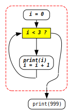

<link rel="stylesheet" href="../assets/css/works_inline.css">
# 單元 5：程式流程結構綜整練習

## 🎯 學習重點

- 程式流程結構重點整理
    - 循序結構、選擇結構、重複結構
    - 程式區塊
    - `while` 和 `if` 流程結構比較

- `while`-`if` 結合使用

---

## 🗂️ 程式流程重點整理

到這裡我們學習了：

- 最簡單的程式依照書寫的順序一條命令接著一條命令執行

- `if`-`elif`-`else` 程式可以有分支的流程結構，但如何在看似一直線的 (linear) 的文本書寫來表示分岔的流程，Python 利用冒號 `:` 和**縮排**來表示結構意義。

- 而這裡你也要開始能夠把一段程式看成一整個區塊：

    - 一整個完整的 `if`-(`elif`)-`else` 結構要看成一段程式區塊。
  
    - 把 `if ...:`、`elif ...:`、`else:` 以及 `for ...:` 和 `while ...:` 等前半句說完的後半句接在下面寫必須**縮排**常常不會只有一條命令，而是整個程式區塊。
     
        這整段程式區塊或者開頭對齊，或者視需要**往右縮排**。但整個區塊中任何一條命令的開頭絕不會比開始那條命令的開頭向左突出；如果突出，那就不是屬於那個程式區塊，不屬於那後半句，而是那個 `if`-`elif`-`else`、`for` 或 `while` 結構整句話做完後要接著做的事了。

- `for` 和 `while` 迴圈用來表示重複迭代的流程運作，也是利用**縮排/區塊**表達結構意義。

---

### 整個結構看成一個區塊 ...

  

    <code>if ...:</code> 
        

        

  

  

    <code>if ...:</code> 
        

        

    <code>else:</code> 
        

        

  

  

    <code>if ...:</code> 
        

        

    <code>elif ...:</code> 
        

        

    <code>else:</code> 
        

        

  

  

    <code>for ...:</code> 
        

        

  

  

    <code>... # 初始條件設定</code> 
    <code>while ...: # 檢查條件狀態</code> 
        

           <code>... # 條件改變</code>
        

  

### 後半句是區塊

上面的

  
     
可能會長成這樣：

  

    

    

    

    

    

    

    

  

  

    

    

    

    

    

    

    

  

  

    

    

    

    

    

    

    

  

  

    

    

    

    

    

    

    

  

  

    

    

    

    

    

    

    

  

  

    

    

    

    

    

    

    

  

但<b>絕不會</b>長這樣：

  

    

    

    

    

    

    

    

  

    &larr; 這句開始<b>不會</b>屬於同一個區塊  ，而會是上段結構做完後要做的事 

---

### `while` 和 `if` 流程比較

<pre><code>
<pre><code> 0 | <em>i = 0</em>
 1 | <em>while i &lt; 3:</em>
 2 | <em>    print (i)</em>
 3 | <em>    i = i + 1</em>
 4 | print (999)
</code></pre>
</code></pre>

<pre><code>
<pre><code> 0 | i = int(input())
 1 | <em>if i &lt; 3:</em>
 2 | <em>    print (i)</em>
 3 | 
 4 | print (999)
</code></pre>
</code></pre>

 

認識理解迴圈的運作並能靈活應用的關鍵在於對執行時每一個步驟的變數變化都有清楚且詳細的意識。同學試著了解或練習時不要怕麻煩，要**拿出紙筆**來做像上面動畫這樣樣的操作練習。

程式中迴圈的設計掌握 3 個重點：

1. 條件的開始

2. 條件的改變

3. 條件的結束**/持續**，但記得 `while ...:` 所描述的是迴圈**持續**的條件，也就是邏輯上是**相反**的。

<pre><code>
<pre><code>...           # 1. 條件的開始
while ...:    # 3. 迴圈持續的條件
    ...       # 2.     條件的改變
</code></pre>
</code></pre>

## ⚙️ `if` 結構放在迴圈結構的後半句中使用

至此，這 3 種結構：循序、選擇 (`if`)、和重複 (迴圈) 綜整使用，你可以讓電腦做任何的事情。你在設計程式的過程，要持續有意識地保持以程式區塊思考的概念：

- 整個程式是最外層、最大的區塊，裡面可以分成幾段按照順序執行的第二層區塊，

- 每個區塊可以是 `if` (-`elif`-`else`) 結構或迴圈 (`for` 或 `while`) 結構

- `if` 結構或迴圈結構的後半句作為一個區塊裡面又可以另ㄧ層或數層區塊，其中可以是 `if` 結構或迴圈結構。

程式區塊可以像俄羅斯套娃一樣層層包裹，而俄羅斯套娃是每層只有一隻，但程式每層可以超過一個區塊；另外要注意在同一層的程式區塊有前後執行的順序。

---

## 🧮 綜整練習

這段程式

<pre><code>
<pre><code> 1 | total = 0
 2 | i = 1
 3 | while i &lt; 10:
 4 |     if i % 2 == 0:
 5 |        total = total + i
 6 |     i = i + 1
 7 | print(total)
</code></pre>
</code></pre>

和

<pre><code>
<pre><code> 1 | total = 0
 2 | i = 0
 3 | while i &lt; 10:
 4 |     total = total + i
 5 |     i = i + <input type="text" class="answer-input answer-inline">
 6 | print(total)
</code></pre>
</code></pre>

執行輸出一樣。框框內應填入什麼**整數**

---

關於這段程式

<pre><code>
<pre><code> 1 | i = 1
 2 | while i &lt; 10:
 3 |     if i % 2 == 0:
 4 |         i = i - 1
 5 |     else:
 6 |         i = i + 1
 7 | print(i)
</code></pre>
</code></pre>

<select class="answer-select answer-inline" style="width: 288px"><option value="">請選擇...</option><option value="i 一直減到負數">i 一直減到負數</option><option value="i 一直加到 10">i 一直加到 10</option><option value="while 條件永遠成立">while 條件永遠成立</option></select> 為真。

---

執行這段程式：

<pre><code>
<pre><code> 1 | n = int (input ())
 2 | 
 3 | i = 1
 4 | while i &lt;= n:
 5 |     if n <input type="text" class="answer-input answer-inline"> i == 0: # 框框內應填入什麼運算符號
 6 |         print (i) 
 7 |     <input type="text" class="answer-input answer-inline">
</code></pre>
</code></pre>

時，若

<table style="border-collapse: collapse; text-align: center;">
  <tr>
    <th style="border: 1px solid gray; padding: 3px 8px; text-align: left;">輸入 <code>n</code> 為</th>
    <td style="border: 1px solid gray; padding: 0 8px; text-align: right; font-family: monospace;">3</td>
    <td style="border: 1px solid gray; padding: 0 8px; text-align: right; font-family: monospace;">4</td>
    <td style="border: 1px solid gray; padding: 0 8px; text-align: right; font-family: monospace;">6</td>
    <td style="border: 1px solid gray; padding: 0 8px; text-align: right; font-family: monospace;">7</td>
    <td style="border: 1px solid gray; padding: 0 8px; text-align: right; font-family: monospace;">8</td>
    <td style="border: 1px solid gray; padding: 0 8px; text-align: right; font-family: monospace;">10</td>
    <td style="border: 1px solid gray; padding: 0 8px; text-align: right; font-family: monospace;">14</td>
    <td style="border: 1px solid gray; padding: 0 8px; text-align: right; font-family: monospace;">15</td>
    <td style="border: 1px solid gray; padding: 0 8px; text-align: right; font-family: monospace;">16</td>
    <td style="border: 1px solid gray; padding: 0 8px; text-align: right; font-family: monospace;">18</td>
    <td style="border: 1px solid gray; padding: 0 8px; text-align: right; font-family: monospace;">19</td>
    <td style="border: 1px solid gray; padding: 0 8px; text-align: right; font-family: monospace;">20</td>
  </tr>
  <tr>
    <th style="border: 1px solid gray; padding: 3px 8px; text-align: left; vertical-align: top;">輸出</th>
    <td style="border: 1px solid gray; padding: 0 8px; text-align: right; vertical-align: top; font-family: monospace; line-height: 1.5;">1 3</td>
    <td style="border: 1px solid gray; padding: 0 8px; text-align: right; vertical-align: top; font-family: monospace; line-height: 1.5;">1 2 4</td>
    <td style="border: 1px solid gray; padding: 0 8px; text-align: right; vertical-align: top; font-family: monospace; line-height: 1.5;">1 2 3 6</td>
    <td style="border: 1px solid gray; padding: 0 8px; text-align: right; vertical-align: top; font-family: monospace; line-height: 1.5;">1 7</td>
    <td style="border: 1px solid gray; padding: 0 8px; text-align: right; vertical-align: top; font-family: monospace; line-height: 1.5;">1 2 4 8</td>
    <td style="border: 1px solid gray; padding: 0 8px; text-align: right; vertical-align: top; font-family: monospace; line-height: 1.5;">1 2 5 10</td>
    <td style="border: 1px solid gray; padding: 0 8px; text-align: right; vertical-align: top; font-family: monospace; line-height: 1.5;">1 2 7 14</td>
    <td style="border: 1px solid gray; padding: 0 8px; text-align: right; vertical-align: top; font-family: monospace; line-height: 1.5;">1 3 5 15</td>
    <td style="border: 1px solid gray; padding: 0 8px; text-align: right; vertical-align: top; font-family: monospace; line-height: 1.5;">1 2 4 8 16</td>
    <td style="border: 1px solid gray; padding: 0 8px; text-align: right; vertical-align: top; font-family: monospace; line-height: 1.5;">1 2 3 6 9 18</td>
    <td style="border: 1px solid gray; padding: 0 8px; text-align: right; vertical-align: top; font-family: monospace; line-height: 1.5;">1 19</td>
    <td style="border: 1px solid gray; padding: 0 8px; text-align: right; vertical-align: top; font-family: monospace; line-height: 1.5;">1 2 4 5 10 20</td>
  </tr>
</table>

---

## 📝 APCS 觀念題選

以下選自 APCS 公開的觀念題。

APCS 觀念題測驗時無法執行程式，可以用紙筆操作。同學做這類的練習 (上面的也一樣) **不要**只照打程式看結果，那樣會失去意義。

這類練習的目的是希望你能去思考電腦根據 Python 程式所設計的意義會如何執行，是要確定你對 Python 如何表達流程邏輯的了解是正確的。

---

執行下段程式前 `a` 可能是任何整數值 ...

<pre><code>
<pre><code>...
while a &lt; 10:
    a = a + 5
if a &lt; 12:
    a = a + 2
if a &lt;= 11:
    a = 5
</code></pre>
</code></pre>

這段程式中，<select class="answer-select answer-inline" style="width: 456px"><option value="">請選擇...</option><option value="a = a + 5 永遠不可能執行到">a = a + 5 永遠不可能執行到</option><option value="a = a + 2 永遠不可能執行到">a = a + 2 永遠不可能執行到</option><option value="a = 5 永遠不可能執行到">a = 5 永遠不可能執行到</option><option value="每ㄧ行 (line) 都可能執行得到">每ㄧ行 (line) 都可能執行得到</option></select>

《106/03, 題本範例#27》

---

<pre><code>
<pre><code> 1 | n = 22
 2 | print (n)
 3 | while n != 1:
 4 |     if n % 2 == 1:
 5 |         n = 3 * n + 1
 6 |     else:
 7 |         n = n // 2
 8 |     print (n)
</code></pre>
</code></pre>

總共 print <input type="text" class="answer-input answer-inline"> 次。(填入整數)

《105/03#15》

---

## 💻 實作練習

    **提示：**

    `input()` 的作用是從使用者的輸入讀入還沒有讀入的下一整列。
    如果確定那一列裡面的字符只表示一個整數，就可以用 `int (input())` 把那串字符轉成整數 (`int`) 型別。
    
    而

    
<pre><code>n = int (input())</code></pre>

    則是將轉換後的整數指定給 `n`。  
    
    如果放在迴圈裡：

    
<pre><code>while ...:
        n = int (input ())
        ...
    </code></pre>

    就是在每個迴圈迭代都讀入還沒有讀入的下一列輸入資料  
    &emsp;&emsp;→ 轉換成整數型別的資料 → 指定給 `n`。

    因為比較複雜，所以都寫到提示裡，不過同學還是可以了解一下。

[更多實作練習](http://zerojudge.tw/)

---

## `break`

在迴圈結構的後半句區塊裡面用到 `if` 結構這類的程式模式當中 (`for` 或 `while` 迴圈包著 `if`)，有時候可以使用 `break` 來中斷它所在那層的迴圈。不過這個指令如果不會也沒關係，對於寫程式的習慣而言可能還比較好。參考[提醒](#關於-break-的提醒)的說明

我們看一下這個例子：它做的事是從 <em>1 × 1</em> 開始找 <em>100</em> 以內第一個大於 <em>50</em> 的平方數，如果有就印出來。

我們把迴圈搜尋的極至設在 `n * n < 100`，就用一個 `while` 迴圈從 `1*1` 開始一個一個檢查 ...

如果找到了，就不用再往上找了，我們可以用 `break` 中斷 `while` 迴圈：

<pre><code>
<pre><code> 1 | n = 1
 2 | while n * n &lt; 100:
 3 |     if n * n &gt; 50:
 4 |         print (n * n)
 5 |         break
 6 |     n = n + 1
</code></pre>
</code></pre>

這裡請注意：

- 上面這段程式中 `if n * n > 50:` 的後半句是一個有 2 條程式的區塊，它們的**縮排**是**對齊**的。
    - `break` 會是它所在區塊的最後一條命令

- `break` 所中斷的是它所在那層的**迴圈**，而不是區塊，中斷區塊沒有意義，
    - 以上面那段程式而言，中斷了迴圈接著執行的是 line 7 的 `print (n)`，而**不會是** line 6 的 `n = n + 1` 喔～～

- 以後你會用到迴圈包著迴圈 (超過一層的迴圈) 這樣的程式設計，<code>break</code> 所中斷的是它所在的那最裡面的一層！

---

一個正整數 <em>n</em> 是不是質數的定義是 <em>n</em> 有沒有除了 <em>1</em> 和自己 (<em>n</em>) 以外的 <input type="text" class="answer-input answer-inline"> 數。  

檢查的程式可以這樣寫：

<pre><code>
<pre><code>...
is_prime = 1
i = 2
while i &lt; n:
    if n <input type="text" class="answer-input answer-inline"> i == 0: # 框框內應填入什麼運算符號？
        is_prime = 0
        break
    i = i + 1

# 報告
print (is_prime)
</code></pre>
</code></pre>

如果 `n` 是質數印出 `1`，否則印出 `0`。

但是上面的 `while i < n:` 可以改成 `while i * i < n:` 會更快完成，因為[最多只要檢查到 <em>√n</em> 就可以了](https://www.youtube.com/watch?v=N5khW8NYxAc)！

---

框框內填入什麼**整數**會讓

<pre><code>
<pre><code> 1 | for i in range(<input type="text" class="answer-input answer-inline">):
 2 |     print(999)
</code></pre>
</code></pre>

和

<pre><code>
<pre><code> 1 | for i in range(5):
 2 |     if i == 3:
 3 |         break
 4 |     print(999)
</code></pre>
</code></pre>

有一樣的執行結果。

---

框框內填入什麼<b>正整數</b>？

<pre><code>
<pre><code> 1 | i = 9
 2 | while i &gt; <input type="text" class="answer-input answer-inline">:
 3 |     if i == 5:
 4 |         break
 5 |     print(i)
 6 |     i = i - 1
</code></pre>
</code></pre>

執行後會印出：

<pre class="output">9
8
7
6</pre>

---

這段程式

<pre><code>
<pre><code> 1 | i = 1
 2 | while i &lt;= 10:
 3 |     if i % 3 == 0:
 4 |         break
 5 |     i = i + 1
</code></pre>
</code></pre>

最後執行的是 <select class="answer-select answer-inline" style="width: 105px"><option value="">請選擇...</option><option value="line 1">line 1</option><option value="line 2">line 2</option><option value="line 3">line 3</option><option value=" line 4"> line 4</option><option value=" line 5"> line 5</option></select>

---

### 關於 `break` 的提醒

`break` 在高中階段練習解題寫不會太複雜的程式用起來很方便。不過初學不學可能沒關係或者更好，在比較嚴肅的程式設計指導準則中一般是不建議使用，因為會破壞流程設計的完整性。以後工作的時候如果你的程式有 `break`，Code Review 時前輩或主管應該會說話。  比較好的習慣會是：想用 `break` 的地方試試看能用什麼邏輯條件或變數以原來就有的 `while` 判斷達成。例如：右邊會是比較好的寫法：

<pre><code>
<pre><code> 1 | 
 2 | i = 0
 3 | while i &lt; 100:
 4 |     print (i)
 5 |     i = i + 1
 6 |     n = int (input ())
 7 | <em>    if n == 1234:</em>
 8 | <em>        break</em>
 9 | print (i)
</code></pre>
</code></pre>

<pre><code>
<pre><code> 1 | <em>go_on = 1</em>
 2 | i = 0
 3 | <em>while i &lt; 100 and go_on == 1:</em>
 4 |     print (i)
 5 |     i = i + 1
 6 |     n = int (input ())
 7 | <em>    if n == 1234:</em>
 8 | <em>        go_on = 0</em>
 9 | print (i)
</code></pre>
</code></pre>

---

`break` 的作用是：<select class="answer-select answer-inline" style="width: 324px"><option value="">請選擇...</option><option value="讓條件變成 False">讓條件變成 False</option><option value="強制跳開目前的迴圈">強制跳開目前的迴圈</option><option value="讓變數歸零">讓變數歸零</option><option value="讓程式重新開始">讓程式重新開始</option></select>

為什麼嚴謹的程式設計準則通常不建議使用 break？<select class="answer-select answer-inline" style="width: 396px"><option value="">請選擇...</option><option value="會破壞流程設計的完整性">會破壞流程設計的完整性</option><option value="會讓程式變慢">會讓程式變慢</option><option value="Python 不支援 break">Python 不支援 break</option><option value="break 只能在 for 迴圈使用">break 只能在 for 迴圈使用</option></select>

---

## 📘 總結

程式的執行流程主要可以分成三種基本型態：

1️⃣ 循序結構 (Sequential)：程式由上而下，依順序逐行執行。

2️⃣ 選擇結構 (Conditional)：`if`-`elif`-`else`  

- 根據條件「是否成立」決定要不要執行某些命令。
- 縮排區塊表示後半句。

3️⃣ 重複結構 (Loops / Iteration)：`for`、`while`  

- 重複執行一段程式 (縮排) 區塊，直到條件不成立或被強制中斷 (break)。

### 設計觀念

- `if` 結構控制要不要做。

- `while`、`for` 結構控制要重複幾次或重複到什麼時候。

    - `break` 提前離開重複。

在實際設計中，「條件」與「重複」常常會交錯出現。
例如要重複輸入直到符合條件、或在迴圈中根據不同條件做不同處理。

這些控制流程的組合，是程式邏輯的骨架。
能夠靈活運用它們，
就能讓程式不只是「照順序做事」，
而是能夠「根據情況思考、靈活反應」。

---

### 無窮迴圈

下面這兩段程式

<pre><code>
<pre><code>while __(a)__:
    __(b)__
</code></pre>
</code></pre>

和

<pre><code>
<pre><code>while True:
    if __(a)__:
        break
    __(b)__
</code></pre>
</code></pre>

作用是一樣的。  

第二段是無窮迴圈裡面有一個條件判斷的後半句是 <code>break</code> 中斷迴圈。  

以初學、練習解題而言，一般不會刻意使用無窮迴圈。不是實際應用上，像你的手機、以及你現在在操作的這個課程介面，本身都是無窮迴圈的應用。需要和使用者互動的應用，基本上使用的設計機制是在一個迴圈中「輪詢 Polling」<b><u>輪</u></b>流<b><u>詢</u></b>問看看哪個使用者有沒有點了哪個按鈕，或是輸入了什麼文字、點了哪個圖示。

2025 © Elton Huang